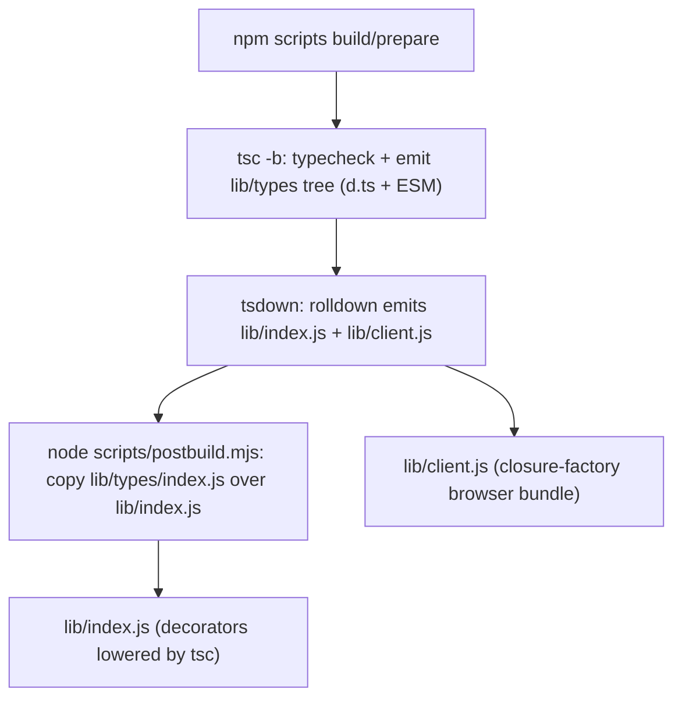
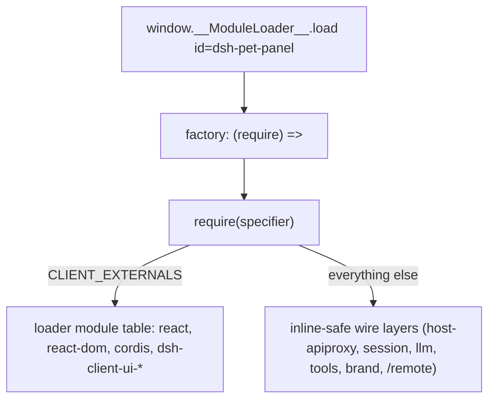

# Build, Bundling, and Packaging

dsh-pet-panel is a **dual-face** DeepSeek Harness Web UI plugin that ships two artifacts from one `src/` tree: a Node **host** half (`lib/index.js`, the Gateways/Services the dsh host loads) and a browser **client** half (`lib/client.js`, the panel/pet UI served to browsers). Everything is produced by a single npm script chain driven by `tsc -b`, `tsdown` (rolldown), and a small `scripts/postbuild.mjs` override. The authoritative inputs are `src/`, `tsconfig.json`, and the two tsdown configs; the emitted `lib/*` bundles and the tsc output are the ground truth for what ships.

## Build chain

The `build` script is `tsc -b && tsdown && node scripts/postbuild.mjs` (`package.json#L22-L27`). Each step has a distinct role:

1. **`tsc -b`** type-checks the project and emits the whole `lib/types/` tree (`tsconfig.json` sets `rootDir: "src"`, `outDir: "lib/types"`, `composite`, `declaration`, `declarationMap`). Because tsc **does** lower Stage-3 decorators, `lib/types/index.js` is a valid ESM host bundle.
2. **`tsdown`** runs rolldown to emit `lib/index.js` (Node/ESM host bundle) and `lib/client.js` (browser closure-factory bundle).
3. **`node scripts/postbuild.mjs`** overwrites `lib/index.js` with `lib/types/index.js` (see [Decorator lowering](#decorator-lowering-postbuild)).

The `prepare` script runs a sibling chain for git installs: `tsc -b && tsdown --config tsdown.prepare.config.ts && node scripts/postbuild.mjs`. Watch mode is `tsdown --watch` only — it does not re-run `tsc -b` or postbuild, so after editing the host face the rolldown-emitted `lib/index.js` is not re-overwritten; run a full `pnpm run build` before loading the host from a fresh `src/` change.

## The shared client preset (`build/tsdown.client.ts`)

`build/tsdown.client.ts` exports `clientBundle(id, libEntry, options)`, the single source of truth for this package's build. It is a self-contained port of the DSH checkout's client-bundle preset and returns an ENV-selected config: a Node-side `clientLibraryConfig` plus a browser `clientConfig` when a browser entry exists (`src/client/index.ts`). A package-level `tsdown.config.ts` **replaces** the root workspace layout, so the lib half is restated here — dropping it would leave the package without `lib/index.js` and the host Loader could not import its Node half (`build/tsdown.client.ts#L95-L129`).

The default (no phase) face emits both halves; Host-only plugins (no `src/client/index.ts`) skip the browser face entirely (`build/tsdown.client.ts#L119-L127`).

### Browser bundle: closure factory + module table

`clientConfig` emits `lib/client.js` as a **closure-factory artifact**: the banner calls `window.__ModuleLoader__.load({ id, factory: (require) => {`, the intro seeds `var module = { exports: {} }; var exports = module.exports;`, and the footer closes `return module.exports; } });` (`build/tsdown.client.ts#L226-L342`). Externals are resolved through the injected `require` backed by the loader's **module table** — cordis DI entities, no globals, no import map.

`__DSH_PKG_VERSION__` is baked into the bundle from the package's own `package.json` version so the anonymous install heartbeat can report which release is running (`build/tsdown.client.ts#L66-L78`). The bundle inlines node-idiom deps (zustand/immer read `process.env.NODE_ENV`; zustand's esm build probes `import.meta.env.MODE`), so `define` substitutes both keys plus the bare `import.meta.env` key and `__DSH_PKG_VERSION__` (`build/tsdown.client.ts#L253-L258`). The sourcemap is rewritten via `browserSourcePath` so the map resolves local sources back into `/packages/<group>/<package>/src` URLs without exposing that tree as an HTTP route (`build/tsdown.client.ts#L87-L93`, `#L331-L337`).

## Frozen platform module table (`build/web-platform.ts`)

`PLATFORM_MODULES` is the single shared list of frozen browser modules the shell shares into the module table: `react`, `react/jsx-runtime`, `react-dom`, `react-dom/client`, `@deepseek-ai/cordis`, `@deepseek-ai/dsh-client-ui-slots`, `@deepseek-ai/dsh-client-ui-primitives`. Seeding, bundling externals, and Vite aliases consume this list so their identities cannot drift, and it mirrors the shell's verified 0.1.1-rc.2 dist set (`build/web-platform.ts#L11-L16`).

The client **externals** are `[...PLATFORM_MODULES, RUNTIME_STORE_EXEMPTION]` (`CLIENT_EXTERNALS`, `build/tsdown.client.ts#L61-L62`). The `noExternal` matcher inlines every specifier **not** in the table — a `require()` the table cannot answer is a guaranteed runtime throw, so the rule is simply the table list itself (`build/tsdown.client.ts#L259-L264`).

### RUNTIME_STORE_EXEMPTION

`@deepseek-ai/dsh-client-runtime/client` is a documented **temporary** exemption, not a platform module (hence not in `web-platform.ts`): the snapshot-store engine (`createSnapshotStore`/`defineStore`/`shallowEqual`) lives in runtime pending promotion-time rehoming, and five importers (locale, ui-layout, ui-conversation ×3) ride this single exemption. At runtime the lazy CJS table answers the require natively because runtime is an immediately-tier row registered before any dependent bundle materializes (`build/tsdown.client.ts#L49-L62`).

### Bundle purity gate

The `dsh-client-bundle-purity` plugin is the build-time mirror of the module-edge rules. It rejects every `@deepseek-ai/*` value import that is neither a platform external nor an inline-safe wire layer: a cross-plugin value import either inlines a duplicate runtime instance or requires a specifier the frozen module table cannot answer, so such imports are a build error — cross-plugin collaboration happens through cordis services (`build/tsdown.client.ts#L265-L281`). Type-only imports are erased and never reach the gate.

Two regexes carve out what may inline:

- `INLINE_SAFE` — `^@deepseek-ai\/dsh-(host-apiproxy|session|llm|tools|brand)(\/|$)`: browser-safe contract surfaces with no runtime identity to share (no `Symbol`/`instanceof`/singleton state).
- `GENERATED_REMOTE` — `^@deepseek-ai\/dsh-[a-z0-9]+(?:-[a-z0-9]+)*\/remote$`: generated descriptor/codec contributions with no shared runtime identity.

(`build/tsdown.client.ts#L32-L41`, `#L275-L276`.)

## CSS Modules: virtual id and lightningcss

CSS Modules are compiled by **lightningcss inside the bundle** rather than by tsdown's own css pipeline (which requires `@tsdown/css`). Importing `x.module.css` yields the hashed class map, and the css text auto-injects a `<style data-plugin="<id>">` tag at factory execution; the loader removes plugin-owned tags on unload.

To keep module CSS away from tsdown's pipeline, the importer resolves to a virtual id `\0dsh-css:<repo-relative-path>.mjs` (`CSS_VIRTUAL_PREFIX`/`CSS_VIRTUAL_SUFFIX`, `build/tsdown.client.ts#L24-L30`). The suffix matters: tsdown's guard matches ids ending in `.css`, so the virtual id must **not** end in `.css`. The plugin re-registers the real stylesheet as a watch dependency and rebases the repo-relative id back onto the physical path so rolldown's watch graph sees it (`build/tsdown.client.ts#L283-L329`).

The loader produces deterministic output: cssExports are sorted so the emitted `lib/client.js` does not churn on rebuild (lightningcss iteration order is process-dependent), and lightningcss uses the repo-relative filename so `[hash]` class names are machine-independent (`build/tsdown.client.ts#L301-L328`).

## Decorator lowering: postbuild

The host half uses Stage-3 `@Remote(...)` decorators from `@deepseek-ai/dsh-typert-protocol` (bare `src/index.ts`). **rolldown does not lower these**, so a raw rolldown `lib/index.js` would keep `@Remote("...")` tokens verbatim and Node's ESM loader would throw `SyntaxError: Invalid or unexpected token` when dsh loads the host face.

tsc **does** lower them (to `__esDecorate`). The `tsc -b` step already emits a correct ESM host bundle at `lib/types/index.js` — the same `export function apply` surface as `src/index.ts` — so `scripts/postbuild.mjs` simply copies it over the rolldown output (`scripts/postbuild.mjs#L1-L18`). The emitted artifacts confirm this: both `lib/index.js` and `lib/types/index.js` carry the lowered `__esDecorate` helpers rather than raw decorator syntax.

> Do **not** hand-edit `lib/*` outputs — `lib/index.js` is overwritten by postbuild on every `build`/`prepare` run, and edit would be lost.

A secondary belt-and-suspenders measure sets a low tsdown compile target for the lib half to try to force rolldown to emit `__esDecorate` helpers, but the postbuild copy is the authoritative guarantee. (Note a comment/value mismatch: `tsdown.config.ts`'s inline comment says an `es2022` target "forces rolldown to emit the __esDecorate helpers", yet the actual value is `es2015` — treat the copy as the real fix, not the target comment.)

## Two tsdown configs

**`tsdown.config.ts` (dev/CI Build)** — `clientBundle('dsh-pet-panel', ['src/index.ts'], { lib: { target: 'es2015' }, libExternal: [...] })`. Declares the host half's full runtime external set: `@deepseek-ai/cordis`, `@deepseek-ai/dsh-typert-protocol`, `@deepseek-ai/dsh-home-paths`, `@deepseek-ai/dsh-tools`, `@deepseek-ai/dsh-skill-filesystem` (`tsdown.config.ts#L1-L22`). These resolve from the dsh profile tree at runtime, so they stay external — the same stance as cordis.

**`tsdown.prepare.config.ts` (git-install `prepare`)** — same `clientBundle` call but with a lighter `libExternal` (`@deepseek-ai/dsh-typert-protocol`, `@deepseek-ai/dsh-home-paths`) and `lib: { target: 'es2022' }` (`tsdown.prepare.config.ts#L1-L17`). Its purpose is the consumer-side build for git installs: transpile straight from `src` **without tsc project references**, which need a sibling harness checkout that only dev machines and CI have. Types are **not** checked here — `pnpm run typecheck` owns that. The client bundle is still emitted because the modules Node half serves `lib/client.js` to browsers, so a git-installed package must ship it.

### `libExternal` declarations

`libExternal` augments the always-present `external: ['@deepseek-ai/cordis', ...]` in `clientLibraryConfig` (`build/tsdown.client.ts#L217-L223`). cordis must stay external because its built declarations carry `.ts`-suffixed relative imports rolldown cannot follow, and because it resolves at runtime from the dsh profile tree rather than this repo's install. Each package states the host-half `@deepseek-ai` runtime deps it needs to stay external at its own `tsdown.config.ts`, keeping the Node bundle free of the profile-tree dependencies.

## lib/ output layout

- **`lib/index.js`** — host Node ESM bundle; the `main`/`.` export default. Overwritten by postbuild from `lib/types/index.js` (decorators lowered).
- **`lib/client.js`** — browser closure-factory bundle served to browsers; the `./client` export default.
- **`lib/types/`** — tsc emit: `.d.ts` declaration files + `.d.ts.map`, plus the ESM `index.js` used as the postbuild source. The `lib/types/client/` sub-tree mirrors `src/client/` with per-module `.d.ts` and `.js`.
- **`lib/tsconfig.tsbuildinfo`** — composite build info.

`package.json` maps these through `main`/`types`/`exports`: `"."` → `lib/index.js` + `lib/types/index.d.ts`, `"./client"` → `lib/client.js` + `lib/types/client/index.d.ts`, plus `"./src/*"` and `"./package.json"` passthroughs; `files` ships `lib/**/*.js`, `lib/**/*.js.map`, `lib/**/*.d.ts`, `src`, and `cordis.patch.yml` (`package.json#L28-L48`).

## Configuration and operations

- **`dsh.bundle.patch` → `cordis.patch.yml`** inserts the plugin row into the web profile roster; installing the package applies the layer automatically, mounting both the modules Node half (which scans `dsh.client` packages and serves `lib/client.js`) and the host half.
- **`dsh.client`** (`platform: "web"`, `inject: ["@deepseek-ai/dsh-client-locale", "@deepseek-ai/dsh-client-runtime", "@deepseek-ai/dsh-client-ui-conversation", "@deepseek-ai/dsh-client-ui-layout", "@deepseek-ai/dsh-client-ui-sidebar"]`) makes the web module table scan this package into the browser roster.
- **`peerDependencies`**: `react`/`react-dom` `^18.2.0` (`package.json#L68-L71`), matching the frozen module-table entries.
- **`DSH_BUILD_FACE`** selects the phase under `tsdown --env.DSH_BUILD_FACE`; `buildFace` validates it must be `host` or `client` and throws otherwise (`build/tsdown.client.ts#L196-L199`). `ClientBundleOptions.hostPhase` lets a package emit its Node-side artifacts during the Host pass instead of the Client pass.

## Focused tests

There are no repository-authored `*.test.ts`/`*.spec.ts` files for the build pipeline; the suite under `node_modules` belongs to dependencies. The build's correctness is enforced by the config's own guards (the purity gate during bundling, `buildFace` validation) and by the observable contract that `lib/index.js` must carry lowered `__esDecorate` helpers. The authoritative checks are `pnpm run build`/`pnpm run typecheck` and loading the host face (`dsh --profile web`) which throws if decorators were left unreduced.
