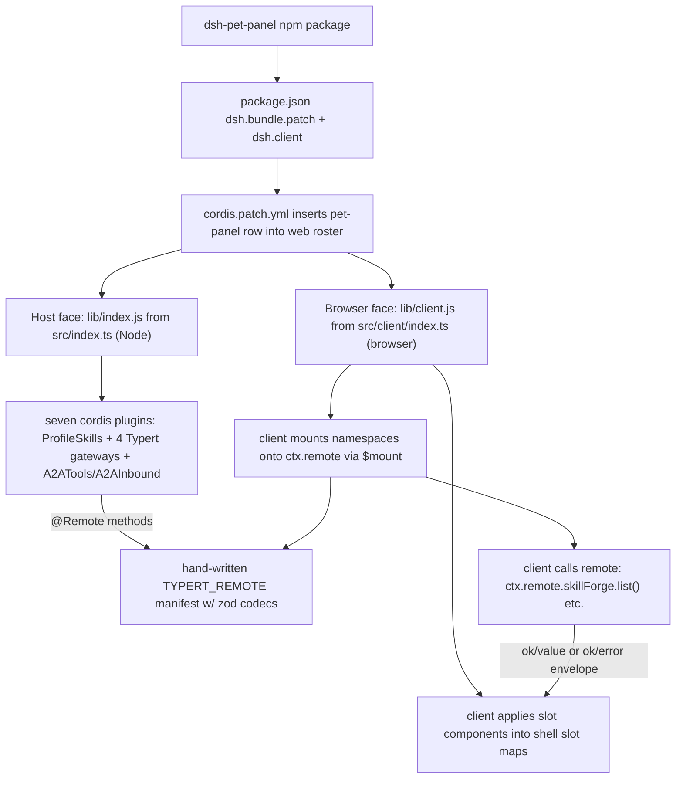

# Dual-Face Plugin Architecture

dsh-pet-panel is a single npm package that deliberately mounts into a DeepSeek Harness **web profile** as **two faces**. They are separate concerns, built into separate bundles, loaded by separate runtimes, and communicate only through an explicit RPC contract. This page is the top-level map: how the package announces itself to the harness, what the host half does, what the client half does, and how the two halves speak.

The host and browser faces are the two halves of one `src/` tree. The **host face** is the Node service bundle loaded by the dsh host process; the **browser face** is the closure-factory bundle served to the browser. Each half must stay in its own directory so the dual-face split survives every build.



Caption: The two faces, their packaging wiring, and the Typert RPC bridge that connects the client slot components to the host Gateways.

## The two halves at a glance

| Face | Source | Emitted bundle | Runtime | Responsibility |
| --- | --- | --- | --- | --- |
| **Host** | `src/index.ts` | `lib/index.js` | Node (dsh host) | Cordis services: four Typert Gateways, model tools, inbound A2A endpoint, per-profile skill provider. Default `"."` export. |
| **Client** | `src/client/index.ts` | `lib/client.js` | Browser (web module loader) | Slot components: dashboard, pet, brand/theme, capability + team panels, `/pet` command. `"./client"` export. |

`package.json` maps the two bundles through `exports`: `"."` → `lib/index.js` + `lib/types/index.d.ts`, `"./client"` → `lib/client.js` + `lib/types/client/index.d.ts`, plus `"./src/*"` and `"./package.json"` passthroughs; `files` ships `lib/**/*.js`, `lib/**/*.d.ts`, `src`, and `cordis.patch.yml` (`package.json#L28-L48`).

## Packaging contract: announcing the plugin to the harness

Two fields in `package.json` are the entire mount contract. `dsh.bundle.patch` points at `cordis.patch.yml`, and `dsh.client` describes how the web module table should scan this package (`package.json#L50-L67`).

- **`dsh.bundle.patch` → `cordis.patch.yml`** — an insert-only patch that adds the `pet-panel` row to the web profile's plugin roster. Installing the package (`dsh plugin --profile web add github:zw11591-sketch/dsh-pet-panel`) applies the layer automatically. The row is the single entry point for both halves: the modules Node half scans the `dsh.client` packages into the web plugin roster (which is what makes `lib/client.js` get served), and the host half registers the skill / MCP / A2A / team gateways plus the A2A inbound endpoint. (`cordis.patch.yml#L1-L10`.)
- **`dsh.client`** (`platform: "web"`, `inject: ["@deepseek-ai/dsh-client-locale", "@deepseek-ai/dsh-client-runtime", "@deepseek-ai/dsh-client-ui-conversation", "@deepseek-ai/dsh-client-ui-layout", "@deepseek-ai/dsh-client-ui-sidebar"]`) — makes the web module table scan this package into the browser roster and serve `lib/client.js`. The entries are the shell faces the client face expects to coexist with (locale, runtime, conversation views, layout/shell overlay, sidebar brand slots).

The client build is produced by `build/tsdown.client.ts`'s `clientBundle(...)` preset, wrapped in `window.__ModuleLoader__.load({ id, factory })` so `@deepseek-ai/*` and `react` resolve from the shell's frozen module table; `zod` (the wire schema) inlines into the client bundle. The build chain, module table, and postbuild decorator lowering are documented separately in [Build, Bundling, and Packaging](/openwiki/architecture/build-and-packaging.md).

## Host face: seven cordis plugins in `apply()`

`src/index.ts` exports a single `apply(ctx)` that registers exactly seven plugins (`src/index.ts#L1465-L1473`):

1. **`ProfileSkillProviderPlugin`** — registers a `FileSystemSkillProvider` scoped to the current profile's `skills/` dir, with `includeDefaultRoots: false`, so only that profile's skills load (`src/index.ts#L1449-L1463`). It reuses dsh's YAML-frontmatter parsing and `isSkillName` validation.
2. **`SkillForgeGateway`** — a `TypertRemoteService` exposing `list` / `read` / `write` / `delete` / `generate` over `@Remote(...)` methods. `generate` drives `llm.stream` with the current default model (`src/index.ts#L58-L201`).
3. **`ToolIntegrationsGateway`** — a `TypertRemoteService` exposing `list` / `read` / `write` / `delete` for MCP servers, hot-mounting them through `ctx.loader.create`/`remove` (`src/index.ts#L222-L326`).
4. **`A2AConfigGateway`** — a `TypertRemoteService` exposing `get` / `setCard` / `upsertAgent` / `delete` / `checkAgents` for the A2A card and external-agent list (`src/index.ts#L429-L495`).
5. **`A2AToolsPlugin`** — a cordis `Service` (injecting `tools`) that registers the model-facing `a2a_list_agents` / `a2a_call` tools (`src/index.ts#L652-L754`).
6. **`A2AInboundPlugin`** — a `Service` (injecting `webServer`, `agents`, `sessions`, `agentDefaultModel`) that serves `/.well-known/agent-card.json` and a JSON-RPC `message/send` handler at the `/a2a` prefix (`src/index.ts#L895-L1049`).
7. **`TeamGateway`** — a `TypertRemoteService` exposing `listTeams` / `createTeam` / `updateTeam` / `deleteTeam` / `listThreads` / `openThread` / `getThread` / `send` for the team chat surface (`src/index.ts#L1195-L1442`).

### Per-profile isolation

Every host data surface resolves to the **active profile directory**, not to a process-relative path. dsh does not `chdir` to the profile directory and does not expose it to plugins, but `--profile <name>` is always present in `process.argv`. `profileNameFromArgv` parses that flag (`src/index.ts#L362-L369`), and `skillRoot()` (`src/index.ts#L22-L25`), `MCP_FILE()` (`src/index.ts#L205-L208`), `a2aConfigDir()` (`src/index.ts#L376-L385`) — and therefore the team `teams.json` / `team-chats` files that hang off `a2aConfigDir()` — all build `$DSH_HOME/profiles/<profile>/...` from it. This is why `dsh --profile <name>` from any cwd and `cd <profile> && dsh` both land on the same config — the paths are deterministic, not cwd-dependent.

Guest-facing path inputs are validated to prevent traversal: skill names must match `^[A-Za-z0-9_-]{1,64}$` (`assertName`, `src/index.ts#L14-L21`), thread ids must match `^[A-Za-z0-9-]{1,64}$` (`src/index.ts#L1091-L1092`).

## The Typert remote bridge

The host/client boundary is an explicit RPC contract, not shared imports. The four host Gateways (`SkillForgeGateway`, `ToolIntegrationsGateway`, `A2AConfigGateway`, `TeamGateway`) are `TypertRemoteService` subclasses whose public methods carry `@Remote('method')` decorators; the identity of each method is discovered from the `typertRemote` binding plus the `@Remote` markers in **source mode**, so no generated `/typert` artifact is needed. Each method returns a JSON-safe business value; the framework wraps it into `{ ok: true, value } | { ok: false, error }`.

The client side only needs a hand-written manifest. `src/client/remote.ts` defines `TYPERT_REMOTE` with `package`, `descriptors`, and per-method **wire codecs**: JSON-encoded position parameters and a strict result schema, each with `typeSymbol`s like `dsh-pet-panel#skillForge/list:result` (`src/client/remote.ts#L157-L187`). The result schema describes the method's business return value, which is what lets the client unwrap the boundary envelope.

The bridge is wired in `src/client/index.ts`:

```ts
const disposeRemote = await (ctx as any).remote.$mount(TYPERT_REMOTE)
```

The client calls a mounted namespace through `ctx.remote.<ns>.<method>()` and unwraps the envelope with a local `unwrap()` helper that throws `r.error.message` when `r.ok` is false (`src/client/index.ts#L36-L39`, `#L192-L193`). The four namespaces — `skillForge`, `toolIntegrations`, `a2aConfig`, `team` — are mounted onto the Typert client remote. Because `compact()` strips `undefined` own-properties from results before returning (`src/index.ts#L50-L56`), zod `.optional()` fields can't leave a `undefined` property that makes Typert's `assertJsonValue` throw `"undefined is not JSON-safe"` and surface as a bogus "business result failed boundary validation".

## Client face: slot components and the capability child plugin

`src/client/index.ts` applies a brand/theme overlay, a per-session dashboard and floating pet, and four self-service panels. Its `inject` is `['slots', 'locale', 'remote']` (`src/client/index.ts#L33`). The browser face registers into the shell's slot maps:

| Slot row | Component | Purpose |
| --- | --- | --- |
| `conversation.view` (order 20) | `DashboardView` | Session dashboard tab. |
| `shell.overlay` | `PetView` | Global floating pet, docked to the shell overlay. |
| `sidebar.brand.mark` / `sidebar.brand.name` (priority −1) | `PapergamesLogo` / `PapergamesWordmark` | Papergames brand shadowing the official DeepSeek whale. |
| `conversation.hero.brand.mark` (priority −1) | `PapergamesLogo` | Hero brand mark swap. |
| `sidebar.footer.action` (order 5) | `TeamTrigger` | Sidebar footer "团队" entry that opens the team panel. |
| `sidebar.footer.action` (order 10) | `BackgroundSwitcher` | Wallpaper + dim switcher. |
| `conversation.view` (order 30/40/50) | `SkillForgeView`, `ToolIntegrationsView`, `A2AView` | Self-service capability panels, each injecting its `api`. |
| `shell.overlay` (order 110) | `TeamView` | Team chat panel, bridged via `teamPanelStore`. |

The base views (dashboard, pet, brand swap, team trigger, background) register directly in `apply()`. The four capability/team panels do **not**. They live in a child plugin `pet-panel-capabilities` whose `inject` is `['slots', 'locale', 'remote', 'remote.skillForge', 'remote.toolIntegrations', 'remote.a2aConfig', 'remote.team']` (`src/client/index.ts#L230-L237`). This is a deliberate ordering constraint: the main `apply(ctx)` only holds `remote`, so touching `remote.skillForge` there would throw `without inject`; the namespaces resolve only against the now-mounted services inside the child plugin. Each view is injected with an `api` object built by wrapping the corresponding `ctx.remote.<ns>` calls in `unwrap()` (`src/client/index.ts#L134-L167`).

The `/pet on | off | toggle` command is similarly isolated in a `pet-panel-command` child plugin injecting `['inputTriggers', 'sessions']`. It registers an input-trigger source on `/` (registered after the built-in command source, so it wins by first-non-undefined adjudication), matches `/pet`, toggles the pet, returns `'handled'` so the line is consumed rather than sent to the model, and clears the input box via the `slash/input-consume-token` bail event (`src/client/index.ts#L50-L95`, `#L240-L246`).

### Shared state across slots

The `PetView` (shell overlay) and the `/pet` command interceptor live in different slots and cannot share React context, so the pet visibility state lives in a module-level publish/subscribe store, `petStore.ts`, exposing a stable `getSnapshot`/`subscribe` surface for `useSyncExternalStore` (`src/client/petStore.ts#L1-L47`). The team panel uses the same pattern with `teamStore.ts`'s `teamPanelStore` to bridge `TeamTrigger` (sidebar footer) and `TeamView` (shell overlay).

### Brand, theme, and hero copy

Because the shell's brand slots are `single` at default priority 0, the Papergames occupants register at `priority: -1` (lowest wins) to shadow the official whale — there is no host theme machinery to touch (`src/client/brand.tsx#L1-L63`). The Papergames theme repaints the DeepSeek blue token ramp onto a coral ramp by injecting a `<style>` on `body` (the host installs tokens on `body`, not `:root`, so a `:root` override would lose to the descendant `body` rule) (`src/client/theme.ts#L21-L57`). The tab favicon is replaced and the empty-state hero slogan is rewritten with a `MutationObserver`, because the locale `register` throws `already has locale` for an existing namespace+locale and cannot be legitimately overridden (`src/client/brand.tsx#L94-L120`). Background and dim restores read from `localStorage`, defaulting to a Papergames wallpaper at 0.25 dim.

## Host-side A2A: outbound tools and inbound endpoint

A2A is wired in both directions. **Outbound** — `A2AToolsPlugin` registers `a2a_list_agents` and `a2a_call` so the model can discover and call registered external agents. `a2a_call` resolves the agent name by exact → normalized → substring → Levenshtein distance (only a unique hit is used), and when resolution fails it returns a candidate-closure message naming the registered agents so the model can retry in a later tool call rather than erroring (`src/index.ts#L625-L744`). **Inbound** — `A2AInboundPlugin` serves the discovery card at `/.well-known/agent-card.json` and a JSON-RPC `message/send` handler under the `/a2a` prefix, reading the request body and driving the **same agent runtime the WebUI uses**: it creates or resumes a session (`agents.create`/`resume`), injects an approval policy of `never` (there is no interactive approval channel, so anything that would ask for approval is deterministically denied), calls `followup` with the extracted text, waits for `whenIdle`, and summarizes the reply from the session events. Multi-turn memory is keyed on the A2A `contextId`, which is exactly the session id, so a restart resumes via session persistence (`src/index.ts#L895-L1049`). The `/a2a` prefix deliberately avoids the SPA's `/` fallback.

## Related pages

- [Build, Bundling, and Packaging](/openwiki/architecture/build-and-packaging.md) — the `tsc -b && tsdown && postbuild` chain, the closure-factory client preset, the frozen module table, and why postbuild copies tsc-lowered output over the rolldown host bundle.
- Per-profile isolation is the shared substrate for the Skill Forge, Tool Integrations, A2A, and team host surfaces.
- The Typert remote bridge is the contract consumed on the client side by `src/client/remote.ts` and the four capability/team views.
