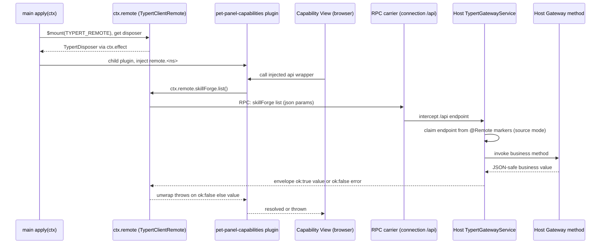

# Client-to-Host Typert Remote Bridge

dsh-pet-panel is built as **two faces that never share imports across the host/client edge**. The Node host bundle (`src/index.ts`) runs Cordis Gateways; the browser client bundle (`src/client/index.ts`) runs React slot views. The only thing that connects them is the **Typert remote bridge** — an explicit RPC contract where the host advertises methods and the client consumes them through a hand-written manifest. This page is the contract in detail: what each side declares, how the wire envelope is shaped, why the strict zod codecs and `compact()` exist, and the load-order constraint that keeps the capability views from touching an unmounted namespace.



Caption: The client-call → `$mount` → remote method → unwrapped value flow: the manifest is mounted in main `apply()`, the namespace services resolve in the `pet-panel-capabilities` child plugin, and a view's call crosses the RPC carrier to a source-mode-discovered host `@Remote` method before the result envelope is collapsed by `unwrap()`.

## The two sides of the boundary

The host only needs to *decorate* its methods; the client only needs to *describe* them. Neither side imports the other's implementation.

- **Host face (`src/index.ts`)** — four Gateways subclass `TypertRemoteService` and annotate public instance methods with `@Remote('<method>')`: `SkillForgeGateway` (`src/index.ts#L58-L201`), `ToolIntegrationsGateway` (`src/index.ts#L222-L326`), `A2AConfigGateway` (`src/index.ts#L429-L530`), and `TeamGateway` (`src/index.ts#L1195-L1442`). All four are registered in the host `apply()` (`src/index.ts#L1465-L1473`). The `TypertRemoteService` constructor binds the gateway to the same Cordis service key and wire namespace. Each `@Remote` method returns a **JSON-safe business value** (for example `{ items: [...] }`, `{ serverName }`, or a `Thread`).
- **Client face (`src/client/remote.ts`)** — a hand-written `TYPERT_REMOTE` manifest (`src/client/remote.ts#L157-L187`) with `package`, `descriptors`, and per-method **wire codecs** that mirror the host method signatures. The client never sees the Gateways; it mounts this manifest onto the Typert client remote and calls the namespaces through `ctx.remote.<ns>.<method>()`.

### The source-mode discovery rationale

The host identity of each method is discovered **without a generated `/typert` artifact**. The Typert Gateway service scans active Cordis Services, reads the `typertRemote` binding (`namespace`/`serviceKey`), and consults the private `@Remote` marker table (`remoteMethods`) to claim endpoints. The client manifest's descriptors therefore only need to be *compatible* with the host signatures — they are not a compiler-generated contract. The bridge is kept in sync by hand (see [Keeping the two halves in sync](#keeping-the-two-halves-in-sync)).

## The wire result envelope

The framework wraps every resolved business value into a discriminated envelope, and every failure into the other branch:

```
{ ok: true,  value: T }   |   { ok: false, error: { code, message, details } }
```

On the client, `unwrap()` collapses this envelope:

```ts
function unwrap<T>(r: { ok: true; value: T } | { ok: false; error?: { message?: string } }): T {
  if (!r.ok) throw new Error(r.error?.message ?? 'remote call failed')
  return r.value
}
```

`src/client/index.ts#L36-L40`. When `r.ok` is false the helper throws an `Error` carrying `r.error.message`. The capability views build their `api` objects by wrapping every call in `unwrap()`, so a host-side failure surfaces as a `Promise` rejection that each view's `try/catch` renders as an inline error (`src/client/index.ts#L99-L132`). The host-side failure mapping is what fills the error branch with `code`, `message`, and `details`, keeping boundary values out of the message.

## The manifest: ids, descriptors, and strict codecs

`src/client/remote.ts` builds each descriptor with a small set of helpers whose outputs match the protocol's `InvocationDescriptor` / `InvocationParameterDescriptor` / `TypertCodec` shapes (`src/client/remote.ts#L119-L155`):

- `jsonParam(name, schema)` — a position parameter with `source: 'json'`, wire name equal to the source name, and a **strict** codec (`mode: 'strict'`, `typeSymbol: dsh-pet-panel#param/<name>`, `schema`) (`src/client/remote.ts#L119-L127`).
- `strictResult(typeSymbol, schema)` — the method's business-return codec, also strict (`src/client/remote.ts#L129-L132`).
- `descriptor(namespace, method, parameters, resultSchema)` — assembles `{ id: dsh-pet-panel#<namespace>/<method>, service: namespace, namespace, method, invocation: { kind: 'direct' }, parameters, result }` (`src/client/remote.ts#L140-L155`).

Every entry uses `invocation: { kind: 'direct' }` because these are direct, unadorned calls (the `@Remote` markers on the host side are all direct too).

### Full descriptor surface

The manifest covers **four namespaces and twenty-two methods**, each with a strict result schema:

- **`skillForge`** — `list` → `{ items: SkillSummary[] }`; `read(name)` → `{ name, content }`; `write(name, content)` → `{ name }`; `delete(name)` → `{ name }`; `generate(description)` → `{ content }` (`src/client/remote.ts#L160-L165`). `generate` is the only method with a side effect beyond the skill directory: it streams the current default model to synthesize a `SKILL.md` (`src/index.ts#L117-L200`).
- **`toolIntegrations`** — `list` → `{ items: McpConfig & { mounted }[] }`; `read(serverName)` → `{ config }`; `write(config)` → `{ serverName }`; `delete(serverName)` → `{ serverName }` (`src/client/remote.ts#L166-L170`). `mcpConfig` uses an enum for `transport` (`stdio` | `streamable-http`) and `.optional()` for `command` / `args` / `env` / `cwd` / `url` / `headers` (`src/client/remote.ts#L30-L43`). The host saves configs to `mcp-servers.json` and hot-reloads the mounted loader entry on `write` (`src/index.ts#L285-L325`).
- **`a2aConfig`** — `get` → `{ card, agents }`; `setCard(card)` → `{ card }`; `upsertAgent(externalAgent)` → `{ name }`; `delete(name)` → `{ name }`; `checkAgents()` → `{ items: A2AHealthItem[] }` (`src/client/remote.ts#L171-L176`). `a2aExternalAgent` has `.optional()` `keywords` and `examples` (`src/client/remote.ts#L52-L59`); `checkAgents` probes each agent's `/.well-known/agent-card.json` with an 8s timeout and returns `online` / `latencyMs` / `error` per agent (`src/index.ts#L500-L529`).
- **`team`** — `listTeams` → `{ teams }`; `createTeam(name, members)` → `{ team }`; `updateTeam(id, name, members)` → `{ team }`; `deleteTeam(id)` → `{ id }`; `listThreads(teamId)` → `{ threads }`; `openThread(teamId, peer)` → `{ thread }`; `getThread(threadId)` → `{ thread }`; `send(threadId, text)` → `{ messages }` (`src/client/remote.ts#L177-L185`). `chatMessage` has `.optional()` `agent` plus an enum `role` (`user` | `agent` | `system`) (`src/client/remote.ts#L84-L90`); `thread` / `threadSummary` carry nullable `teamId` and `peer` (`src/client/remote.ts#L91-L106`).

The client also re-exports the inferred types it hands to its views — `A2ACard`, `A2AExternalAgent`, `A2AConfig`, `A2AHealth`, `Team`, `ChatMessage`, `ThreadSummary`, `Thread` (`src/client/remote.ts#L71-L74`, `#L114-L117`) — which are the same shapes the host returns.

## Why `compact()` is mandatory

The Typert boundary validates that any value crossing it is **JSON-safe**. `assertJsonValue` rejects non-plain objects, cyclic values, non-finite numbers, weakmap/symbol/sparse traps, and — critically — **`undefined`**: a plain object whose own property has `value: undefined` is not JSON-safe (`src/index.ts#L46-L56`).

The problem is that zod `.optional()` parsing does **not** delete the key when the value is absent — it leaves an own property whose value is `undefined`. So a host method that reconstructs an object from persisted data where some `.optional()` member is genuinely absent would produce `{ agent: undefined }`, and Typert would reject the whole payload with `"undefined is not JSON-safe"`, surfacing as a bogus "business result failed boundary validation".

The host strips those properties before returning, in `compact()`:

```ts
function compact<T extends Record<string, unknown>>(obj: T): T {
  const out: Record<string, unknown> = {}
  for (const [k, v] of Object.entries(obj)) {
    if (v !== undefined) out[k] = v
  }
  return out as T
}
```

`src/index.ts#L50-L56`. In the current surface it is used in the **team chat path**: `loadThread` decodes each persisted message and wraps the reconstructed literal in `compact(...)`, so the optional `agent` member — absent on `user`/`system` messages — is dropped before a `Thread` returned by `getThread` / `openThread` / `send` crosses the boundary (`src/index.ts#L1123-L1150`). The result schema for `chatMessage` declares `agent` as `z.string().optional()`, so without `compact()` those messages would carry an undefined-valued own property.

`compact()` is only needed where a result can contain a `.optional()` field that is genuinely absent. The `skillForge` and `toolIntegrations` business values are all-required, so they cross the boundary untouched; the `a2aExternalAgent` optional `keywords`/`examples` are normalized to empty arrays on the host side before return, so they are never `undefined` (`src/index.ts#L463-L485`).

## Keeping the two halves in sync

Adding or changing a remote method requires editing **both** sides:

1. Add (or rename) the `@Remote('<method>')` on the host `TypertRemoteService` subclass in `src/index.ts`, keeping the parameter list JSON-serializable and the return value JSON-safe.
2. Add (or update) a matching `descriptor(...)` in `src/client/remote.ts`, with `jsonParam` entries in the same order as the host method parameters and a strict zod result schema that matches the host return type.

The host does not need a generated artifact — the api-gateway reflects the `@Remote` markers at runtime. The client manifest is the only thing that tells the client how to encode parameters and decode the result, so a mismatch between the two produces an ambiguous endpoint or a "business result failed boundary validation" from the strict result codec. Because the host gateway types (`McpConfig`, `A2ACard`, `A2AExternalAgent`, `Team`, `Thread`, ...) and the client zod schemas mirror one another (host interfaces in `src/index.ts` vs. `z.infer` in `src/client/remote.ts#L71-L74`, `#L114-L117`), the two are verified against each other at build time only by matching shapes, not by a shared type.

## Mount order: namespaces resolve only after `$mount`

The bridge is mounted in `apply(ctx)` with:

```ts
const disposeRemote = await (ctx as any).remote.$mount(TYPERT_REMOTE)
ctx.effect(() => disposeRemote, 'pet-panel: unmount remote')
```

`src/client/index.ts#L191-L193`. The main client context inject is `['slots', 'locale', 'remote']` (`src/client/index.ts#L33`) — it only holds the `remote` service itself, not the mounted namespace sub-services.

This is why the **capability views are not registered in `apply()`**. They live in a child plugin `pet-panel-capabilities` whose inject list is `['slots', 'locale', 'remote', 'remote.skillForge', 'remote.toolIntegrations', 'remote.a2aConfig', 'remote.team']` (`src/client/index.ts#L231-L237`). The `remote.<ns>` entries are the namespace services mounted by `$mount`; they resolve only against the now-mounted namespaces inside that child plugin. `registerCapabilityViews` builds `skillApi`, `mcpApi`, `a2aApi`, `teamApi`, and a `teamA2aApi`, then registers the `skill-forge` / `tool-integrations` / `a2a-management` conversation views and the `team-panel` shell-overlay (`src/client/index.ts#L97-L168`). Touching `remote.skillForge` in the main `apply(ctx)` body would throw `without inject`, because that context only knows `remote`.

## Failure and lifecycle invariants

- **Disposal is fiber-scoped.** `$mount` returns a disposer (`TypertDisposer`) registered via `ctx.effect`, so unloading the plugin withdraws the exact contribution (`src/client/index.ts#L191-L193`).
- **Host method errors carry identity, boundary errors carry safety.** The api-gateway distinguishes business method throws (passed through) from infrastructure failures (wrapped with an endpoint and no boundary values). The client sees all of them as `{ ok: false, error }`, and `unwrap()` surfaces the message.
- **`compact()` must be re-applied to any new optional field a host method reconstructs from persisted data**, or the strict result codec rejects the payload at the boundary.
- **The a2a `get` result is a config object**, and the host normalizes optional agent fields to empty arrays before returning, so `a2aConfig` results are always JSON-safe without `compact()`.

## Related pages

- [Dual-Face Plugin Architecture](/openwiki/architecture/overview.md) — the top-level map of the two faces and the packaging wiring that makes `lib/index.js` and `lib/client.js` the two halves.
- [Build, Bundling, and Packaging](/openwiki/architecture/build-and-packaging.md) — how the host and client bundles are emitted, and why the `@Remote` decorators must be lowered by `tsc` for the host half.
