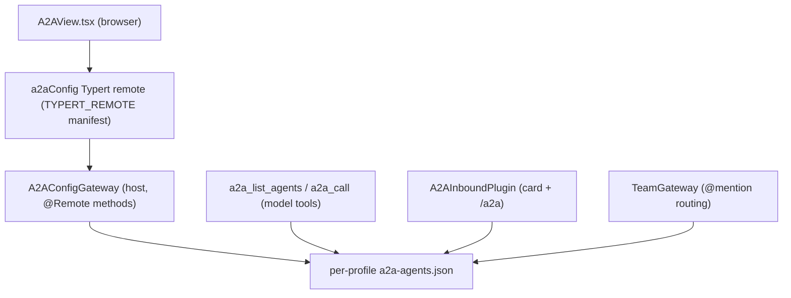
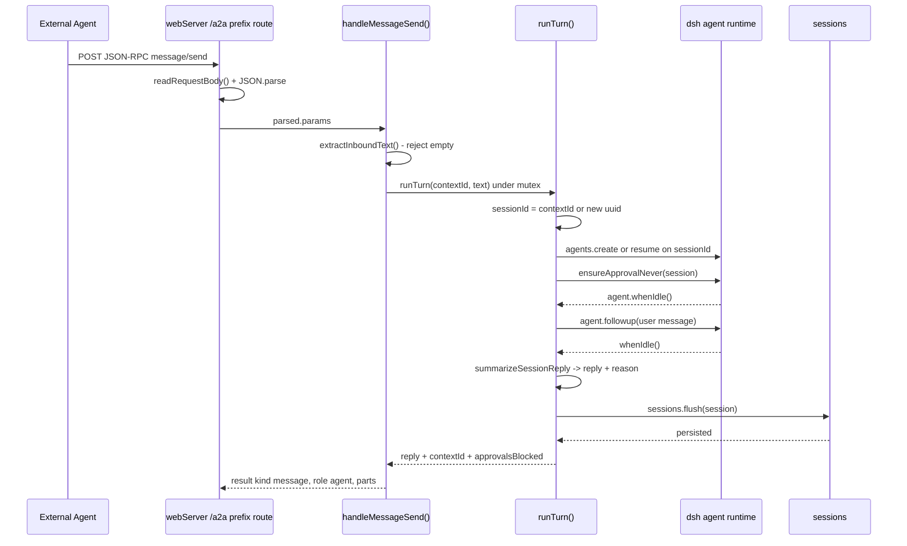

# A2A Protocol Surface

dsh-pet-panel implements the [A2A (Agent2Agent)](https://a2a-protocol.org) protocol at both ends of its dual-face architecture. The **host face** (`src/index.ts`) owns the whole protocol: a per-profile **card + external-agent registry** (the `a2aConfig` Typert remote), a pair of **model-facing outbound tools** (`a2a_list_agents`, `a2a_call`) that let the conversational agent discover and call other agents, and an **inbound A2A endpoint** (`/.well-known/agent-card.json` plus `/a2a` JSON-RPC `message/send`) that makes the local profile itself discoverable and callable as an agent — running the same dsh agent runtime as the WebUI. The **browser face** (`src/client/A2AView.tsx`) lets a user edit the card and the external-agent list and watch live agent health, riding the same `a2aConfig` remote. `TeamGateway` reuses the same registry to route group chats among "me" and the registered external agents.

This page is the protocol's domain model, its three planes (registry, outbound tools, inbound endpoint), the isolation invariant that keeps each profile's registry separate, the failure semantics of agent resolution and inbound reply generation, and the team reuse of the same registry.



Caption: the planes of the A2A surface — a single per-profile registry file fed by the management view, by the outbound model tools, by the inbound endpoint, and by the team routing engine.

## The domain model

Three interfaces in `src/index.ts` define the A2A data shape (`repo://src/index.ts#L330-L350`):

- **`A2ACard`** — `{ name, description, capabilities: string[] }`. The local agent's self-description, exposed to remote peers via the discovery endpoint.
- **`A2AExternalAgent`** — `{ name, url, description, capabilities: string[], keywords?: string[], examples?: string[] }`. A registered remote agent. `url` is its **agent card endpoint** (`.well-known/agent-card.json`); `keywords` (trigger terms) and `examples` (typical tasks) are explicit routing hints that bias the model toward this agent when a task matches them. `keywords` and `examples` are optional on the wire and normalized to empty arrays before persistence.
- **`A2AConfig`** — `{ card: A2ACard, agents: A2AExternalAgent[] }`. The whole registry, persisted as one JSON document.

The default registry (`DEFAULT_A2A_CONFIG`, `repo://src/index.ts#L352-L355`) is `{ card: { name: '叠纸游戏-Papergames', description: '', capabilities: [] }, agents: [] }` — a Papergames-branded card with no registered agents and no capabilities until the user fills them in.

## The per-profile registry and isolation invariant

The registry is the plugin's third self-authored per-profile data surface (alongside skills and MCP config). It lives at `join(a2aConfigDir(), 'a2a-agents.json')` (`repo://src/index.ts#L387-L389`), where `a2aConfigDir()` resolves deterministically from the active profile (`repo://src/index.ts#L376-L385`):

```ts
function a2aConfigDir(): string {
  const profile = profileNameFromArgv(process.argv)
  if (profile) return dshHomePath('profiles', profile)
  // fallback (non-dsh --profile start, e.g. running lib directly): legacy heuristic
  const env = process.env.DSH_PROFILE_DIR
  if (env) return env
  const cwd = process.cwd()
  if (existsSync(join(cwd, 'cordis.yml'))) return cwd
  return dshHomePath('')
}
```

The primary branch uses `dshHomePath('profiles', profile)`, so the registry resolves under `$DSH_HOME/profiles/<name>/a2a-agents.json`. `profileNameFromArgv()` (`repo://src/index.ts#L362-L369`) derives the profile from `process.argv` (`--profile <name>` or `--profile=<name>`), **not** from `process.cwd()`. This is the isolation invariant behind [Per-Profile Data Isolation](/openwiki/concepts/per-profile-isolation.md): because dsh does not `chdir` into the profile directory, a cwd-derived path would split one profile's registry into two copies (the global home from `dsh --profile <name>` in an arbitrary directory, and the profile directory from `cd <profile> && dsh`). Deriving from argv keeps the path deterministic for the process that spawned the plugin.

The fallback branches (`DSH_PROFILE_DIR`, a `cordis.yml`-bearing cwd, then the global home) are the escape hatch for non-`dsh --profile` startups such as running `lib` directly — these are the **contamination risk** documented on [Per-Profile Data Isolation](/openwiki/concepts/per-profile-isolation.md#a2a-path-determinism-and-the-contamination-risk).

Persistence is two functions: `loadA2AConfig()` reads and validates the file, returning a deep copy of `DEFAULT_A2A_CONFIG` when it is missing or malformed (`repo://src/index.ts#L395-L422`); `saveA2AConfig()` does an `mkdir -p` on the config dir then writes pretty-printed JSON (`repo://src/index.ts#L424-L427`). Load only accepts agents that have a string `name` and a string `url`, dropping anything else, and coerces card/agent fields through `strArray()` so every expected field is present.

## The `a2aConfig` Typert remote

`A2AConfigGateway` (`repo://src/index.ts#L429-L530`) is the host face of the registry — a `TypertRemoteService` subclass whose public methods carry `@Remote(...)` markers and are discovered in source mode (no generated `/typert` artifact). It exposes five methods:

| Method | Signature | Behavior |
| --- | --- | --- |
| `get` | `() => Promise<A2AConfig>` | Loads the current registry. |
| `setCard` | `(card: A2ACard) => Promise<{ card: A2ACard }>` | Replaces `config.card`, but only after name validation and normalization (name trimmed + non-empty; description and capabilities normalized to strings / string arrays). |
| `upsertAgent` | `(agent: A2AExternalAgent) => Promise<{ name }>` | Inserts or replaces an agent by `name` after validating a non-empty name and url, and normalizing optional fields to arrays. |
| `delete` | `(name: string) => Promise<{ name }>` | Removes every agent whose name matches the (non-empty) argument. |
| `checkAgents` | `() => Promise<{ items: { name, online, latencyMs, error }[] }>` | Live health probe of every registered agent (see below). |

`setCard` and `upsertAgent` reject empty names/urls with an `Error` (`repo://src/index.ts#L447-L485`), so a malformed card or agent never reaches disk. The method normalization keeps the persisted registry and the returned value JSON-safe: `keywords`/`examples` are always arrays, never `undefined`, which is why `a2aConfig` results cross the Typert boundary without the `compact()` stripping needed by the lifecycle snapshot (see [Client-to-Host Typert Remote Bridge](/openwiki/architecture/typert-remote-bridge.md#why-compact-is-mandatory)).

`checkAgents()` (`repo://src/index.ts#L496-L529`) probes each registered agent by HTTP `GET` to `a2aBaseUrl(agent.url) + '/.well-known/agent-card.json'` with an 8 second `AbortController` timeout. A non-OK HTTP status, a non-object JSON body, or an aborted/errored fetch is reported per agent as `online: false` with the failure in `error`; otherwise `online: true` with the measured `latencyMs`. The probe is read-only with no side effects, and the browser view polls it every 15 seconds to render live status badges.

The client half of the bridge is the hand-written `TYPERT_REMOTE` manifest in `src/client/remote.ts`. The `a2aConfig` codecs define the wire schemas — `a2aCard`, `a2aExternalAgent`, `a2aConfigResult`, `a2aCardResult`, `a2aNameResult`, `a2aHealthItem`, `a2aHealthResult` with `.optional()` `keywords` and `examples` (`repo://src/client/remote.ts#L45-L74`) — and the five descriptors (`get` / `setCard` / `upsertAgent` / `delete` / `checkAgents`), each with a strict zod result schema (`repo://src/client/remote.ts#L171-L176`). The inferred types (`A2ACard`, `A2AExternalAgent`, `A2AConfig`, `A2AHealth`) are re-exported to the views and mirror the host interfaces (`repo://src/client/remote.ts#L71-L74`). Keep the manifest in sync when changing `A2AConfigGateway`: add/rename the `@Remote('method')` on the host and the matching `descriptor(...)` on the client.

The browser consumes the remote through `A2AView.tsx`, which builds an `A2AApi` object (`{ get, setCard, upsertAgent, delete, checkAgents }`) wrapping every call in the `unwrap()` envelope helper (`repo://src/client/index.ts#L112-L118`, `repo://src/client/index.ts#L36-L39`). The view is registered into the `conversation.view` slot as `id: 'a2a-management'` with order 50 (`repo://src/client/index.ts#L152-L159`). It renders a **My Agent Card** form (name / description / comma-separated capabilities), a read-only **对外端点** block showing the derived `cardUrl` (`${origin}/.well-known/agent-card.json`) and `messageUrl` (`${origin}/a2a`), and an **External Agents** list with add/edit/delete plus a health polling loop (`checkHealth` on mount and every 15 s) that renders each agent as online/offline with `latencyMs` (`repo://src/client/A2AView.tsx#L70-L89`). The card and agent editable fields are joined by the `splitTags()` helper, which splits comma/Chinese-comma/newline-separated text into a trimmed string array (`repo://src/client/A2AView.tsx#L23-L25`).

## Outbound tools: `a2a_list_agents` and `a2a_call`

`registerA2ATools(ctx)` registers two model-facing tools through `ctx.tools.register(defineTool(...))` (`repo://src/index.ts#L653-L744`), hosted by the `A2AToolsPlugin` cordis `Service` (injecting `tools`, `repo://src/index.ts#L747-L754`). Together they let the model autonomously discover external agents and call them:

- **`a2a_list_agents`** — zero parameters. Loads the registry and returns `{ agents: [...] }` with each agent's `name`, `url`, `description`, `capabilities`, `keywords`, `examples`. Its `render` fold formats the list for the model/user, including capability and keyword hints (`repo://src/index.ts#L654-L700`).
- **`a2a_call`** — parameters `agent` (the registered name) and `message` (text to send). Loads the registry, resolves the target agent, and sends the message (`repo://src/index.ts#L702-L743`). Throws on an empty agent/message; otherwise resolves and calls.

### The agent resolution chain

`resolveAgent(agents, name)` (`repo://src/index.ts#L621-L650`) is the heart of `a2a_call`. It walks four increasingly fuzzy strategies and returns **only a unique match**; any ambiguity returns `null` so the caller can produce a corrective reply rather than mis-route:

<!-- openwiki: mermaid parse failed and this diagram was converted to a text fence so it does not break rendering. Fix the diagram source and restore the mermaid fence. Parser error: Heuristic: an unescaped angle bracket inside a label breaks rendering; rephrase the label. -->
```text
flowchart TD
    call["a2a_call execute"]
    load["loadA2AConfig (per-profile a2a-agents.json)"]
    res["resolveAgent name"]
    exact{"1. exact name match"}
    norm{"2. normalized single hit"}
    sub{"3. substring single hit"}
    lev{"4. Levenshtein unique min"}
    hit["target agent found"]
    miss["null - no unique match"]
    closure["candidate-closure reply: list registered agents"]
    send["a2aSendMessage JSON-RPC message/send"]
    base["a2aBaseUrl strips agent-card.json suffix"]
    reply["extractA2AReply -> reply text"]

    call --> load --> res
    res --> exact
    exact -->|yes| hit
    exact -->|no| norm
    norm -->|yes| hit
    norm -->|no| sub
    sub -->|yes| hit
    sub -->|no| lev
    lev -->|yes| hit
    lev -->|no| miss
    miss --> closure
    hit --> base --> send --> reply
```

Caption: the `a2a_call` resolution chain — exact, then normalized, then substring, then Levenshtein — returning a unique match or nulling into the candidate-closure reply.

The four stages (`repo://src/index.ts#L621-L650`):

1. **Exact** — an agent whose `name` equals the argument.
2. **Normalized** — `normalizeAgentName()` lowercases and strips spaces, hyphens, underscores, and interpuncts (`\s\-_·`) (`repo://src/index.ts#L602-L605`), neutralizing the character differences a model naturally introduces when reproducing a name; a single normalized hit is returned.
3. **Substring** — a registered name that contains the argument (either direction), case-insensitively; a single hit is returned.
4. **Levenshtein** — the full DP edit distance (`repo://src/index.ts#L608-L619`). After normalizing both sides, each agent gets a distance; only those within a threshold of `max(2, floor(norm.length / 3))` are kept, sorted ascending. A single in-threshold entry, or a unique lowest score strictly below the next, is returned; ties return `null`.

### The candidate closure

When `resolveAgent` returns `null`, `a2a_call` does **not** throw. It returns a corrective reply listing every registered agent's name and description, instructing the model to re-choose and retry (`repo://src/index.ts#L733-L738`). This is deliberate: the model can self-correct on the next tool call instead of the request failing hard. The reply's `agent` field is `''` to signal no agent was selected.

On a hit, the message is dispatched through `a2aSendMessage(a2aBaseUrl(target.url), message)` (`repo://src/index.ts#L740-L741`).

## Sending a message to an external agent

`a2aSendMessage(baseUrl, text, contextId?)` (`repo://src/index.ts#L571-L600`) posts a JSON-RPC `message/send` request:

```json
{ "jsonrpc": "2.0", "method": "message/send",
  "params": { "message": { "role": "user", "parts": [{ "kind": "text", "text" }] } },
  "id": 1 }
```

The endpoint is derived by `a2aBaseUrl()`, which strips the card-path suffixes (`/.well-known/agent-card.json` and `/agent-card.json`) and trailing slashes from the registered `url` so the JSON-RPC base is reached (`repo://src/index.ts#L535-L540`). The fetch is aborted after 120 s; a non-OK HTTP status and a non-JSON body each become a descriptive `Error`. The reply is pulled out of the A2A result by `extractA2AReply()` (`repo://src/index.ts#L543-L557`), which tolerates both the A2A v0.2 `Task` shape (`result.status.message`) and the v0.3 direct `Message` shape (`result.message`), then joins the text parts. `extractA2AContextId()` (`repo://src/index.ts#L559-L569`) pulls a `contextId` out of the same result (v0.2 `result.contextId` / `result.status.contextId` / `result.status.message.contextId`), and `a2aSendMessage` returns `{ text, contextId }`. An optional inbound `contextId` is threaded into the request params for multi-turn conversations. An empty reply throws.

Note that the outbound `a2a_call` tool calls `a2aSendMessage` without a `contextId` and discards the returned one, so the model-facing tool is single-turn per call; the **team** path is what threads `contextId` across a conversation (see below).

## Inbound: making the local profile an agent

`A2AInboundPlugin` (`repo://src/index.ts#L895-L1049`) is a cordis `Service` (injecting `webServer`, `agents`, `sessions`, `agentDefaultModel`) that exposes the local profile to remote peers through two routes registered on `ctx.webServer`:

- **Agent Card** — `/.well-known/agent-card.json`, an `exact` handler that serves the card built from the registry, advertising the `/a2a` message URL (derived from the request's `Host` header), `version: '1.0.0'`, `capabilities: { streaming: false, pushNotifications: false }`, `defaultInputModes`/`defaultOutputModes` of `['text']`, and `skills` mapped from the card's `capabilities` (`repo://src/index.ts#L921-L945`).
- **JSON-RPC** — `/a2a`, a `prefix` handler (chosen to avoid the SPA's `/` fallback) that requires `POST`, parses the body, and dispatches only `message/send`. A non-`POST` request gets `405`; any other method gets an HTTP `400` whose body carries a JSON-RPC `-32601` "unknown method" error (`repo://src/index.ts#L948-L982`).

`message/send` flows through `handleMessageSend()` → `runTurn()` (`repo://src/index.ts#L986-L1048`), which turns an inbound call into a real agent reply by running the **same dsh agent runtime the WebUI uses** — tools, skills, MCP config, multi-turn memory and session persistence all apply, rather than a bespoke single-turn prompt:



Caption: the inbound `message/send` request flow — contextId→sessionId mapping, live agent reuse, fail-closed approval, then a real agent turn whose reply is wrapped in the A2A result envelope and persisted for later resume.

### The agent-loop handler

`extractInboundText()` (`repo://src/index.ts#L768-L777`) pulls plain text from either `message.parts` or `message.content` (the v0.2/v0.3 difference), rejecting an empty body. `runTurn()` then:

1. Resolves the model via `agentDefaultModel.currentSelection()` and sets `sessionId = contextId ?? randomUUID()` — so the A2A `contextId` **is** the dsh `sessionId`.
2. Resumes or creates the agent on that session: with a `contextId`, `agents.resume({ resumeSessionId: sessionId })`; without one, `agents.create({ sessionId, ... })` (`repo://src/index.ts#L1003-L1017`).
3. Caches the live agent handle in `this.live` (keyed by sessionId) and serializes concurrent turns through a per-`contextId` `mutex`, so two simultaneous messages on the same conversation can't interleave (`repo://src/index.ts#L902-L904`, `L990-L996`).
4. Forces the approval policy to `never` via `ensureApprovalNever()`, waits for idle, feeds the user message through `agent.followup(...)`, waits again, and summarizes the final assistant text and turn `reason` with `summarizeSessionReply()` (`repo://src/index.ts#L999-L1035`).
5. Persists the session with `this.sessions.flush(agent.session)` and collects any tools that were blocked by approval with `collectBlockedApprovals()` (`repo://src/index.ts#L1036-L1039`). On failure it disposes the live handle so the next request re-creates/resumes.

The step where the model requests a tool that needs approval is **fail-closed**: because there is no interactive approval channel on the inbound path, `ensureApprovalNever()` (`repo://src/index.ts#L863-L873`) appends an `approval/policy` event (or returns if it already exists) so a request for approval resolves to a deterministic rejection instead of hanging. `collectBlockedApprovals()` (`repo://src/index.ts#L876-L887`) records every `approval/asked` event (with its tool name and reason) from the turn, and those blocked tools are returned in the JSON-RPC result's `metadata.approvalsBlocked` (`repo://src/index.ts#L960-L972`) — making the no-approval-channel restriction observable to the caller instead of silently swallowed.

The reply is wrapped as `{ kind: 'message', role: 'agent', parts: [{ kind: 'text', text }], contextId, ...(approvalsBlocked.length ? { metadata: { approvalsBlocked } } : {}) }` in a JSON-RPC `result` echo of the inbound `id` (`repo://src/index.ts#L962-L972`). Because `contextId` equals `sessionId` and the session is flushed, a remote peer that sends the same `contextId` on a later call resumes the same session after a process restart through `sessionPersistence`.

## Team reuse of the A2A registry

`TeamGateway` (`repo://src/index.ts#L1195-L1442`) reuses the same per-profile `a2a-agents.json` registry and `resolveAgent` for routing group and direct threads. A thread's members are names from the registry plus the reserved `"me"`; `@name` mentions are resolved against `config.agents` filtered to that thread's members via the same exact→normalized→substring→Levenshtein chain (`repo://src/index.ts#L1371`). An unresolved `@` yields a system message listing the valid members rather than a dropped message. For each target member, `send()` dispatches concurrently with `Promise.allSettled`: the `"me"` member answers through `replyAsSelf()` (the card-driven `llm.stream` lightweight reply, `repo://src/index.ts#L785-L843`), while external members are called through `a2aSendMessage(a2aBaseUrl(agent.url), text, prev)` where `prev` is that member's stored `contextId` — threading multi-turn memory across the thread and resetting it on a `/context/`-tagged failure (`repo://src/index.ts#L1397-L1412`). So the team path is both the multi-turn consumer of the outbound transport and a second consumer of the same agent registry that the inbound endpoint and the outbound tools already read.

## Invariants, failures, and extension points

- **Per-profile isolation is the crux.** The registry path must resolve under the active profile via `profileNameFromArgv(process.argv)`, never from `process.cwd()` — a cwd-derived path silently splits a profile's A2A config into two copies. See [Per-Profile Data Isolation](/openwiki/concepts/per-profile-isolation.md).
- **Name/url validation is the traversal and integrity guard.** Empty card/agent names and empty agent urls are rejected before persistence (`repo://src/index.ts#L447-L485`), and agents without a string `name` and `url` are dropped on load (`repo://src/index.ts#L406-L415`). The registry otherwise accepts arbitrary user/guest content, all normalized to the declared shapes.
- **Resolution returns a unique match or null, never a guessed one.** Ambiguity in normalized, substring, or edit-distance matching routes into the candidate closure rather than a potentially wrong target (`repo://src/index.ts#L621-L650`).
- **The outbound reply is a self-correction surface, not a hard error.** A failed resolve returns a listing reply; a transport or protocol failure throws and surfaces as a tool error the model can react to (`repo://src/index.ts#L733-L738`).
- **The inbound endpoint is a full agent, fail-closed on approval.** It reuses the WebUI agent runtime (tools, skills, MCP, multi-turn, session persistence), maps `contextId`→`sessionId`, and forces `approval/policy` to `never` so tool approvals become deterministic rejections reported in `metadata.approvalsBlocked` (`repo://src/index.ts#L999-L1047`, `L863-L887`).
- **`a2aConfig` results are JSON-safe without `compact()`.** Because `keywords`/`examples` are normalized to arrays before returning, the `a2aConfig` namespace doesn't need the `undefined`-stripping required by the lifecycle snapshot (see [Client-to-Host Typert Remote Bridge](/openwiki/architecture/typert-remote-bridge.md#why-compact-is-mandatory)).
- **Changing `A2AConfigGateway` requires editing both halves.** Update the `@Remote` host method and the matching `descriptor`/codec in `src/client/remote.ts`, or the strict result codec rejects the payload at the boundary (see [Keeping the two halves in sync](/openwiki/architecture/typert-remote-bridge.md#keeping-the-two-halves-in-sync)).

## Related pages

- [Dual-Face Plugin Architecture](/openwiki/architecture/overview.md) — the host plugins registered in `apply()`: `ProfileSkillProviderPlugin`, `SkillForgeGateway`, `ToolIntegrationsGateway`, `A2AConfigGateway`, `A2AToolsPlugin`, `A2AInboundPlugin`, and `TeamGateway`.
- [Client-to-Host Typert Remote Bridge](/openwiki/architecture/typert-remote-bridge.md) — the `a2aConfig` manifest codecs, the wire envelope, `unwrap()`, and the two-halves-in-sync rule.
- [Per-Profile Data Isolation](/openwiki/concepts/per-profile-isolation.md) — the invariant that the `a2a-agents.json` registry resolves under the active profile, including the A2A path fallback and contamination risk.
- [Browser Client Surfaces](/openwiki/workflows/client-surface.md) — the `conversation.view` slot registration of the `a2a-management` A2A panel.
- [Team Workflows](/openwiki/workflows/team.md) — the `TeamGateway` reuse of the A2A registry for @mention routing and `contextId`-backed multi-turn.
- [Quickstart / Task-Routing Map](/openwiki/quickstart.md) — the routing entry point that points A2A changes here.
