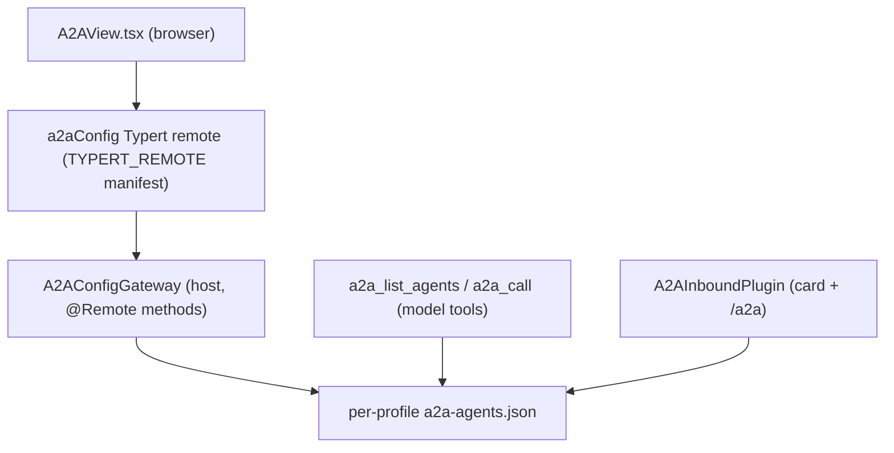
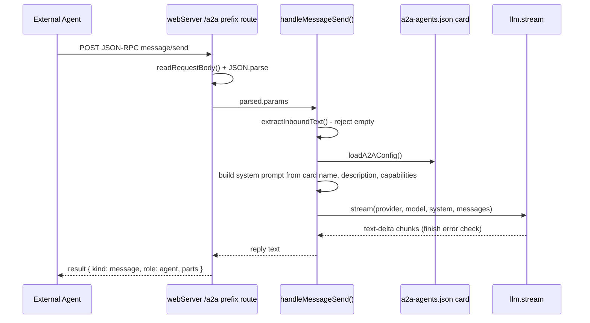

# A2A Protocol Surface

dsh-pet-panel implements the [A2A (Agent2Agent)](https://a2a-protocol.org) protocol at both ends of its dual-face architecture. The **host face** (`src/index.ts`) owns the whole protocol: a per-profile **card + external-agent registry** (the `a2aConfig` Typert remote), a pair of **model-facing outbound tools** (`a2a_list_agents`, `a2a_call`) that let the conversational agent discover and call other agents, and an **inbound A2A endpoint** (`/.well-known/agent-card.json` plus `/a2a` JSON-RPC `message/send`) that makes the local profile itself discoverable and callable as an agent. The **browser face** (`src/client/A2AView.tsx`) lets a user edit the card and the external-agent list, riding the same `a2aConfig` remote.

This page is the protocol's domain model, its three planes (registry, outbound tools, inbound endpoints), the isolation invariant that keeps each profile's registry separate, and the failure semantics of agent resolution and inbound reply generation.



Caption: the three planes of the A2A surface — a single registry file fed by the management view, the outbound model tools, and the inbound endpoint.

## The domain model

Three interfaces in `src/index.ts` define the A2A data shape (`repo://src/index.ts#L539-L559`):

- **`A2ACard`** — `{ name, description, capabilities: string[] }`. The local agent's self-description, exposed to remote peers via the discovery endpoint.
- **`A2AExternalAgent`** — `{ name, url, description, capabilities: string[], keywords?: string[], examples?: string[] }`. A registered remote agent. `url` is its **agent card endpoint** (`.well-known/agent-card.json`); `keywords` (trigger terms) and `examples` (typical tasks) are explicit routing hints that biased the LLM toward this agent when a task matches them. `keywords` and `examples` are optional on the wire and normalized to empty arrays before persistence.
- **`A2AConfig`** — `{ card: A2ACard, agents: A2AExternalAgent[] }`. The whole registry, persisted as one JSON document.

The default registry (`DEFAULT_A2A_CONFIG`, `repo://src/index.ts#L561-L564`) is `{ card: { name: '叠纸游戏-Papergames', description: '', capabilities: [] }, agents: [] }` — a Papergames-branded card with no registered agents and no capabilities until the user fills them in.

## The per-profile registry and isolation invariant

The registry is the plugin's third self-authored per-profile data surface (alongside skills and MCP config). It lives at `join(a2aConfigDir(), 'a2a-agents.json')` (`repo://src/index.ts#L596-L598`), where `a2aConfigDir()` resolves deterministically from the active profile (`repo://src/index.ts#L585-L594`):

```ts
function a2aConfigDir(): string {
  const profile = profileNameFromArgv(process.argv)
  if (profile) return dshHomePath('profiles', profile)
  // fallback (non-dsh --profile start, e.g. running lib directly): legacy heuristic
  const env = process.env.DSH_PROFILE_DIR
  if (env) return env
  const cwd = process.cwd()
  if (existsSync(join(cwd, 'cordis.yml'))) return cwd
  return dshHomePath('')
}
```

The primary branch uses `dshHomePath('profiles', profile)`, so the registry resolves under `$DSH_HOME/profiles/<name>/a2a-agents.json`. `profileNameFromArgv()` (`repo://src/index.ts#L571-L578`) derives the profile from `process.argv` (`--profile <name>` or `--profile=<name>`), **not** from `process.cwd()`. This is the isolation invariant behind [Per-Profile Data Isolation](/openwiki/concepts/per-profile-isolation.md): because dsh does not `chdir` into the profile directory, a cwd-derived path would split one profile's registry into two copies (the global home from `dsh --profile <name>` in an arbitrary directory, and the profile directory from `cd <profile> && dsh`). Deriving from argv keeps the path deterministic for the process that spawned the plugin.

The fallback branches (`DSH_PROFILE_DIR`, a `cordis.yml`-bearing cwd, then the global home) are the escape hatch for non-`dsh --profile` startups such as running `lib` directly — these are the **contamination risk** documented on [Per-Profile Data Isolation](/openwiki/concepts/per-profile-isolation.md#a2a-path-determinism-and-the-contamination-risk).

Persistence is two functions: `loadA2AConfig()` reads and validates the file, returning `DEFAULT_A2A_CONFIG` (a deep copy) when it is missing or malformed (`repo://src/index.ts#L604-L631`); `saveA2AConfig()` does an `mkdir -p` on the config dir then writes pretty-printed JSON (`repo://src/index.ts#L633-L636`). Load only accepts agents that have a string `name` and a string `url`, dropping anything else.

## The `a2aConfig` Typert remote

`A2AConfigGateway` (`repo://src/index.ts#L638-L704`) is the host face of the registry — a `TypertRemoteService` subclass whose public methods carry `@Remote(...)` markers and are discovered in source mode (no generated `/typert` artifact). It exposes four methods:

| Method | Signature | Behavior |
| --- | --- | --- |
| `get` | `() => Promise<A2AConfig>` | Loads the current registry. |
| `setCard` | `(card: A2ACard) => Promise<{ card: A2ACard }>` | Replaces `config.card`, but only after name validation and normalization (name trimmed + non-empty; description and capabilities normalized to strings / string arrays). |
| `upsertAgent` | `(agent: A2AExternalAgent) => Promise<{ name }>` | Inserts or replaces an agent by `name` after validating a non-empty name and url, and normalizing optional fields to arrays. |
| `delete` | `(name: string) => Promise<{ name }>` | Removes every agent whose name matches the (non-empty) argument. |

`setCard` and `upsertAgent` reject empty names/urls with an `Error` (`repo://src/index.ts#L656-L693`), so a malformed card or agent never reaches disk. The method normalization keeps the persisted registry and the returned value JSON-safe: `keywords`/`examples` are always arrays, never `undefined`, which is why `a2aConfig` results cross the Typert boundary without the `compact()` stripping needed by the lifecycle snapshot (see [Client-to-Host Typert Remote Bridge](/openwiki/architecture/typert-remote-bridge.md#why-compact-is-mandatory)).

The client half of the bridge is the hand-written `TYPERT_REMOTE` manifest in `src/client/remote.ts`. The `a2aConfig` codecs define the wire schemas — `a2aCard`, `a2aExternalAgent`, `a2aConfigResult`, `a2aCardResult`, `a2aNameResult` with `.optional()` `keywords` and `examples` (`repo://src/client/remote.ts#L79-L98`) — and the four descriptors (`get` / `setCard` / `upsertAgent` / `delete`), each with a strict zod result schema (`repo://src/client/remote.ts#L153-L157`). The inferred types (`A2ACard`, `A2AExternalAgent`, `A2AConfig`) are re-exported to the views and mirror the host interfaces (`repo://src/client/remote.ts#L96-L98`). Keep the manifest in sync when changing `A2AConfigGateway`: add/rename the `@Remote('method')` on the host and the matching `descriptor(...)` on the client.

The browser consumes the remote through `A2AView.tsx`, which builds an `A2AApi` object (`{ get, setCard, upsertAgent, delete }`) wrapping every call in the `unwrap()` envelope helper (`repo://src/client/index.ts#L113-L118`, `repo://src/client/index.ts#L36-L40`). The view is registered into the `conversation.view` slot as `id: 'a2a-management'` with order 50 (`repo://src/client/index.ts#L138-L145`). It renders a **My Agent Card** form (name / description / comma-separated capabilities), a read-only **对外端点** block showing the derived `cardUrl` (`${origin}/.well-known/agent-card.json`) and `messageUrl` (`${origin}/a2a`), and an **External Agents** list with add/edit/delete. The card and agent editable fields are joined by the `splitTags()` helper, which splits comma/Chinese-comma/newline-separated text into a trimmed string array (`repo://src/client/A2AView.tsx#L21-L24`).

## Outbound tools: `a2a_list_agents` and `a2a_call`

`registerA2ATools(ctx)` registers two model-facing tools through `ctx.tools.register(defineTool(...))` (`repo://src/index.ts#L812-L904`), hosted by the `A2AToolsPlugin` cordis `Service` (injecting `tools`, `repo://src/index.ts#L907-L914`). Together they let the model autonomously discover external agents and call them:

- **`a2a_list_agents`** — zero parameters. Loads the registry and returns `{ agents: [...] }` with each agent's `name`, `url`, `description`, `capabilities`, `keywords`, `examples`. Its `render` fold formats the list for the model/user, including capability and keyword hints (`repo://src/index.ts#L815-L860`).
- **`a2a_call`** — parameters `agent` (the registered name) and `message` (text to send). Loads the registry, resolves the target agent, and sends the message (`repo://src/index.ts#L863-L903`). Throws on an empty agent/message; otherwise resolves and calls.

### The agent resolution chain

`resolveAgent(agents, name)` (`repo://src/index.ts#L785-L810`) is the heart of `a2a_call`. It walks four increasingly fuzzy strategies and returns **only a unique match**; any ambiguity returns `null` so the caller can produce a corrective reply rather than mis-route:

<!-- openwiki: mermaid parse failed and this diagram was converted to a text fence so it does not break rendering. Fix the diagram source and restore the mermaid fence. Parser error: Heuristic: an unescaped angle bracket inside a label breaks rendering; rephrase the label. -->
```text
flowchart TD
    call["a2a_call execute"]
    load["loadA2AConfig (per-profile a2a-agents.json)"]
    res["resolveAgent name"]
    exact{"1. exact name match"}
    norm{"2. normalized single hit? [lowercase, strip space - _ ]"}
    sub{"3. substring single hit? [either direction contains]"}
    lev{"4. Levenshtein: unique min within threshold"}
    hit["target agent found"]
    miss["null - no unique match"]
    closure["candidate-closure reply: list registered agents"]
    send["a2aSendMessage(JSON-RPC message/send)"]
    base["a2aBaseUrl strips /agent-card.json suffix"]
    reply["extractA2AReply -> reply text"]

    call --> load --> res
    res --> exact
    exact -->|"yes"| hit
    exact -->|"no"| norm
    norm -->|"yes"| hit
    norm -->|"no"| sub
    sub -->|"yes"| hit
    sub -->|"no"| lev
    lev -->|"yes"| hit
    lev -->|"no"| miss
    miss --> closure
    hit --> base --> send --> reply
```

Caption: the `a2a_call` resolution chain — exact, then normalized, then substring, then Levenshtein — returning a unique match or nulling into the candidate-closure reply.

The four stages (`repo://src/index.ts#L781-L810`):

1. **Exact** — an agent whose `name` equals the argument.
2. **Normalized** — `normalizeAgentName()` lowercases and strips spaces, hyphens, underscores, and interpuncts (`\s\-_·`) (`repo://src/index.ts#L763-L765`), neutralizing the character differences an LLM naturally introduces when reproducing a name; a single normalized hit is returned.
3. **Substring** — a registered name that contains the argument (either direction), case-insensitively; a single hit is returned.
4. **Levenshtein** — the full DP edit distance (`repo://src/index.ts#L768-L779`). After normalizing both sides, each agent gets a distance; only those within a threshold of `max(2, floor(norm.length / 3))` are kept, sorted ascending. A single in-threshold entry, or a unique lowest score strictly below the next, is returned; ties return `null`.

### The candidate closure

When `resolveAgent` returns `null`, `a2a_call` does **not** throw. It returns a corrective reply listing every registered agent's name and description, instructing the model to re-choose and retry (`repo://src/index.ts#L893-L899`). This is deliberate: the model can self-correct on the next tool call instead of the request failing hard. The reply's `agent` field is `''` to signal no agent was selected.

On a hit, the message is dispatched through `a2aSendMessage(a2aBaseUrl(target.url), message)` (`repo://src/index.ts#L900-L901`).

## Sending a message to an external agent

`a2aSendMessage(baseUrl, text)` (`repo://src/index.ts#L734-L760`) posts a JSON-RPC `message/send` request:

```json
{ "jsonrpc": "2.0", "method": "message/send",
  "params": { "message": { "role": "user", "parts": [{ "kind": "text", "text" }] } },
  "id": 1 }
```

The endpoint is derived by `a2aBaseUrl()`, which strips the card-path suffixes (`/.well-known/agent-card.json` and `/agent-card.json`) and trailing slashes from the registered `url` so the JSON-RPC base is reached (`repo://src/index.ts#L709-L714`). The fetch is aborted after 120 s; a non-OK HTTP status and a non-JSON body each become a descriptive `Error`. The reply is pulled out of the A2A result by `extractA2AReply()` (`repo://src/index.ts#L717-L731`), which tolerates both the A2A v0.2 `Task` shape (`result.status.message`) and the v0.3 direct `Message` shape (`result.message`), then joins the text parts. An empty reply throws.

## Inbound: making the local profile an agent

`A2AInboundPlugin` (`repo://src/index.ts#L940-L1055`) is a cordis `Service` (injecting `webServer`, `llm`, `agentDefaultModel`) that exposes the local profile to remote peers through two routes registered on `ctx.webServer`:

- **Agent Card** — `/.well-known/agent-card.json`, an `exact` handler that serves the card built from the registry, advertising the `/a2a` message URL (derived from the request's `Host` header), `version: '1.0.0'`, `capabilities: { streaming: false, pushNotifications: false }`, `defaultInputModes`/`defaultOutputModes` of `['text']`, and `skills` mapped from the card's `capabilities` (`repo://src/index.ts#L954-L979`).
- **JSON-RPC** — `/a2a`, a `prefix` handler (chosen to avoid the SPA's `/` fallback) that requires `POST`, parses the body, and dispatches only `message/send` (other methods get a `-32601` "unknown method" error; `405` for non-POST) (`repo://src/index.ts#L982-L1010`).

`message/send` flows through `handleMessageSend()` (`repo://src/index.ts#L1013-L1054`), which turns an inbound call into a real agent reply:



Caption: the inbound `message/send` request flow — card-derived system prompt, then a `llm.stream` reply wrapped in the A2A result envelope.

### The inbound system prompt

`extractInboundText()` pulls plain text from either `message.parts` or `message.content` (the v0.2/v0.3 difference), rejecting an empty body (`repo://src/index.ts#L929-L937`). Then `handleMessageSend` builds the system message from the registry card (name, description, joined capabilities, plus an instruction to answer concisely and accurately in Chinese) and selects the model via `agentDefaultModel.currentSelection()` (`repo://src/index.ts#L1019-L1028`). It streams through `this.llm.stream(...)`, accumulating `text-delta` chunks and folding a `finish` error chunk into a thrown `Error`; an empty reply is rejected (`repo://src/index.ts#L1037-L1052`). The reply is wrapped as `{ type: 'message', role: 'agent', parts: [{ kind: 'text', text }] }` in a JSON-RPC `result` echo of the inbound `id` (`repo://src/index.ts#L996-L1000`).

The inbound handler is explicitly a **lightweight reply**, not a full agent loop: it has no tool-calling or multi-turn memory — that would need a preset mount and is deferred (`repo://src/index.ts#L1017-L1018`). This is an important extension boundary: an inbound caller gets a single-turn, model-only response, not the full conversational harness.

## Invariants, failures, and extension points

- **Per-profile isolation is the crux.** The registry path must resolve under the active profile via `profileNameFromArgv(process.argv)`, never from `process.cwd()` — a cwd-derived path silently splits a profile's A2A config into two copies. See [Per-Profile Data Isolation](/openwiki/concepts/per-profile-isolation.md).
- **Name/url validation is the traversal and integrity guard.** Empty card/agent names and empty agent urls are rejected before persistence (`repo://src/index.ts#L656-L693`), and agents without a string `name` and `url` are dropped on load (`repo://src/index.ts#L615-L616`). The registry otherwise accepts arbitrary user/guest content, all normalized to the declared shapes.
- **Resolution returns a unique match or null, never a guessed one.** Ambiguity in normalized, substring, or edit-distance matching routes into the candidate closure rather than a potentially wrong target (`repo://src/index.ts#L781-L810`).
- **The outbound reply is a self-correction surface, not a hard error.** A failed resolve returns a listing reply; a transport or protocol failure throws and surfaces as a tool error the model can react to (`repo://src/index.ts#L893-L899`).
- **The inbound endpoint is single-turn model-only.** Its card-driven system prompt and `llm.stream` reply are the whole agent; tools and memory require a preset mount (an intentional deferred enhancement) (`repo://src/index.ts#L1017-L1018`).
- **`a2aConfig` results are JSON-safe without `compact()`.** Because `keywords`/`examples` are normalized to arrays before returning, the `a2aConfig` namespace doesn't need the `undefined`-stripping required by the lifecycle snapshot (see [Client-to-Host Typert Remote Bridge](/openwiki/architecture/typert-remote-bridge.md#why-compact-is-mandatory)).
- **Changing `A2AConfigGateway` requires editing both halves.** Update the `@Remote` host method and the matching `descriptor`/codec in `src/client/remote.ts`, or the strict result codec rejects the payload at the boundary (see [Keeping the two halves in sync](/openwiki/architecture/typert-remote-bridge.md#keeping-the-two-halves-in-sync)).

## Related pages

- [Dual-Face Plugin Architecture](/openwiki/architecture/overview.md) — the six host plugins including `A2AConfigGateway`, `A2AToolsPlugin`, and `A2AInboundPlugin`.
- [Client-to-Host Typert Remote Bridge](/openwiki/architecture/typert-remote-bridge.md) — the `a2aConfig` manifest codecs, the wire envelope, `unwrap()`, and the two-halves-in-sync rule.
- [Per-Profile Data Isolation](/openwiki/concepts/per-profile-isolation.md) — the invariant that the `a2a-agents.json` registry resolves under the active profile, including the A2A path fallback and contamination risk.
- [Browser Client Surfaces](/openwiki/workflows/client-surface.md) — the `conversation.view` slot registration of the `a2a-management` A2A panel.
- [Quickstart / Task-Routing Map](/openwiki/quickstart.md) — the routing entry point that points A2A changes here.
