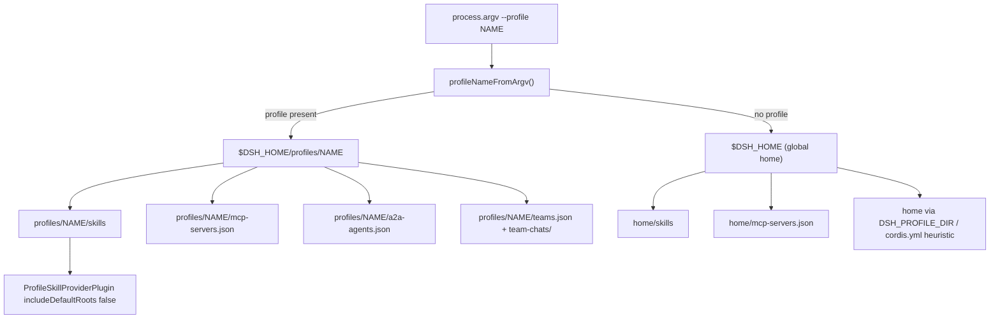

# Per-Profile Data Isolation

dsh-pet-panel's three self-service host data surfaces — **skills**, **MCP server config**, and **A2A agent registry** — plus its **team / team-chat** data are the only things the plugin persists for a user, and they are all scoped to the **active dsh profile**. A profile is a named DeepSeek Harness environment (`dsh --profile <name>`). The plugin never touches a profile-agnostic global config for these surfaces: each profile sees only the skills it created, only the MCP servers it configured, only the A2A agents it registered, and only the teams and threads it created.

This page is the isolation invariant that the **[Dual-Face Plugin Architecture](/openwiki/architecture/overview.md)** and the four workflows ([Skill Forge](/openwiki/workflows/skill-forge.md), [Tool Integrations](/openwiki/workflows/tool-integrations.md), [A2A](/openwiki/concepts/a2a-protocol.md), [Team](/openwiki/workflows/team.md)) all depend on.

## The invariant

The profile data root is deterministic and **does not depend on the process working directory**:

```
$DSH_HOME/profiles/<name>/skills/<skill-name>/SKILL.md
$DSH_HOME/profiles/<name>/mcp-servers.json
$DSH_HOME/profiles/<name>/a2a-agents.json
$DSH_HOME/profiles/<name>/teams.json
$DSH_HOME/profiles/<name>/team-chats/<thread-id>.json
```

`dshHomePath(...)` (from `@deepseek-ai/dsh-home-paths`) joins child segments onto `resolveDshHome()`, whose precedence is: an explicitly configured path, then `$DSH_HOME`, then the default `~/.dsh` (`repo://node_modules/@deepseek-ai/dsh-home-paths/lib/index.js#L73-L84`). Every path below is built through that helper, so the profile root always lands under the same single dsh home regardless of where the process was launched.



Caption: profile-name → profile root → per-surface paths, with the global-home fallback that is the contamination risk.

## Deriving the profile from argv, not cwd

dsh does **not** `chdir` into the profile directory when launching a profile, and it does **not** expose the profile directory to plugins. The only reliable signal available to the plugin is that `--profile <name>` is always present in `process.argv`. `profileNameFromArgv()` extracts the name from either `--profile <name>` or `--profile=<name>` (`repo://src/index.ts#L362-L369`). This argv-based derivation is deliberate and must be preserved if the launch conditions change — it is what makes the path set deterministic.

Every resolver in `src/index.ts` calls `profileNameFromArgv(process.argv)` freshly, rather than caching a value from module load. This keeps the active profile consistent with the process that spawned the plugin, even though the host face runs inside a single dsh process.

## The surface resolvers

| Surface | Active-profile path | Global fallback (no `--profile`) |
| --- | --- | --- |
| Skills | `dshHomePath('profiles', profile, 'skills')` | `dshHomePath('skills')` |
| MCP | `dshHomePath('profiles', profile, 'mcp-servers.json')` | `dshHomePath('mcp-servers.json')` |
| A2A | `dshHomePath('profiles', profile)` | heuristic, see below |
| Team / chat | `a2aConfigDir()` → `teams.json` + `team-chats/` | same heuristic |

**Skills** — `skillRoot()` returns the profile skills dir when a profile is active, else the global `dshHomePath('skills')` (`repo://src/index.ts#L22-L25`). `SkillForgeGateway` reads and writes `<skillRoot>/<name>/SKILL.md` for `list` / `read` / `write` / `delete`.

**MCP** — `MCP_FILE()` returns the profile `mcp-servers.json` when a profile is active, else the global `dshHomePath('mcp-servers.json')` (`repo://src/index.ts#L205-L208`). `ToolIntegrationsGateway` reads and writes this file and hot-mounts the configured servers through `ctx.loader`.

**A2A** — `a2aConfigDir()` returns `dshHomePath('profiles', profile)` when a profile is active (`repo://src/index.ts#L376-L385`); the config file is `join(a2aConfigDir(), 'a2a-agents.json')` (`repo://src/index.ts#L387-L389`).

**Team / team-chat** — both `teams.json` and the `team-chats/` directory are resolved under `a2aConfigDir()`: `TEAMS_FILE = () => join(a2aConfigDir(), 'teams.json')` and `TEAM_CHATS_DIR = () => join(a2aConfigDir(), 'team-chats')` (`repo://src/index.ts#L1089-L1090`). `TeamGateway` reads/writes the teams list through `loadTeams`/`saveTeams` and persists each thread as `<TEAM_CHATS_DIR>/<threadId>.json` via `threadFile()` (`repo://src/index.ts#L1119-L1121`, `repo://src/index.ts#L1195-L1205`). Because the team and chat data lives under the same `a2aConfigDir()` root, the A2A fallback heuristic also governs team isolation.

## Per-profile skill loading: `ProfileSkillProviderPlugin`

The host face registers exactly one skill provider. `ProfileSkillProviderPlugin` (`repo://src/index.ts#L1449-L1463`) injects `skills` and registers a `FileSystemSkillProvider` from `@deepseek-ai/dsh-skill-filesystem` with:

```ts
{
  providerName: 'profile',
  includeDefaultRoots: false,
  customSkillDirs: [skillRoot()],
  watch: false,
}
```

- **`includeDefaultRoots: false`** is the isolation crux. It tells the provider to omit the project and user skill roots — `~/.dsh/skills` and `~/.agents/skills` — and the `$DSH_BUNDLED_SKILL_DIR` environment default, so the **global** skill roots are not also loaded alongside the profile directory. The provider scans only the explicitly configured `customSkillDirs`, which is `skillRoot()` (the active profile's skills dir).
- **`customSkillDirs: [skillRoot()]`** points the provider at the profile path, so the `ctx.skills` registry sees only that profile's skills.
- **`watch: false`** disables filesystem watching for this provider, since the profile skill directory is the plugin's own authored surface rather than a shared, externally-edited tree.
- Reusing `FileSystemSkillProvider` means the plugin inherits dsh's own discovery logic — YAML-frontmatter parsing and `isSkillName` validation — rather than reimplementing skill loading.

This is why a skill created in profile `web` is invisible in profile `research`: the registry only ever receives candidates from the active profile's `skills/` directory.

## A2A path determinism and the contamination risk

The A2A resolver is the one surface with a non-trivial fallback, and its rationale is documented in code (`repo://src/index.ts#L371-L385`). The core path is deterministic:

```ts
function a2aConfigDir(): string {
  const profile = profileNameFromArgv(process.argv)
  if (profile) return dshHomePath('profiles', profile)
  // fallback (non-dsh --profile start, e.g. running lib directly): legacy heuristic
  const env = process.env.DSH_PROFILE_DIR
  if (env) return env
  const cwd = process.cwd()
  if (existsSync(join(cwd, 'cordis.yml'))) return cwd
  return dshHomePath('')
}
```

The comment is explicit about why this must not depend on `process.cwd()`: if the A2A config path were cwd-derived, then `dsh --profile <name>` from an arbitrary directory and `cd <profile> && dsh` would resolve to **different** roots — one landing on the global home and one on the profile directory. That would silently split a profile's A2A configuration into two copies that never see each other.

This is the **contamination risk** that applies to all four surfaces: any resolver that accidentally resolves to the global home instead of the profile directory splits that profile's data into two copies. `skillRoot()` and `MCP_FILE()` have the same failure mode when `--profile` parsing fails or is absent. In practice launches carry `--profile`, but the global fallbacks and the A2A heuristic remain the escape hatch for non-`dsh` startup paths.

## Path-validation guardrails

Because skill, agent, and thread names are user/guest-supplied and are joined onto the profile path, they are validated before any filesystem operation:

- **Skill names** must match `^[A-Za-z0-9_-]{1,64}$` via `assertName()` (`repo://src/index.ts#L14-L20`); `SkillForgeGateway.read` / `write` / `delete` all call it before joining the name under `skillRoot()` (`repo://src/index.ts#L27-L34`, `repo://src/index.ts#L95-L115`). This blocks path traversal out of the profile's skills directory.
- **A2A agent card and external agent names** are trimmed and required to be non-empty before upsert (`repo://src/index.ts#L447-L485`).
- **Team thread ids** must match `^[A-Za-z0-9-]{1,64}$` via the `THREAD_ID_RE` guard (`repo://src/index.ts#L1092`); `getThread` and `send` test the id before using it as a filename under `team-chats/`, which blocks path traversal out of the profile's team-chats directory (`repo://src/index.ts#L1326-L1336`).
- **Session ids** for the lifecycle trace must match `^session-[A-Za-z0-9-]+$`.

## Configuration and operations

- The profile data root is `~/.dsh/profiles/<name>/` (or `$DSH_HOME/profiles/<name>/` when `DSH_HOME` is set), and `DSH_HOME` overrides only the home root, never the `profiles/<name>` layout.
- Installing the plugin into a profile (e.g. `dsh plugin --profile web add github:zw11591-sketch/dsh-pet-panel`, then `dsh --profile web`) causes all surfaces to resolve under that profile.
- Each of `SkillForgeGateway`, `ToolIntegrationsGateway`, `A2AConfigGateway`, and `TeamGateway` is a `TypertRemoteService` exposing its surface over the Typert bridge consumed by the corresponding client view (`SkillForgeView`, `ToolIntegrationsView`, `A2AView`, `TeamView`). The client views explicitly document that they operate on the current profile's data (`repo://src/client/SkillForgeView.tsx#L1`, `repo://src/client/ToolIntegrationsView.tsx#L1`, `repo://src/client/A2AView.tsx#L1-L2`).

## Related pages

- [Dual-Face Plugin Architecture](/openwiki/architecture/overview.md) — the host and client faces; the plugins including `ProfileSkillProviderPlugin`.
- [Skill Forge](/openwiki/workflows/skill-forge.md) — authoring `SKILL.md` files under the active profile.
- [Tool Integrations](/openwiki/workflows/tool-integrations.md) — MCP server config under the active profile.
- [A2A Protocol](/openwiki/concepts/a2a-protocol.md) — the A2A card and external-agent registry, including the A2A path fallback.
- [Team](/openwiki/workflows/team.md) — teams and team-chat threads under the active profile.
