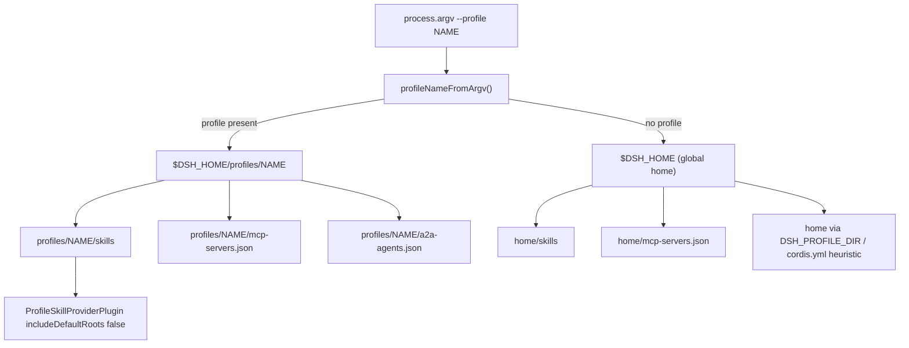

# Per-Profile Data Isolation

dsh-pet-panel's three self-service host data surfaces — **skills**, **MCP server config**, and **A2A agent registry** — are the only things the plugin persists for a user, and they are all scoped to the **active dsh profile**. A profile is a named DeepSeek Harness environment (`dsh --profile <name>`). The plugin never touches a profile-agnostic global config for these surfaces: each profile sees only the skills it created, only the MCP servers it configured, and only the A2A agents it registered.

This page is the isolation invariant that the **[Dual-Face Plugin Architecture](/openwiki/architecture/overview.md)** and the three workflows ([Skill Forge](/openwiki/workflows/skill-forge.md), [Tool Integrations](/openwiki/workflows/tool-integrations.md), [A2A](/openwiki/concepts/a2a-protocol.md)) all depend on.

## The invariant

The profile data root is deterministic and **does not depend on the process working directory**:

```
$DSH_HOME/profiles/<name>/skills/<skill-name>/SKILL.md
$DSH_HOME/profiles/<name>/mcp-servers.json
$DSH_HOME/profiles/<name>/a2a-agents.json
```

`dshHomePath(...)` (from `@deepseek-ai/dsh-home-paths`) joins child segments onto `resolveDshHome()`, whose precedence is: an explicitly configured path, then `$DSH_HOME`, then the default `~/.dsh` (`repo://node_modules/@deepseek-ai/dsh-home-paths/lib/index.js#L73-L84`). Every path below is built through that helper, so the profile root always lands under the same single dsh home regardless of where the process was launched.



Caption: profile-name → profile root → per-surface paths, with the global-home fallback that is the contamination risk.

## Deriving the profile from argv, not cwd

dsh does **not** `chdir` into the profile directory when launching a profile, and it does **not** expose the profile directory to plugins. The only reliable signal available to the plugin is that `--profile <name>` is always present in `process.argv`. `profileNameFromArgv()` extracts the name from either `--profile <name>` or `--profile=<name>` (`repo://src/index.ts#L566-L578`). This argv-based derivation is deliberate and must be preserved if the launch conditions change — it is what makes the path set deterministic.

Every resolver in `src/index.ts` calls `profileNameFromArgv(process.argv)` freshly, rather than caching a value from module load. This keeps the active profile consistent with the process that spawned the plugin, even though the host face runs inside a single dsh process.

## The three surface resolvers

| Surface | Active-profile path | Global fallback (no `--profile`) |
| --- | --- | --- |
| Skills | `dshHomePath('profiles', profile, 'skills')` | `dshHomePath('skills')` |
| MCP | `dshHomePath('profiles', profile, 'mcp-servers.json')` | `dshHomePath('mcp-servers.json')` |
| A2A | `dshHomePath('profiles', profile)` | heuristic, see below |

**Skills** — `skillRoot()` returns the profile skills dir when a profile is active, else the global `dshHomePath('skills')` (`repo://src/index.ts#L23-L26`). `SkillForgeGateway` reads and writes `<skillRoot>/<name>/SKILL.md` for `list` / `read` / `write` / `delete`.

**MCP** — `MCP_FILE()` returns the profile `mcp-servers.json` when a profile is active, else the global `dshHomePath('mcp-servers.json')` (`repo://src/index.ts#L414-L417`). `ToolIntegrationsGateway` reads and writes this file and hot-mounts the configured servers through `ctx.loader`.

**A2A** — `a2aConfigDir()` returns `dshHomePath('profiles', profile)` when a profile is active (`repo://src/index.ts#L587`); the config file is `join(a2aConfigDir(), 'a2a-agents.json')` (`repo://src/index.ts#L596-L598`).

## Per-profile skill loading: `ProfileSkillProviderPlugin`

The host face registers exactly one skill provider. `ProfileSkillProviderPlugin` (`repo://src/index.ts#L1062-L1076`) injects `skills` and registers a `FileSystemSkillProvider` from `@deepseek-ai/dsh-skill-filesystem` with:

```ts
{
  providerName: 'profile',
  includeDefaultRoots: false,
  customSkillDirs: [skillRoot()],
  watch: false,
}
```

- **`includeDefaultRoots: false`** is the isolation crux. It tells the provider to omit the project and user skill roots — `~/.dsh/skills` and `~/.agents/skills` — and the `$DSH_BUNDLED_SKILL_DIR` environment default, so the **global** skill roots are not also loaded alongside the profile directory. The provider scans only the explicitly configured `customSkillDirs`, which is `skillRoot()` (the active profile's skills dir).
- **`customSkillDirs: [skillRoot()]`** points the provider at the profile path, so the `ctx.skills` registry sees only that profile's skills.
- **`watch: false`** disables filesystem watching for this provider, since the profile skill directory is the plugin's own authored surface rather than a shared, externally-edited tree.
- Reusing `FileSystemSkillProvider` means the plugin inherits dsh's own discovery logic — YAML-frontmatter parsing and `isSkillName` validation — rather than reimplementing skill loading (`repo://src/index.ts#L1057-L1061`).

This is why a skill created in profile `web` is invisible in profile `research`: the registry only ever receives candidates from the active profile's `skills/` directory.

## A2A path determinism and the contamination risk

The A2A resolver is the one surface with a non-trivial fallback, and its rationale is documented in code (`repo://src/index.ts#L580-L594`). The core path is deterministic:

```ts
function a2aConfigDir(): string {
  const profile = profileNameFromArgv(process.argv)
  if (profile) return dshHomePath('profiles', profile)
  // fallback (non-dsh --profile start, e.g. running lib directly): legacy heuristic
  const env = process.env.DSH_PROFILE_DIR
  if (env) return env
  const cwd = process.cwd()
  if (existsSync(join(cwd, 'cordis.yml'))) return cwd
  return dshHomePath('')
}
```

The comment is explicit about why this must not depend on `process.cwd()`: if the A2A config path were cwd-derived, then `dsh --profile <name>` from an arbitrary directory and `cd <profile> && dsh` would resolve to **different** roots — one landing on the global home and one on the profile directory. That would silently split a profile's A2A configuration into two copies that never see each other.

This is the **contamination risk** that applies to all three surfaces: any resolver that accidentally resolves to the global home instead of the profile directory splits that profile's data into two copies. `skillRoot()` and `MCP_FILE()` have the same failure mode when `--profile` parsing fails or is absent. In practice launches carry `--profile`, but the global fallbacks and the A2A heuristic remain the escape hatch for non-`dsh` startup paths.

## Path-validation guardrails

Because skill and agent names are user/guest-supplied and are joined onto the profile path, they are validated before any filesystem operation:

- **Skill names** must match `^[A-Za-z0-9_-]{1,64}$` via `assertName()` (`repo://src/index.ts#L14-L21`); `SkillForgeGateway.read` / `write` / `delete` all call it before joining the name under `skillRoot()` (`repo://src/index.ts#L196-L216`). This blocks path traversal out of the profile's skills directory.
- **Session ids** for the lifecycle trace must match `^session-[A-Za-z0-9-]+$` (`repo://src/index.ts#L306-L308`).
- **A2A external agent and card names** are trimmed and required to be non-empty before upsert (`repo://src/index.ts#L656-L703`).

## Configuration and operations

- The profile data root is `~/.dsh/profiles/<name>/` (or `$DSH_HOME/profiles/<name>/` when `DSH_HOME` is set), and `DSH_HOME` overrides only the home root, never the `profiles/<name>` layout.
- Installing the plugin into a profile (e.g. `dsh plugin --profile web add github:zw11591-sketch/dsh-pet-panel`, then `dsh --profile web`) causes all three surfaces to resolve under that profile.
- Each of `SkillForgeGateway`, `ToolIntegrationsGateway`, and `A2AConfigGateway` is a `TypertRemoteService` exposing its surface over the Typert bridge consumed by the corresponding client view (`SkillForgeView`, `ToolIntegrationsView`, `A2AView`). The client views explicitly document that they operate on the current profile's data (`repo://src/client/SkillForgeView.tsx#L1`, `repo://src/client/ToolIntegrationsView.tsx#L1`, `repo://src/client/A2AView.tsx#L1-L2`).

## Related pages

- [Dual-Face Plugin Architecture](/openwiki/architecture/overview.md) — the host and client faces; the six plugins including `ProfileSkillProviderPlugin`.
- [Skill Forge](/openwiki/workflows/skill-forge.md) — authoring `SKILL.md` files under the active profile.
- [Tool Integrations](/openwiki/workflows/tool-integrations.md) — MCP server config under the active profile.
- [A2A Protocol](/openwiki/concepts/a2a-protocol.md) — the A2A card and external-agent registry, including the A2A path fallback.
