# Session Lifecycle Trace (zstd JSONL)

The Task Manager's **生命周期** tab shows a per-session execution trace — every turn, step, tool call, message, approval, and todo write that a session produced. That trace is not built from live session state. It is **reconstructed by re-reading the session's own log file**, which dsh keeps as a zstd-compressed JSONL file, and folding each record into a flat event stream. This page is how that reconstruction works: where the log lives, how it is decompressed, how each record type becomes a lifecycle event, and the invariants that make the parse resilient.

```mermaid
flowchart LR
    id["sessionId (regex ^session-[A-Za-z0-9-]+$)"]
    id --> scan["findSessionFile()"]
    scan --> root["$DSH_HOME/sessions workspace tree"]
    root -->|"dsh reads only the workspace that contains session/<id>/session.jsonl.zstd"| file["session.jsonl.zstd"]
    file --> decomp["decompressZstdFrames()"]
    decomp -->|"scan 28 B5 2F FD magic bytes, decompress each frame"| text["UTF-8 JSONL text"]
    text --> switch["switch (rec.type) event-kind parser"]
    switch --> events["LivecycleEvent[] (compact per event)"]
    switch --> stats["aggregate counters + startedAt/endedAt + title"]
    events --> snap["LifecycleSnapshot (compact)"]
    stats --> snap
    snap -->|"typert.remote.skillForge.lifecycle"| client["TaskManagerView / LifecycleTimeline"]
```



Caption: from a matching session id to the rendered lifecycle timeline: locate the log, decompress its zstd frames, parse each JSONL record into a flat event, aggregate a snapshot, and return it over the `skillForge.lifecycle` remote.

## The RPC surface and why it sits under `skillForge`

`lifecycle(sessionId)` is an `@Remote` method on `SkillForgeGateway` and is exposed under the **`skillForge` namespace** — it is the sixth method of that namespace beside `list` / `read` / `write` / `delete` / `generate` (`repo://src/index.ts#L303-L410`; descriptor `repo://src/client/remote.ts#L147`). It is not a separate namespace (there is no `lifecycle` service) because it is a host-side read-only inspection over a data surface the client already talks to. The result `LifecycleSnapshot` crosses the Typert boundary with the same `{ ok: true, value } | { ok: false, error }` envelope described on the [Client-to-Host Typert Remote Bridge](/openwiki/architecture/typert-remote-bridge.md).

On the client, the Task Manager wires this namespace method into the panel through a wrapper that `unwrap()`s the envelope:

```ts
const lifecycle = async (sessionId: string): Promise<LifecycleSnapshot> =>
  unwrap(await ctx.remote.skillForge.lifecycle(sessionId))
ctx.slots.inject('shell.overlay', () => ctx.slots.register({
  name: 'shell.overlay',
  id: 'task-manager-panel',
  order: 100,
  inject: () => ({ lifecycle }),
}, TaskManagerView))
```

`repo://src/client/index.ts#L150-L157`. The wrapper is created inside the `pet-panel-capabilities` child plugin precisely because that child injects `remote.skillForge` after `$mount`; the main `apply()` context only holds `remote`. `TaskManagerView` receives the wrapper as the optional `lifecycle` prop (`repo://src/client/TaskManagerView.tsx#L26-L28`), caches the fetched snapshot per session id in a `cache` map, and surfaces a loading / error state per node (`repo://src/client/TaskManagerView.tsx#L293-L313`).

The wire codec mirrors the host shape: `lifecycleResult` is `{ title, turns, steps, toolCalls, approvals, todoWrites, startedAt, endedAt, events[] }` where each `lifecycleEvent` has required `seq`/`time`/`kind` and `.optional()` `turn`/`step`/`text`/`toolName`/`toolArgs`/`isError`/`outcome`/`reason`/`todos` (`repo://src/client/remote.ts#L30-L58`). The host interface versions are `LifecycleEvent` and `LifecycleSnapshot` (`repo://src/index.ts#L48-L74`).

## Where the log lives: `findSessionFile()`

dsh stores each session's event log at `<workspace>/<sessionId>/session.jsonl.zstd` under a **workspace tree** rooted at `$DSH_HOME/sessions`. The plugin does not know which workspace a session belongs to, so `findSessionFile()` scans the directory tree:

1. `readdir($DSH_HOME/sessions)` and collect the immediate subdirectories as candidate workspaces (a failed read returns `null` immediately — no log found).
2. For each workspace, `access(<workspace>/<sessionId>/session.jsonl.zstd)` and return the first hit; a miss falls through to the next workspace.

`repo://src/index.ts#L97-L117`. The scan is linear over workspaces and terminates on the first file that exists. The caller already guarded the id against path traversal before this scan:

```ts
if (typeof sessionId !== 'string' || !/^session-[A-Za-z0-9-]+$/.test(sessionId)) {
  throw new Error(`invalid session id: ${sessionId}`)
}
```

`repo://src/index.ts#L306-L308`. Together with the fixed `session.jsonl.zstd` filename and the `join()` of small name segments, this prevents the id from escaping the sessions root. A missing log is a thrown `找不到会话日志：<id>` from the `lifecycle` method (`repo://src/index.ts#L309-L310`), which the client renders as that node's error.

## Multi-frame zstd decompression

dsh writes the log as **multiple zstd frames** — roughly one frame per write batch — and Node's single-frame `zstdDecompressSync` only decodes the first frame. `decompressZstdFrames()` therefore scans the buffer for the zstd frame magic bytes (`28 B5 2F FD`) and decompresses each frame independently (`repo://src/index.ts#L76-L95`):

```ts
function decompressZstdFrames(buf: Buffer): string {
  const positions: number[] = []
  for (let i = 0; i <= buf.length - 4; i++) {
    if (buf[i] === 0x28 && buf[i + 1] === 0xb5 && buf[i + 2] === 0x2f && buf[i + 3] === 0xfd) {
      positions.push(i)
    }
  }
  if (positions.length === 0) return ''
  positions.push(buf.length)
  const parts: string[] = []
  for (let i = 0; i < positions.length - 1; i++) {
    try {
      parts.push(zstdDecompressSync(buf.subarray(positions[i], positions[i + 1])).toString('utf8'))
    } catch {
      // 跳过坏帧
    }
  }
  return parts.join('\n')
}
```

Two design points matter:

- **No magic bytes → empty text.** If the buffer has no frame marker, the function returns `''` and the parser produces zero events. This is the graceful path for a truncated or non-zstd file, not a thrown error.
- **Per-frame isolation.** Each frame is decompressed in its own `try/catch`; a corrupt frame is skipped and the remaining frames still contribute their records. This is the practical way the parse tolerates partially-written logs — exactly the resilience the page's instruction points at: the session log format is owned by dsh, so the parser must not fail the whole trace over one bad frame.

The decoded chunks are joined with `\n`, which is what the JSONL line loop expects.

## The event-kind switch and aggregation

After decompression, the `lifecycle` method splits the text into lines, parses each line as JSON inside a `try/catch` (unparseable lines are skipped), reads `rec.time` / `rec.seq` / `rec.data` (`d`), and switches on `rec.type` (`repo://src/index.ts#L315-L406`). Each record carries `rec.time` (a number) and a nested `rec.data` object holding kind-specific payload.

### Event `kind` values produced

The switch maps the dsh log `type` to a `kind` the client understands, and in most cases also updates an aggregate:

| Log `rec.type` | Event `kind` | Aggregate effect |
| --- | --- | --- |
| `session/title` | — (no event) | sets `title` from `d.title` |
| `turn/start` | `turn-start` | `turns = max(turns, turn)` |
| `turn/end` | `turn-end` | — |
| `step/start` | `step-start` | `steps++` (every step/start counts) |
| `step/end` | `step-end` | — |
| `user/message` | `user` | — (only if it has text) |
| `assistant/message` | `assistant` | — (only if it has a text block) |
| `tool/call` | `tool-call` | `toolCalls++` |
| `tool/result` | `tool-result` | — |
| `approval/asked` | `approval-asked` | `approvals++` |
| `approval/decided` | `approval-decided` | — |
| `todo/write` | `todo` | `todoWrites++` |
| (any other type) | — | — |

The client's `eventBody`/`eventIcon` switches mirror these kinds (with `turn-start` / `turn-end` / `step-start` / `step-end` groupings) to render icons and labels (`repo://src/client/TaskManagerView.tsx#L119-L151`). An unknown `rec.type` simply produces no event and no counter change — an extension point for future log record types without breaking existing traces.

### Per-record semantics worth calling out

- **`turn` and `step` are routed from `d`**, and only when they are numbers (`repo://src/index.ts#L337-L338`). They feed the optional `turn`/`step` fields on each event, so the flat stream can be re-grouped by turn client-side.
- **`turns` is `Math.max`ed, `steps` is incremented.** The comment documents why the two differ: turn numbers are monotonically increasing within a session, so the max turn number is the true turn count; step numbering *resets each turn*, so summing `step/start` events is the only reliable step count.
- **`startedAt` is the first non-zero `rec.time`; `endedAt` is the latest non-zero `rec.time`** (`repo://src/index.ts#L333-L335`). Records with a non-number or zero `time` are still parsed for content but do not advance the window.
- **Text-bearing events are skipped when empty.** A `user/message` only emits a `user` event if `extractText(d.content)` returns non-empty text; an `assistant/message` only emits an `assistant` event if it finds a `text` block (`repo://src/index.ts#L358-L368`). Both are truncated to **400 chars**.
- **`tool/result` error flagging** uses `extractToolResult(d.message.content)` (which pulls the `tool-result` content block's text and `isError`), OR-ed with `rec.error != null` (`repo://src/index.ts#L381-L386`).
- **`todo/write` filters and reshapes `d.todos`** to `{ content, status }` pairs where both are strings, and the array is emitted on a single `todo` event (`repo://src/index.ts#L394-L404`).

### Truncation limits

`truncate(s, n)` appends an ellipsis when `s.length > n` (`repo://src/index.ts#L143-L145`). It is applied to the header/argument/long-text fields of the trace so a single huge tool result or message cannot blow up the flat event payload:

- `user` / `assistant` text → 400 chars
- `tool-result` text → 400 chars
- `tool-call` `toolArgs` → 200 chars (stringified if `d.arguments` is not already a string)
- `approval-asked` `reason` → 200 chars

`repo://src/index.ts#L358-L403`.

## Aggregates and `compact()`

The final snapshot carries the scalar aggregates plus the event array:

```ts
return compact({ title, turns, steps, toolCalls, approvals, todoWrites, startedAt, endedAt, events })
```

`repo://src/index.ts#L408`. `turns` / `steps` / `toolCalls` / `approvals` / `todoWrites` are the counts from the switch, `startedAt` / `endedAt` are the time window, `title` comes from the last `session/title` record, and `events` is the ordered flat stream.

`compact()` strips any own property whose value is `undefined` (`repo://src/index.ts#L151-L157`). In the lifecycle path it is applied in two places: once **per event** as each event literal is pushed, and once to the whole snapshot. This is not cosmetic — the Typert boundary rejects `undefined` as not JSON-safe, and the zod `.optional()` fields (`turn`, `step`, `text`, `toolName`, `toolArgs`, `isError`, `outcome`, `reason`, `todos`) are only sometimes present. Without `compact()`, an event that genuinely lacks a `step` would carry `{ step: undefined }` and the whole result would fail boundary validation with `"business result failed boundary validation"` (see the [Client-to-Host Typert Remote Bridge](/openwiki/architecture/typert-remote-bridge.md) page for the full rationale).

## Client rendering: grouping the flat stream

The client re-groups the flat event stream by turn rather than trusting the snapshot's turn count. `LifecycleTimeline` walks `snap.events`, tracks the current turn number starting at 1 (advancing it whenever it sees a `turn-start` with a defined `turn`), buckets each event under `ev.turn ?? currentTurn`, sorts the turn keys ascending, and defaults to opening turn 1 (`repo://src/client/TaskManagerView.tsx#L154-L165`). Each turn header shows its tool-call count and event count; each event row renders its icon, a body built from the `kind`-specific fields, and a local time (`repo://src/client/TaskManagerView.tsx#L119-L151`, `#L191-L207`).

The header stats line uses the snapshot aggregates directly: `共 {snap.turns} 轮 · {snap.steps} 步 · {snap.toolCalls} 次工具调用`, plus optional approval / todo / time window additions (`repo://src/client/TaskManagerView.tsx#L178-L183`). Because the client groups by `turn-start` markers rather than trusting `snap.turns` for the grouping bound, a snapshot with zero `turn-start` events renders the empty state `无执行记录（草稿会话）` — the "draft session" case.

## Invariants and failure semantics

- **A missing or unreadable log is a distinguished error, not a crash.** `findSessionFile()` returns `null` and the method throws `找不到会话日志`. The client shows that per-node error text.
- **Bad frames and bad lines are skipped, never fatal.** A corrupt zstd frame is skipped per-frame; a non-JSON line is skipped per-line; a record type not in the switch produces no event. The parse yields whatever subset of the trace it could recover.
- **`time` is tolerated as zero or missing.** Records without a valid numeric `time` still contribute content events but do not advance `startedAt`/`endedAt`.
- **Timestamps are wall-clock** but the meaningful ordering is the `seq` field's, which is why `seq` is carried on every event and used as the React key in the client (`repo://src/client/TaskManagerView.tsx#L202`).
- **The event `kind` string is the contract.** The host switch and the client `eventBody`/`eventIcon` switches must stay aligned; the host is the single source of `kind` values, and the client's `default:` branches (rendering the raw kind) make a new kind degrade gracefully rather than crash.

## Config and operations

- The trace source is a **read-only** file: `$DSH_HOME/sessions/<workspace>/<sessionId>/session.jsonl.zstd`. The plugin never writes to it; it is dsh's own log.
- Session ids are validated against `^session-[A-Za-z0-9-]+$` before any filesystem access (`repo://src/index.ts#L306-L308`).
- There is no pagination or streaming: the whole log is read, decompressed, and parsed per request, and text/tool-argument fields are truncated to bound the payload size.
- The RPC is mounted per-profile like the rest of the host gateways; because the log lives under `$DSH_HOME/sessions`, it is not profile-scoped the way skills/MCP/A2A are (see [Per-Profile Data Isolation](/openwiki/concepts/per-profile-isolation.md) for the surfaces that are).

## Related pages

- [Client-to-Host Typert Remote Bridge](/openwiki/architecture/typert-remote-bridge.md) — the `{ ok, value } | { ok, error }` envelope, the `compact()` JSON-safety requirement, and the mount-order constraint that places the `lifecycle` wrapper in the capabilities child plugin.
- [Dual-Face Plugin Architecture](/openwiki/architecture/overview.md) — where `SkillForgeGateway` and the Task Manager panel sit in the two-face layout.
- [Skill Forge](/openwiki/workflows/skill-forge.md) — the namespace that also owns `lifecycle`.
