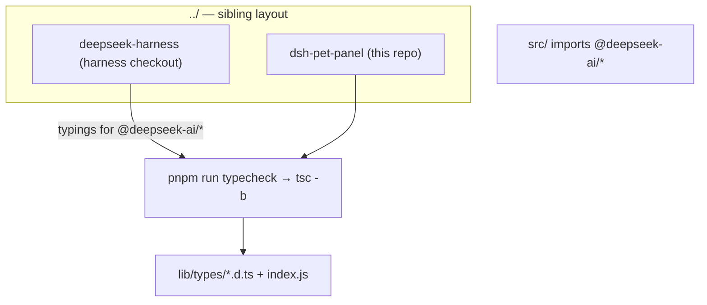
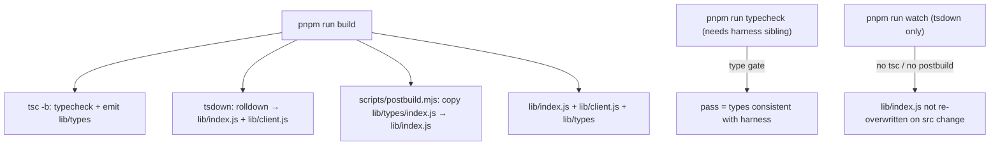

# Development, Build, and Verification

dsh-pet-panel is a TypeScript npm package built from a single `src/` tree into a dual host/client artifact. Its day-to-day workflow is unusual in two ways: **the type gate needs a sibling DeepSeek Harness checkout** (because `tsc -b` resolves project references against the harness tree), and **there is no automated test suite** in the repo. Verification is therefore the type gate plus the (non-type-checking) build plus running the loaded plugin. This page is the operational map for that workflow.

The authoritative inputs are `package.json` (scripts/versions), `tsconfig.json` (the type gate), `scripts/postbuild.mjs`, the two `tsdown` configs, and the OpenWiki workflow in `.github/workflows/openwiki-update.yml`. The emitted `lib/*` bundles and the tsc output are the ground truth for what ships; do **not** hand-edit `lib/*`.

## Prerequisite: sibling-checkout layout

`pnpm run typecheck` invokes `tsc -b`, a **composite project build** that type-checks the whole repo and emits declarations into `lib/types`. Because the source imports `@deepseek-ai/*` packages whose typings come from the DeepSeek Harness checkout, the harness repo must sit **as a sibling** of this repo so the resolver can reach it:

```text
../
├── deepseek-harness   # your DeepSeek Harness checkout
└── dsh-pet-panel      # this repo
```

This is why the ordinary `build`/`prepare` use `tsdown`/a non-reference path, and why the "run everything" CI/dev gate (`typecheck`) deliberately depends on the harness sibling. If a local checkout is not a sibling, `tsc -b` cannot resolve the harness tree and the type gate fails; see [tsc project references need the sibling harness checkout](#the-type-gate-tsc--b-needs-the-harness-sibling).



Caption: the type gate resolves `@deepseek-ai/*` typings from the sibling harness checkout, which is why the two repos must be siblings.

## Install and the pnpm>=10 allowBuilds issue

Install dependencies with npm's package manager (`packageManager: "pnpm@11.7.0"`):

```sh
pnpm install
```

A **git-source install** (`dsh plugin --profile web add github:zw11591-sketch/dsh-pet-panel`) triggers the package's `prepare` script, so pnpm ≥ 10 **blocks** the build until you explicitly allow it. pnpm prints the exact package key to allow; add it to the profile's `pnpm-workspace.yaml` and re-run:

```yaml
allowBuilds:
  dsh-pet-panel: true
```

The first install then builds `lib/index.js` + `lib/client.js` from source via the `prepare` script — **without type checking** (that is what CI/`typecheck` does). The `README.md` blocks this exact step at `README.md#L30-L43`, and `package.json#L18` establishes the pnpm version.

## Build, watch, and typecheck

The scripts live in `package.json#L22-L27`:

- **`pnpm run build`** — `tsc -b && tsdown && node scripts/postbuild.mjs`. Emits the host bundle `lib/index.js`, the browser bundle `lib/client.js`, and the `lib/types/` tree. See [Build, Bundling, and Packaging](/openwiki/architecture/build-and-packaging.md) for the per-step roles; the postbuild step overwrites `lib/index.js` with the tsc-lowered `lib/types/index.js` so `@Remote` Stage-3 decorators are down-leveled for Node's ESM loader.
- **`pnpm run watch`** — `tsdown --watch` only. It does **not** re-run `tsc -b` or postbuild, so after editing the host face the rolldown-emitted `lib/index.js` is not re-overwritten. Run a full `pnpm run build` before loading the host from a fresh `src/` change.
- **`pnpm run typecheck`** — `tsc -b --pretty false`. The **type gate**; needs the sibling harness checkout.



Caption: the three workflows. `build` is the full emit chain; `typecheck` is the type gate (needs the harness sibling); `watch` only re-bundles via tsdown and leaves the host `lib/index.js` stale after a host-face edit.

## The type gate (`tsc -b`) needs the harness sibling

`tsconfig.json#L16-L21` is a **composite** project (`composite: true`, `declaration: true`, `declarationMap: true`) emitting from `rootDir: "src"` into `outDir: "lib/types"`. Crucially, `tsc -b` type-checks the `@deepseek-ai/*` imports against the harness checkout's published typings. This is the **only** thing that catches a drifted interface between this plugin and the harness: a renamed cordis service, a dropped slot row, or a removed `@deepseek-ai/*` module surfaces here. See [DeepSeek Harness Contract Surface](/openwiki/integrations/deepseek-harness-contract.md) for what the gate protects.

Because of that harness dependency, the `prepare` script deliberately **does not** type-check: it uses `tsdown --config tsdown.prepare.config.ts` to transpile straight from `src` without the project references that only dev machines and CI have (`tsdown.prepare.config.ts#L2-L9`). Types are owned solely by `pnpm run typecheck`.

## The prepare script (git installs) and its relationship to build

For a git-source install the harness runs the `prepare` script on the consumer side: `tsc -b && tsdown --config tsdown.prepare.config.ts && node scripts/postbuild.mjs` (`package.json#L26`). Two differences from `build`:

- It uses the **lighter** `tsdown.prepare.config.ts`, which keeps only `@deepseek-ai/dsh-typert-protocol` and `@deepseek-ai/dsh-home-paths` external (`tsdown.prepare.config.ts#L11-L16`) because a git-installed package cannot rely on the sibling harness checkout for project references.
- It still emits the **client** bundle `lib/client.js`, because the modules Node half serves it to browsers and a git-installed package must ship it.

`scripts/postbuild.mjs` runs identically in both: it copies the tsc-lowered `lib/types/index.js` over the rolldown `lib/index.js` so the host half loads cleanly. Never hand-edit `lib/index.js` — it is overwritten on every `build`/`prepare`.

## Install from a local checkout

From a local checkout, build and install a `file:` package:

```sh
pnpm run build
dsh plugin --profile web add file:.
dsh --profile web
```

`file:.` installs this repo as a package into the web profile; `dsh --profile web` loads it. This is the fastest dev loop that exercises the real plugin mounting.

## Verification: there is no automated test suite

There are **no repository-authored `*.test.ts` / `*.spec.ts`** files and no `vitest`/`jest` config; the `*.test.ts` hits in the repo come from `node_modules` (dependency test files, e.g. zod). So there is no `pnpm test`. Verification of a change is a combination of:

1. **`pnpm run typecheck`** — the type gate. It must pass, and it requires the sibling harness checkout.
2. **`pnpm run build`** — must complete and emit `lib/index.js`, `lib/client.js`, `lib/types`. Note that `build` **does NOT type check**; it is a transpile-only chain (plus tsc emit for declarations), so a type error can still slip past a successful `build`. The type gate is `typecheck`.
3. **Run the loaded plugin** — `dsh --profile web` and exercise what changed. Loading the host face throws if decorators were left unreduced (the postbuild is what prevents that), and the `build`'s observable contract is that `lib/index.js` carries lowered `__esDecorate` helpers.

Because `build` does not type-check, treat `build` as producing artifacts and `typecheck` as producing the correctness signal. Prefer the **narrowest quiet validation** that actually proves the changed behavior, and **preserve complete failure output** rather than masking or truncating it.

## Don't hand-edit generated OpenWiki pages or the marker blocks

The `openwiki/` evidence index and the `<!-- OPENWIKI:START/END -->` marker blocks in `AGENTS.md` and `CLAUDE.md` are **generated**, not authored. The scheduled `.github/workflows/openwiki-update.yml` workflow regenerates them: it runs on a `schedule` (cron `0 8 * * *`) or `workflow_dispatch`, installs `openwiki@0.5.0`, runs `openwiki code --update --print` with provider/model env vars, removes transient `openwiki/.run.json` state, then opens a PR adding `openwiki`, `AGENTS.md`, `CLAUDE.md`, and the workflow file itself (`.github/workflows/openwiki-update.yml#L1-L66`). The agent instructions in `AGENTS.md#L5-L10` explicitly say to treat source/tests as authoritative and prefer the narrowest quiet validation.

Do **not** hand-edit generated OpenWiki pages or those marker blocks: update source code/docs and let the scheduled workflow regenerate them. If a run fails, the PR intentionally preserves only the pages completed before the failure so that progress becomes the baseline for the next scheduled run (`.github/workflows/openwiki-update.yml#L67-L78`).

## Operations notes

- **Never hand-edit `lib/*`** — `lib/index.js` is overwritten by postbuild on every `build`/`prepare`.
- **`build` ≠ `typecheck`** — `build` is a transpile/emit chain; only `typecheck` (which needs the harness sibling) enforces type correctness against the harness.
- **pnpm ≥ 10 blocks the prepare build** on git installs until you add `allowBuilds: dsh-pet-panel: true` to the profile's `pnpm-workspace.yaml`.
- **Watch mode leaves the host bundle stale** — after editing `src/index.ts`, run a full `build` (not just `watch`) before loading the host.

## Related

- [Build, Bundling, and Packaging](/openwiki/architecture/build-and-packaging.md) — the full build chain, tsdown preset, postbuild rationale.
- [DeepSeek Harness Contract Surface](/openwiki/integrations/deepseek-harness-contract.md) — the external contract the type gate protects.
- [Dual-Face Plugin Architecture](/openwiki/architecture/overview.md) — how the two faces are wired and loaded.
