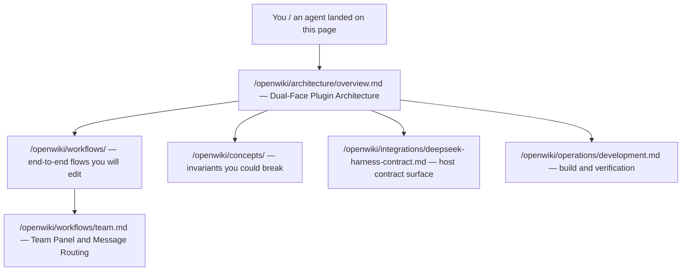

# Quickstart / Task-Routing Map

`dsh-pet-panel` is a **dual-face plugin** for [DeepSeek Harness](https://github.com/deepseek-ai/deepseek-harness) Web UI. A single npm package mounts into a web profile as two halves that share nothing at runtime except an explicit RPC contract:

- **Host face** — `src/index.ts` → `lib/index.js`. The Node half. A single `apply(ctx)` registers **seven cordis plugins**: `ProfileSkillProviderPlugin`, `SkillForgeGateway`, `ToolIntegrationsGateway`, `A2AConfigGateway`, `A2AToolsPlugin`, `A2AInboundPlugin`, and `TeamGateway` (`repo://src/index.ts#L1465-L1473`).
- **Browser face** — `src/client/index.ts` → `lib/client.js`. The browser half. Applies slot components (dashboard tab, floating pet, brand/theme, background, three capability panels, team panel) and the `/pet on|off|toggle` command (`repo://src/client/index.ts#L177-L247`).

These are the **primary change surfaces**. Before editing anything, decide which face the change belongs to — the two halves are isolated by build (`tsc -b && tsdown && postbuild`), by runtime (Node vs browser), and by contract (Typert remotes). A change that touches both halves is rare and crosses the remote bridge.

Caption: the recommended reading order for a coding agent: start at the architecture overview, then branch to workflows (including the Team panel), concepts, the harness contract, and the dev workflow.

## What the plugin does (30-second version)

The browser face gives a DeepSeek Harness web profile a **desktop pet** (a floating, draggable, skinnable SVG creature), a **session dashboard** (context occupancy, totals, 7-day trend, token ranking), and three **self-service capability panels** — Skill Forge (skill authoring), Tool Integrations (MCP server config), and A2A Management (agent card + external agents). A **team panel** adds multi-agent team chat threaded by `@`-mentions, and a **background switcher** plus a Papergames brand/theme repaint round out the identity.

The host face backs the panels with Typert remotes, exposes **A2A outbound** model tools (`a2a_list_agents` / `a2a_call`), serves an **A2A inbound** endpoint at `/.well-known/agent-card.json` and `/a2a`, and enforces **per-profile isolation** for skills, MCP servers, A2A registrations, and team/team-chat data.

The package announces itself to the harness through `package.json` (`dsh.bundle.patch` → `cordis.patch.yml`, and `dsh.client` with `platform: "web"` and an `inject` list), and the host/client boundary is the hand-written `TYPERT_REMOTE` manifest in `src/client/remote.ts` (`repo://package.json#L50-L67`, `repo://cordis.patch.yml#L1-L10`).

## Recommended reading order

1. **[Dual-Face Plugin Architecture](/openwiki/architecture/overview.md)** — read this first. It is the top-level mental model: the two faces, the packaging contract, the seven host plugins, the client slot registrations, and the Typert RPC bridge. Everything else hangs off it.

## Task-routing map

Use the per-page pointers below to jump straight to the page that answers a given question or task. They are grouped by the domain the page belongs to.

### Architecture — the mental model

- **[/openwiki/architecture/overview.md](/openwiki/architecture/overview.md)** — *Read when you need the whole plugin in one map: what the two faces are, how the package mounts, and how host and client speak.* This is the anchor page.
- **[/openwiki/architecture/typert-remote-bridge.md](/openwiki/architecture/typert-remote-bridge.md)** — *Read when you touch the host/client boundary: the `TYPERT_REMOTE` manifest, the `{ ok, value } | { ok, error }` wire envelope, `unwrap()`, `compact()`, and the child-plugin ordering constraint.* The contract consumed by `src/client/remote.ts` and the capability views.
- **[/openwiki/architecture/build-and-packaging.md](/openwiki/architecture/build-and-packaging.md)** — *Read when you change the build, the client bundle preset, the frozen module table, or the postbuild decorator lowering.*

### Workflows — end-to-end flows you will edit

- **[/openwiki/workflows/client-surface.md](/openwiki/workflows/client-surface.md)** — *Read when you edit a browser component: `PetView`, `DashboardView`, brand/theme, background, capability views, the team overlay, or the `/pet` command.* This is the browser face in depth.
- **[/openwiki/workflows/skill-forge.md](/openwiki/workflows/skill-forge.md)** — *Read when you touch skill CRUD/generation or the `skillForge` namespace.* The host `SkillForgeGateway` + client `SkillForgeView`.
- **[/openwiki/workflows/tool-integrations.md](/openwiki/workflows/tool-integrations.md)** — *Read when you touch MCP server config.* The `toolIntegrations` gateway, hot-mount/remount loader behavior, and the `mcp-servers.json` persistence.
- **[/openwiki/workflows/team.md](/openwiki/workflows/team.md)** — *Read when you touch the team feature.* The host `TeamGateway` (`listTeams`/`createTeam`/`updateTeam`/`deleteTeam`/`listThreads`/`openThread`/`getThread`/`send`), the per-profile `teams.json` + `team-chats/` persistence, the client team overlay, and the `@`-mention routing engine.

### Concepts — invariants you could break

- **[/openwiki/concepts/per-profile-isolation.md](/openwiki/concepts/per-profile-isolation.md)** — *Read before touching any host path resolution.* The invariant that each profile sees only its own skills, MCP servers, A2A registrations, and team/team-chat data; derived from `process.argv` via `profileNameFromArgv()` and `dshHomePath()`.
- **[/openwiki/concepts/a2a-protocol.md](/openwiki/concepts/a2a-protocol.md)** — *Read before touching A2A.* The card/external-agent domain model, the outbound tools and their matching, and the inbound JSON-RPC endpoint, including how the team feature reuses the same agent registry.

### Integration — the host contract surface

- **[/openwiki/integrations/deepseek-harness-contract.md](/openwiki/integrations/deepseek-harness-contract.md)** — *Read when the upstream harness API changes or when you need to know exactly what the plugin relies on.* The injected cordis services, the `SlotMap` rows it registers against, the `@deepseek-ai/*` modules resolved from the harness tree, and the frozen browser module table.

### Operations — build and verification

- **[/openwiki/operations/development.md](/openwiki/operations/development.md)** — *Read when you change code and need to build or verify.* The sibling-checkout layout, the `pnpm >= 10` `allowBuilds` step, the build/typecheck/watch commands, and the fact that there is no automated test suite — verification is the type gate plus the (non-type-checking) build plus running the loaded plugin.

## The two halves at a glance

| Face | Source | Emitted bundle | Runtime | Primary change surface |
| --- | --- | --- | --- | --- |
| **Host** | `src/index.ts` | `lib/index.js` | Node (dsh host) | Seven cordis plugins: skill provider, skill/MCP/A2A gateways, A2A outbound tools, A2A inbound endpoint, team gateway. Default `"."` export. |
| **Client** | `src/client/index.ts` | `lib/client.js` | Browser (web module loader) | Slot components: dashboard, pet, brand/theme, background, capability views, team overlay, `/pet` command. `"./client"` export. |

`package.json` maps these two bundles via `exports` (`"."` → `lib/index.js`, `"./client"` → `lib/client.js`, plus `"./src/*"` and `"./package.json"` passthroughs) (`repo://package.json#L28-L41`). The host face is the gateways and model/A2A services; the browser face is the UI. When a change crosses the RPC boundary, update **both** `src/index.ts` (the host `@Remote` method) and `src/client/remote.ts` (the wire manifest + result codec) together.

## Related pages

- [Dual-Face Plugin Architecture](/openwiki/architecture/overview.md) — the anchor page.
- [Build, Bundling, and Packaging](/openwiki/architecture/build-and-packaging.md) — the build chain and module table.
- [Client-to-Host Typert Remote Bridge](/openwiki/architecture/typert-remote-bridge.md) — the RPC contract.
- [Per-Profile Data Isolation](/openwiki/concepts/per-profile-isolation.md) — the isolation invariant the host surfaces depend on.
- [A2A Protocol](/openwiki/concepts/a2a-protocol.md) — the card/agent domain model and inbound/outbound endpoints.
- [Team Panel and Message Routing Engine](/openwiki/workflows/team.md) — the team feature and `@`-mention routing.
- [DeepSeek Harness Contract Surface](/openwiki/integrations/deepseek-harness-contract.md) — the external harness API the plugin plugs into.
- [Development, Build, and Verification](/openwiki/operations/development.md) — the day-to-day build/verify workflow.
