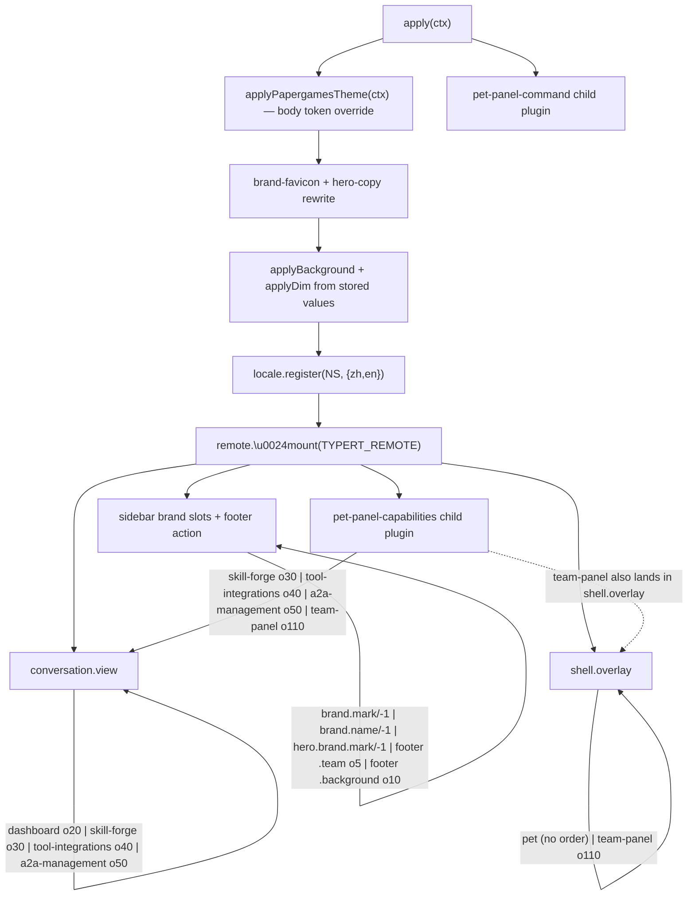

# Browser Client Surfaces

The browser half of dsh-pet-panel is a single closure-factory bundle (`lib/client.js` from `src/client/index.ts`) that the web module loader serves into a DeepSeek Harness profile's shell. It never imports the host face. Instead it contributes **slot components** into the shell's slot maps, mounts three Typert remote namespaces against the host Gateways, swaps the Papergames identity, and registers a client-side slash command. This page is that face in detail: what each slot component does, how the surfaces are ordered and identified, how cross-slot state is shared without React context, and the load-order invariants the whole thing depends on.

The packaging that delivers this face, the Node host face that answers it, and the Typert wire contract are documented on [Dual-Face Plugin Architecture](/openwiki/architecture/overview.md) and [Client-to-Host Typert Remote Bridge](/openwiki/architecture/typert-remote-bridge.md). This page is confined to the **browser side**.

## Entrypoint and the slot-wiring contract

`src/client/index.ts` declares the plugin's top-level injects (`['slots', 'locale', 'remote']`) and exports an async `apply(ctx)` that registers every client surface (`repo://src/client/index.ts#L33`, `repo://src/client/index.ts#L177-L246`). Registration goes through `ctx.slots.inject(slotName, () => ctx.slots.register({ name, id, order|priority, ... }, Component))` — the *slot name* and component identity/ordering are the only mechanism by which these surfaces appear. There is no imperative mounting of React trees.

Caption: the client `apply()` sequence — theme/brand/background/locale first, then the Typert `$mount`, then the base slot registrations, with the capability views (and the team panel, which needs the mounted `remote.team` / `remote.a2aConfig` namespaces) pushed into a child plugin and the `/pet` command into a second child plugin.

### Slot map, order, and priority

The ordering fields are not decorative — they determine tab order and shadowing:

| Slot map | id | order | priority | Component | Purpose |
| --- | --- | --- | --- | --- | --- |
| `conversation.view` | `dashboard` | 20 | — | `DashboardView` | session metrics tab |
| `conversation.view` | `skill-forge` | 30 | — | `SkillForgeView` | skill CRUD tab |
| `conversation.view` | `tool-integrations` | 40 | — | `ToolIntegrationsView` | MCP server CRUD tab |
| `conversation.view` | `a2a-management` | 50 | — | `A2AView` | A2A card / external-agent tab |
| `shell.overlay` | `pet` | (default) | — | `PetView` | floating desk pet |
| `shell.overlay` | `team-panel` | 110 | — | `TeamView` | team chamber panel |
| `sidebar.brand.mark` | — | — | -1 | `PapergamesLogo` | logo mark shadow |
| `sidebar.brand.name` | — | — | -1 | `PapergamesWordmark` | wordmark shadow |
| `conversation.hero.brand.mark` | — | — | -1 | `PapergamesLogo` | hero logo shadow |
| `sidebar.footer.action` | `team` | 5 | — | `TeamTrigger` | team chamber entry button |
| `sidebar.footer.action` | `background` | 10 | — | `BackgroundSwitcher` | wallpaper + dim control |

`repo://src/client/index.ts#L134-L168` (capability views + team-panel), `repo://src/client/index.ts#L196-L228` (dashboard, pet, brand slots, footer actions).

Two ordering facts are load-bearing.

- **`priority: -1` shadows the host brand.** `sidebar.brand.mark` / `sidebar.brand.name` / `conversation.hero.brand.mark` are `single` slots with default priority 0; the host `dsh-client-ui-brand-official` fills them. Registering at `-1` (the lowest-priority occupant renders) makes the shell show the Papergames identity instead of the whale mark (`repo://src/client/brand.tsx#L1-L8`).
- **The capability views and the team panel are registered inside the capability child plugin, not the main `apply()`.** Their `inject()` closures read the mounted Typert namespace services (`remote.skillForge`, `remote.toolIntegrations`, `remote.a2aConfig`, `remote.team`), which resolve only after `$mount` and only inside a child context whose inject array lists each sub-namespace. The main `apply()` context holds `remote` but not the mounted sub-namespaces, so touching them there throws `without inject` (`repo://src/client/index.ts#L161-L167`, `repo://src/client/index.ts#L231-L237`).

## Cross-slot state: module-level pub/sub stores

The command interceptor (`inputTriggers` source) and the pet body live in different slot maps; the Team chamber trigger and its overlay panel live in different slot maps too. React context cannot cross a slot boundary, so both pairs are bridged by **module-level publish/subscribe stores** exposing a stable `getSnapshot` plus a `subscribe` for `useSyncExternalStore` (`repo://src/client/petStore.ts#L1-L47`, `repo://src/client/teamStore.ts#L1-L45`).

- `petStore.isVisible()` returns the boolean, `show`/`hide`/`toggle` mutate it (only emitting on an actual change), and `subscribe` registers a listener. The default is `visible = true` — the pet shows by default (`repo://src/client/petStore.ts#L9-L10`).
- `teamPanelStore` is the identical shape for panel open/close (`repo://src/client/teamStore.ts#L9`, `repo://src/client/teamStore.ts#L16-L45`).

`PetView` reads visibility through `useSyncExternalStore(petStore.subscribe, petStore.isVisible)` (`repo://src/client/PetView.tsx#L292`), and `TeamView` reads open-state the same way (`repo://src/client/TeamView.tsx#L46`). Because the snapshot is a plain boolean that changes identity only on real transitions, the React external-store contract holds. This is the intended pattern to reuse when bridging shared state between two slot components — not React context.

## The floating PetView (`shell.overlay`)

`PetView` is a root-scope overlay (no session; it gets the global `useSessions` feed) that is draggable, resizable, skinnable, and emotes from a shared expression table. It renders **no binary sprite assets** — every character is inline SVG.

### Species and the shared FACES expression table

Five species are defined as a colored head plus species-defining `ears`/`detail` and an optional `mouthOverride` (the chick's beak replaces the mouth): cat, dog, rabbit, chick, dragon (`repo://src/client/PetView.tsx#L137-L205`). Each species reuses the same `FACES: Record<PetAction, Face>` table, where a `Face` selects an `EyeKind`, a `MouthKind`, whether to blink, an optional `talk`/`chomp` mouth animation, and optional cheeks — so every animal makes the same expressions with its own face (`repo://src/client/PetView.tsx#L40-L48`). The action set is `idle | busy | waiting | happy | eating | playing | sleeping` (`repo://src/client/PetView.tsx#L20`).

### Action derivation and lifecycle-reactive behavior

The resting action is **derived from the global session lifecycle feed**: `running > 0` → `'busy'`, else any session with `pendingInteraction` → `'waiting'`, else `'idle'`. A manual action (feed/play/sleep) overrides it for `MANUAL_MS` (4000 ms) through a separate `manual` state, then reverts to the derived value (`repo://src/client/PetView.tsx#L303-L306`, `repo://src/client/PetView.tsx#L314-L319`). Accessory glyphs float beside the pet for `eating`/`playing`/`sleeping` (`repo://src/client/PetView.tsx#L238-L242`).

The pet also *narrates* the lifecycle transition and self-entertains when idle:

- A transition effect announces the busy edge (`running` 0 → >0) and celebrates with `hold('happy', ...)` when the last running session finishes (`running` >0 → 0) (`repo://src/client/PetView.tsx#L321-L326`).
- While resting idle it re-arms a 16–36 s timer to speak a proactive line or do a little hop; the effect re-arms whenever the pet returns to idle, and cleans up on unmount (`repo://src/client/PetView.tsx#L330-L339`).

### Drag, persistence, and the click/drag distinction

Drag uses pointer capture on the element that owns the handlers (`.body`) so pointermove/up are not retargeted to an ancestor, and clamps the sprite to the viewport minus the scaled box (`box = 72 * size.scale`) (`repo://src/client/PetView.tsx#L349-L374`). A `DRAG_THRESHOLD` of 4 px separates a click from a drag: a pointerup that never moved past the threshold toggles the control panel and chatters (`repo://src/client/PetView.tsx#L376-L385`). Drag position is local state and is **not persisted**; only the chosen skin and size persist to `localStorage` (`dsh-pet-skin`, `dsh-pet-size`) with clamped reads for a missing/out-of-range index (`repo://src/client/PetView.tsx#L260-L268`, `repo://src/client/PetView.tsx#L341-L342`).

### Visibility and the hidden no-DOM invariant

When `visible` is false the component returns `<>` before any JSX — no sprite, bubble, or menu is rendered (`repo://src/client/PetView.tsx#L403`). So a hidden pet has no DOM footprint until `/pet on` flips the store.

## The Papergames brand and theme overlays

The client repaints the DeepSeek identity onto Papergames without touching host theme machinery or the official brand package.

- **Theme (`theme.ts`)** — `applyPapergamesTheme(ctx)` injects a `<style data-papergames-theme>` via `ctx.effect` (auto-removed on plugin dispose, the same pattern the host `dsh-client-ui-theme` uses). It remaps the `--dsw-static-deepseek-*` blue ramp (`#edf3fe → #283142`, brand `#4176e6`) onto the Papergames coral ramp anchored at the mark color `#F36864`, plus background-glass and base-bg token overrides (`repo://src/client/theme.ts#L1-L47`, `repo://src/client/theme.ts#L55-L63`). The rule **must target `body`, not `:root`**, because the host installs its tokens on `body` and a `:root` rule loses to the host's `body` rule (a descendant re-declares the same custom properties).
- **Brand (`brand.tsx`)** — `PapergamesLogo` (five coral bars with white circular cutouts, redrawn as vectors at 84×56) and `PapergamesWordmark` fill the brand slots at `priority: -1` (`repo://src/client/brand.tsx#L17-L63`). `applyPapergamesFavicon` repoints `link[rel=icon].href` to an inline SVG data URI; `applyHeroCopyRewrite` uses a `MutationObserver` because re-registering a namespace+locale that already exists throws `already has locale`, so the DeepSeek slogan `探索未至之境` is rewritten to `叠纸游戏-Papergames` and the `预览版` badge is hidden at the DOM level, returning a dispose function for the plugin to clean up (`repo://src/client/brand.tsx#L95-L150`).

Both are applied in the first lines of `apply()` before any slot registration (`repo://src/client/index.ts#L178-L183`).

## The DashboardView (`conversation.view`, order 20)

`DashboardView` is a self-contained metrics page that derives **every figure from standard framework feeds** — the `useSessions` `byId` summary map, `useWorkspaces` archived-session ids, and the `dsh-token-meter` projection values (context pressure / breakdown / token usage) on the current session (`repo://src/client/DashboardView.tsx#L303-L319`). It is two local-switchable sections: Overview, Analytics (`repo://src/client/DashboardView.tsx#L15-L17`).

All aggregation lives in pure helpers wrapped in `useMemo`, keyed on the session map:

- `weeklyActivity` buckets non-blank sessions into a trailing-7-day window, oldest bar first (`repo://src/client/DashboardView.tsx#L55-L74`).
- `sessionStats` tallies total / running / today's non-blank sessions (`repo://src/client/DashboardView.tsx#L83-L93`).
- `tokenOverview` aggregates whole-log billed tokens across sessions and ranks the top spenders (cumulative spend-to-date, not a windowed rate) (`repo://src/client/DashboardView.tsx#L133-L149`).
- `contextUsage` and `contextAnalysis` build the context gauge, remaining budget, system/tools/messages breakdown, billing buckets, and cache-hit share (`repo://src/client/DashboardView.tsx#L180-L192`, `repo://src/client/DashboardView.tsx#L228-L262`).

The Overview tab renders a context gauge plus session tallies, a 7-day activity bar chart, archived-session and fork/session lists (marking subagent-origin rows). The Analytics tab renders a token-spend ranking and a detailed current-session context analysis. The context gauge mirrors the composer's ContextMeter: numerator is the provider-anchored `projectedTokens` (falling back to `pressureTokens`), denominator is the newest route `contextWindow`; both must be known before a percent renders, otherwise the card shows "等待首次请求…" (`repo://src/client/DashboardView.tsx#L346-L366`).

## Capability panels: SkillForge / ToolIntegrations / A2A

Three `conversation.view` tabs (orders 30 / 40 / 50) are thin CRUD editors over the three Typert namespaces. Each receives an `api` object injected via `inject: () => ({ api })`, and each `api` method is a `unwrap()`-wrapped call into `ctx.remote.<ns>` (`repo://src/client/index.ts#L98-L118`).

- `SkillForgeView` lists, reads, writes, deletes, and AI-generates `skills/<name>/SKILL.md` for the current profile (`repo://src/client/SkillForgeView.tsx#L1-L69`). `generate` calls `ctx.remote.skillForge.generate(description)` and surfaces the model's returned content into the editor.
- `ToolIntegrationsView` manages MCP server configs (`repo://src/client/ToolIntegrationsView.tsx#L1-L70`), parsing `args`/`env`/`headers` from textareas and writing the config back so the host hot-mounts the server.
- `A2AView` manages the local agent card and a list of external agents, deriving the card and message URLs from `window.location.origin` (`/.well-known/agent-card.json`, `/a2a`) and showing a fixed toast on success/failure (`repo://src/client/A2AView.tsx#L29-L33`).

The wire codecs and the mount/`unwrap` mechanics are the Typert bridge's job; here the relevant fact is that these views are **read-only consumers of the injected `api`**, never touching `ctx.remote` directly, and that the whole trio is registered by the `pet-panel-capabilities` child plugin (`repo://src/client/index.ts#L231-L237`).

## Team Chamber: trigger, panel, and group chat

The Team Chamber is a two-piece surface bridged by `teamPanelStore`.

- **`TeamTrigger`** (`sidebar.footer.action`, order 5) is a sidebar-footer button whose only job is `teamPanelStore.openPanel` on click; it reads nothing from the store (`repo://src/client/TeamTrigger.tsx#L20-L32`).
- **`TeamView`** (`shell.overlay`, order 110) is root-scope — `PropsRuntime<'shell.overlay'>` plus an injected `api: TeamApi` and `a2a: TeamA2AApi` (`repo://src/client/TeamView.tsx#L29`). It reads `teamPanelStore.isOpen` via `useSyncExternalStore` and returns `null` when closed (`repo://src/client/TeamView.tsx#L46`, `repo://src/client/TeamView.tsx#L277`). It renders a full-screen overlay that closes on outside click, with a left column of teams / members / threads and a right-hand chat pane (`repo://src/client/TeamView.tsx#L281-L283`).

**Data + health** — the panel refreshes teams (`api.listTeams`) and the a2a config (`a2a.get`, which supplies the card name for the `me` member and the registered external agents to pick from) whenever it opens; it also probes every external agent's health (`a2a.checkAgents`) on open and then every 15 s while open (`repo://src/client/TeamView.tsx#L103-L124`). Member status is derived: `'me'` is always `online`, external agents map to the probe result, and unknown names show `unknown` (`repo://src/client/TeamView.tsx#L37-L42`).

**Chat `@mention` + send** — the chat input autocompletes `@member` against the open thread's members, excluding already-mentionable members and matching on a normalized label (lowercased, spaces/hyphens/underscores stripped) (`repo://src/client/TeamView.tsx#L210-L246`, `repo://src/client/TeamView.tsx#L528-L530`). Sending (`api.send`) optimistically appends the local message and a `replying` indicator, then appends only the reply/system messages (filtering `role !== 'user'`) so the optimistic row is not duplicated (`repo://src/client/TeamView.tsx#L248-L270`).

**Delete confirmation** — team deletion goes through an in-panel modal (`confirmDelete` state) rather than `window.confirm`, and on success clears the selected thread if it belonged to the deleted team (`repo://src/client/TeamView.tsx#L175-L198`, `repo://src/client/TeamView.tsx#L508-L521`).

## Background switcher and `bg.ts` inline wallpapers

`BackgroundSwitcher` (sidebar footer action, order 10) is a small popover that lists `GAME_BACKGROUNDS` and a dim slider (`repo://src/client/BackgroundSwitcher.tsx#L27-L100`). Choices and dim are persisted to `localStorage` and reapplied on startup in `apply()` (`repo://src/client/index.ts#L184-L187`). The actual application targets inline `body` custom properties:

- `applyBackground(key)` sets `--pg-bg-image` to the chosen game's CSS `url(...)` and persists the key (`repo://src/client/bg.ts#L45-L54`).
- `applyDim(t)` clamps to `[BG_DIM_MIN, BG_DIM_MAX]`, then writes `--pg-bg-dim` (a black-overlay strength, 0 → 0.7) and a *glass-layer* alpha derived from it into `--dsw-specific-sidebar-fill` and the `--dsw-alias-bg-base` / `--dsw-alias-bg-layer-1..3` tokens, so the wallpaper's translucency and text legibility are coupled (`repo://src/client/bg.ts#L84-L102`).
- The `--pg-bg-*` variables are the seam the Papergames theme (`theme.ts`) references in its `body` rule (`repo://src/client/theme.ts#L40`).

`DEEPSPACE_BG` and the other three wallpapers are **inlined as base64 `data:image/webp` URIs** (1600×900) rather than served asset URLs, so the client bundle carries no extra network requests (`repo://src/client/bg.ts#L1-L21`).

## The `/pet` slash command

`registerPetCommand` adds a custom `inputTriggers` source on the `/` trigger. The built-in dsh command source already claims `/`, but its `matchEnter` returns `undefined` for unknown commands like `/pet on`; `adjudicate` polls sources in registration order and the first non-`undefined` wins, so registering **after** the built-in source lets this one take over `/pet` (`repo://src/client/index.ts#L42-L96`).

- `candidates` lists a `pet` menu entry (hint `on | off`) when the query is empty or a prefix of `pet` (`repo://src/client/index.ts#L56-L61`).
- `onPick` toggles the pet and consumes the input via `slash/input-consume-token` with a span guard (`repo://src/client/index.ts#L62-L74`).
- `matchEnter` matches `/^\/pet(?:\s+(on|off|toggle))?$/i`, calls `petStore.show()/hide()/toggle()` (defaulting to `toggle`), consumes the line via `slash/input-consume-token` with a bare-token guard, and returns `'handled'` — which **swallows the line so it is never sent to the model** (`repo://src/client/index.ts#L75-L93`).

Consumption failures are caught and ignored (the pet state change is not rolled back). This is why the command is registered in the `pet-panel-command` child plugin injecting `['inputTriggers', 'sessions']` (`repo://src/client/index.ts#L240-L246`).

## Locale and the `dashboard` namespace

The client ships `zh` / `en` dictionaries under namespace `dashboard`, declared in `locales.ts` and typed into the slot `LocaleNamespaceMap` (`repo://src/client/locales.ts#L4-L22`). `apply()` registers them via `ctx.locale.register(NS, { zh, en })` and binds `t = ctx.locale.bind(NS)`, which labels the dashboard tab and the skill-forge / tool-integrations / a2a tabs (`repo://src/client/index.ts#L188-L189`). Because the namespace is owned by this plugin, the capability views and dashboard read `PropsLocale<'dashboard'>`.
