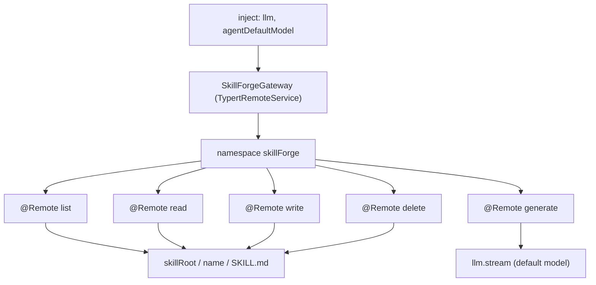
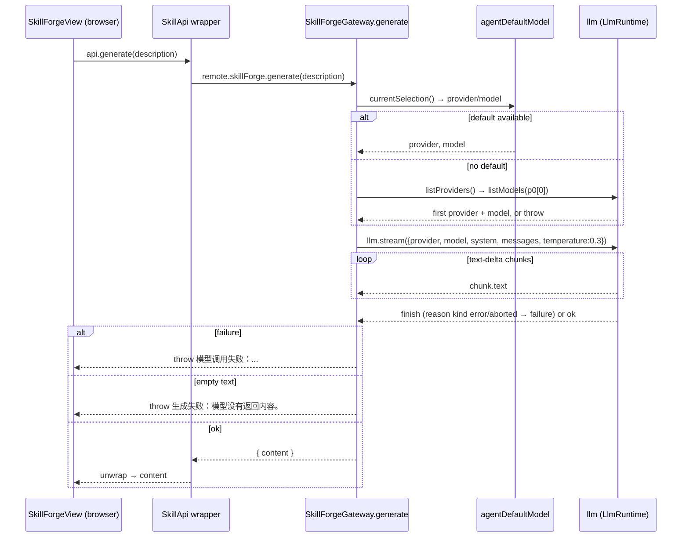

# Skill Forge (技能工坊)

The Skill Forge tab is dsh-pet-panel's self-service **skill authoring surface**: it lets a user list, read, write, and delete the `SKILL.md` files in the **active profile's skill root**, and it can generate a whole `SKILL.md` from a one-line natural-language description using the harness's current default model. The feature is split across the two plugin faces — the host face (`src/index.ts`) owns the filesystem, the `NAME_RE` guard, and the model call; the browser face (`src/client/SkillForgeView.tsx`) owns the editor UI and the mirrored `SkillApi` wrappers over the Typert remote.

This page is the workflow in detail. The per-profile isolation invariant it depends on is documented on [Per-Profile Data Isolation](/openwiki/concepts/per-profile-isolation.md), the wire contract on [Client-to-Host Typert Remote Bridge](/openwiki/architecture/typert-remote-bridge.md), and the browser slot that hosts the tab on [Browser Client Surfaces](/openwiki/workflows/client-surface.md).

## The `skillForge` namespace and the gateway

`SkillForgeGateway` extends `TypertRemoteService`, injects `['llm', 'agentDefaultModel']`, and binds its wire namespace to `skillForge` in its constructor (`repo://src/index.ts#L58-L68`). It exposes five `@Remote` methods — `list`, `read`, `write`, `delete`, and `generate` — each returning a **JSON-safe business value** that the Typert framework wraps into the `{ ok: true, value } | { ok: false, error }` envelope (`repo://src/client/remote.ts#L140-L155`). The client never imports this class; it mounts the hand-written `TYPERT_REMOTE` manifest and calls the namespace through `ctx.remote.skillForge.<method>()`.



Caption: the `skillForge` namespace — the five `@Remote` SKILL.md-facing methods and their targets.

## The path-traversal guard: `NAME_RE` and `assertName`

The single most security-relevant invariant here is that **a skill name can never escape the skill root**. `NAME_RE` is `/^[A-Za-z0-9_-]{1,64}$/` — letters, digits, hyphen, underscore, 1-64 characters — and `assertName()` throws `invalid name: <name>` for anything that is not a non-empty string matching it (`repo://src/index.ts#L14-L20`). Every name that reaches the filesystem is routed through it:

```ts
function skillDir(name: string): string {
  assertName(name)
  return join(skillRoot(), name)
}
function skillFile(name: string): string {
  return join(skillDir(name), 'SKILL.md')
}
```

`repo://src/index.ts#L27-L34`. Because `assertName` rejects `..`, absolute paths, slashes, and any character outside the allowed set, a call like `read('../other')` or `read('../../etc')` is rejected before `join()`, so the resolved path always lands inside `skillRoot()`. `join()` only ever appends the validated single segment plus the fixed `SKILL.md` filename.

## Per-profile root and the `SKILL.md` layout

`skillRoot()` resolves the active profile from `process.argv` and returns the profile skills directory when one is active, else the global home skills directory (`repo://src/index.ts#L22-L25`):

```ts
function skillRoot(): string {
  const profile = profileNameFromArgv(process.argv)
  return profile ? dshHomePath('profiles', profile, 'skills') : dshHomePath('skills')
}
```

So each skill lives at `<skillRoot>/<name>/SKILL.md` — a single directory per skill, containing exactly one `SKILL.md` file. `read`/`write`/`delete` all build paths via `skillFile(name)` / `skillDir(name)`, so they are all scoped to that root (see [Per-Profile Data Isolation](/openwiki/concepts/per-profile-isolation.md) for why the argv-based derivation and the provider plugin's `includeDefaultRoots: false` keep profiles isolated at load time).

## Frontmatter parsing and name/description fallback

`parseFrontmatter()` (`repo://src/index.ts#L37-L42`) extracts `title` (from the frontmatter `name:` key) and `description` (from the frontmatter `description:` key) by regexing the leading `--- ... ---` block. It is deliberately fault-tolerant:

- **No frontmatter at all** → `title: ''`, `description: ''`.
- **Frontmatter without a `name:`** → `title: ''`.
- **Frontmatter without a `description:`** → `description: ''`.

The *list* operation then favors the **directory name** over the parsed value: it sets `title: title || name` (so a missing/empty frontmatter `name` falls back to the directory name) and keeps `description` as-is (empty when absent) (`repo://src/index.ts#L70-L93`). This is why the sidebar can display a human-facing `title` while the item key is still the on-disk directory `name`.

## The CRUD methods

`list()` (`repo://src/index.ts#L71-L93`) `readdir`s the skill root, keeps only the immediate subdirectories, reads each `<name>/SKILL.md`, parses its frontmatter, fills the fallback title, and returns the array sorted by `name` with `localeCompare`. If the root does not exist yet it returns `{ items: [] }` rather than throwing — a fresh profile with no skills is not an error.

`read(name)` (`repo://src/index.ts#L95-L100`) asserts the name and returns `{ name, content }` from `skillFile(name)`.

`write(name, content)` (`repo://src/index.ts#L102-L108`) asserts the name, `mkdir`s the skill directory with `recursive: true` (so creating a new skill does not need a pre-existing dir), writes `SKILL.md` as UTF-8, and returns `{ name }`.

`delete(name)` (`repo://src/index.ts#L110-L115`) asserts the name and removes the whole skill directory with `rm(..., { recursive: true, force: true })`, returning `{ name }`. `force` makes a missing directory a no-op rather than an error; `recursive` removes the directory and its `SKILL.md` together.

## The `generate()` flow

`generate(description)` is the model-driven half of the feature. It validates the description is non-empty, **selects a model**, streams the generation, and surfaces any model failure (`repo://src/index.ts#L118-L200`).

### Model selection: default preference, then first-provider fallback

Selection deliberately **prefers the current default model** and only falls back to the *first* provider when the default is unavailable. It does **not** assume `providers[0]` is configured:

```ts
try {
  const sel = this.agentDefaultModel.currentSelection()
  provider = sel?.provider
  model = sel?.model
} catch {
  provider = ''
  model = ''
}
if (!provider || !model) {
  const providers = this.llm.listProviders()
  if (!providers || providers.length === 0) {
    throw new Error('没有已配置的 LLM provider，请先在设置里配置模型。')
  }
  provider = providers[0].id
  const models = await this.llm.listModels(provider)
  if (!models || models.length === 0) {
    throw new Error(`provider ${provider} 没有可用模型。`)
  }
  model = models[0].id
}
```

`repo://src/index.ts#L126-L148`. The comment in source is explicit: the fallback must not blindly take `providers[0]` as the *primary* choice, because that first registered provider could be an unconfigured or insufficient-balance one (e.g. an unused `deepseek` route). The default model, read live from `agentDefaultModel.currentSelection()` (`AgentDefaultModelConfig`, part of the `agentDefaultModel` service), is tried first. `llm.listProviders()` / `llm.listModels(provider)` (the `LlmRuntime` methods) are the fallback source, and empty results throw a user-facing Chinese error.

### Prompt, stream, and failure surfacing

The system prompt instructs the model to emit a DeepSeek-Harness `SKILL.md` — YAML frontmatter with `name` (lowercase-hyphen, e.g. `weather-query`) and a one-sentence `description` containing the trigger scenario, a Markdown body describing usage/steps/commands, a `name` restricted to `[A-Za-z0-9_-]{1,64}`, and concrete executable content. The model is told to output **only** the `SKILL.md` content starting from `---`, with no explanation and no wrapping code fence (`repo://src/index.ts#L150-L160`).

The call is a hand-built single user message (id via `randomUUID()`, `source: { kind: 'user' }`), streamed with `this.llm.stream({ provider, model, system, messages, temperature: 0.3 })` (`repo://src/index.ts#L171-L177`). The code walks the chunk stream:

- accumulates `text-delta` chunks into `text`;
- on a `finish` chunk whose `reason.kind` is `error` or `aborted`, captures `reason.failure` as the failure.
- after the loop, if a failure was captured it throws `模型调用失败：<message>（<code>） HTTP <status>` (omitting the parts that are absent) (`repo://src/index.ts#L179-L199`);
- if no text came back, it throws `生成失败：模型没有返回内容。`.



Caption: the `generate()` request flow — default model first, first-provider fallback, streaming accumulation, and the failure surfacing that renders in the view's error line.

## The browser face: `SkillForgeView` and `SkillApi`

`src/client/SkillForgeView.tsx` receives a `SkillApi` prop — the host remote wrapped into promise-returning helpers (`repo://src/client/SkillForgeView.tsx#L17-L23`). The client's `registerCapabilityViews` builds that `skillApi` by wrapping every `ctx.remote.skillForge.*` call in `unwrap()` (which throws on the `{ ok: false }` branch) and registers the view as the `conversation.view` slot with id `skill-forge`, order 30 (`repo://src/client/index.ts#L99-L141`). So a host-side failure surfaces as a `Promise` rejection that the view's `try/catch` renders as the inline error line.

The view keeps its own editor state and mirrors the host's name rules in the browser:

- `skeleton(name)` produces a minimal frontmatter + body for a fresh skill (`repo://src/client/SkillForgeView.tsx#L28-L30`).
- `create()` selects the sentinel `'__new__'` and fills the editor with `skeleton('my-skill')`; the actual on-disk name is decided only on save.
- `save()` extracts the name **from the frontmatter `name:` line**, not from the sidebar selection, and validates it against the same `/^[A-Za-z0-9_-]{1,64}$/` pattern *before* calling `api.write` (`repo://src/client/SkillForgeView.tsx#L80-L99`). If the frontmatter lacks a valid `name:`, it shows a Chinese error and does not call the host. This mirrors the host `assertName()` — the directory is named after the frontmatter `name`, so a user pasting a `SKILL.md` with a different `name:` will create (or overwrite) a directory under that new name.
- `remove(name)` confirms via `window.confirm`, then `api.delete(name)` and refreshes.
- `generate()` (the view-side half) calls `api.generate(desc)`, then displays the returned content with a typewriter effect (rapid `setTimeout` stepping 4 chars at a time), and on completion sets the editor content and selects the sentinel `'__generated__'` (`repo://src/client/SkillForgeView.tsx#L128-L155`), which the editor path renders as `智能生成结果`. A failed model call sets the inline error and clears the busy flag.

The editor path label switches on these sentinels — `__new__` renders `新技能`, `__generated__` renders `智能生成结果`, and any other selection renders `<name>/SKILL.md` (`repo://src/client/SkillForgeView.tsx#L223`). The delete button is hidden for both sentinels, which are not real skills yet.

## Summary of invariants

- **Names never escape the root.** `assertName` + `NAME_RE` guard every `read`/`write`/`delete`; `join()` then appends only the validated segment and `SKILL.md`.
- **The directory is named after the frontmatter `name:`**, and the browser mirrors the host name regex before writing, so a malformed or mismatched `name:` is caught client-side and again host-side.
- **The frontmatter parse is fault-tolerant**, falling back to the directory name for the display title; `description` may be empty.
- **`generate` prefers the current default model** and only falls back to the first registered provider + model when the default is unavailable; it never assumes `providers[0]` is configured, and it surfaces model failures and empty output as distinct errors.
