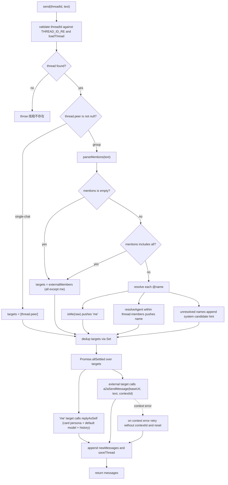

# Team Panel and Message Routing Engine

The team feature turns the local profile and its registered external A2A agents into a chat group ("me" plus the external agents). It is split across the same dual-face architecture as the rest of the plugin:

- **Host face** (`src/index.ts`) — the `TeamGateway`, a `TypertRemoteService` that owns the full team/thread data model, the persistence and path-traversal guards, and the **routing engine** that decides which members a sent message reaches.
- **Browser face** (`src/client`) — the `TeamTrigger` sidebar entry button, the `TeamView` floating panel mounted in `shell.overlay`, the module-level `teamPanelStore` that bridges them, and the `TYPERT_REMOTE` manifest that mounts the `team` namespace on the client remote.

The browser face carries no logic decision-making about routing; that all lives on the host. The client only collects the input, invokes `send(threadId, text)`, and renders the returned messages (including the system candidate hints). This page is the end-to-end flow: the cross-slot bridge that opens the panel, the persistence layer and its invariants, the routing matrix, and the per-target send path for both "me" and external agents.

Summary of the related surfaces: [A2A Protocol Surface](/openwiki/concepts/a2a-protocol.md) for the shared registry (`a2a-agents.json`) and the A2A send/reply handling that the team reuses; [Per-Profile Data Isolation](/openwiki/concepts/per-profile-isolation.md) for the profile-dir path determinism; and [Browser Client Surfaces](/openwiki/workflows/client-surface.md) for the broader slot wiring.

## Responsibilities and the dual-face split

`TeamGateway` is registered on the host via `apply()` (`repo://src/index.ts#L1465-L1473`) and exposes eight `@Remote` methods, all discovered in source mode (no generated `/typert` artifact):

| Method | Signature | Behavior |
| --- | --- | --- |
| `listTeams` | `() => Promise<{ teams: Team[] }>` | Loads `teams.json`. |
| `createTeam` | `(name, members) => Promise<{ team }>` | Validates name, forces `'me'` first, de-dups others. |
| `updateTeam` | `(id, name, members) => Promise<{ team }>` | Replaces a team by id, same member normalization. |
| `deleteTeam` | `(id) => Promise<{ id }>` | Removes the record from `teams.json` only. |
| `listThreads` | `(teamId) => Promise<{ threads: ThreadSummary[] }>` | Scans `team-chats/` and returns the team's threads, newest last-time first. |
| `openThread` | `(teamId \| peer) => Promise<{ thread }>` | Returns an existing or creates a new group/single thread. |
| `getThread` | `(threadId) => Promise<{ thread }>` | Validates `threadId`, loads the thread, re-syncs live membership. |
| `send` | `(threadId, text) => Promise<{ messages }>` | The routing engine: picks targets, sends to each, persists. |

`TeamGateway` declares `static inject = ['llm', 'agentDefaultModel']` and stores them in `this.llm` / `this.agentDefaultModel` (`repo://src/index.ts#L1195-L1205`) — the two dependencies it needs to answer as "me" via `replyAsSelf`. It reuses the A2A registry (`loadA2AConfig`, `resolveAgent`, `a2aSendMessage`, `a2aBaseUrl`) rather than owning its own external-agent list.

The client mirrors these as promise helpers: `TeamTrigger.tsx` only opens the panel, and `TeamView.tsx` calls the api/wrappers and renders the result.

## Client wiring: the TeamTrigger entry point

`TeamTrigger` is registered into the `sidebar.footer.action` slot at `order: 5` (`repo://src/client/index.ts#L219-L223`). It is a plain button whose `onClick` calls `teamPanelStore.openPanel()` (`repo://src/client/TeamTrigger.tsx#L20-L32`). It receives `wide` from the shell (whether the sidebar is expanded) — when expanded it shows a "团队" label next to the inline SVG team icon.

## The teamPanelStore cross-slot bridge

`TeamTrigger` (in `sidebar.footer.action`) and `TeamView` (in `shell.overlay`) are components in **different slot maps**, so React context cannot carry state between them. The bridge is a module-level publish/subscribe store (`repo://src/client/teamStore.ts#L1-L45`) — the identical pattern used by `petStore` (`repo://src/client/petStore.ts#L1-L47`).

`teamPanelStore` keeps a module-level `open` boolean, a `Set<Listener>`, and exposes the `useSyncExternalStore` contract:

- `isOpen()` returns the boolean and, as `getSnapshot`, is guaranteed to return a stable identity that only changes on a real transition (the mutations only `emit()` when the value actually flips).
- `openPanel()` / `closePanel()` / `toggle()` mutate it and notify listeners.
- `subscribe(listener)` registers and returns an unsubscribe for React's external-store hook.

`TeamView` consumes it via `useSyncExternalStore(teamPanelStore.subscribe, teamPanelStore.isOpen)` (`repo://src/client/TeamView.tsx#L46`), and returns `null` early when closed (`repo://src/client/TeamView.tsx#L277`) — so a closed team panel has no DOM footprint, exactly like the hidden pet. Clicking the overlay backdrop or the × button calls `teamPanelStore.closePanel()` (`repo://src/client/TeamView.tsx#L282`, `repo://src/client/TeamView.tsx#L286`).

This is the intended pattern to reuse for cross-slot state, not React context.

## The `team` Typert remote manifest

`src/client/remote.ts` declares the `team` namespace in `TYPERT_REMOTE.descriptors` (`repo://src/client/remote.ts#L177-L185`) and the zod wire codecs for the data shapes (`repo://src/client/remote.ts#L78-L117`):

- `Team` — `{ id, name, members: string[], createdAt }`.
- `ChatMessage` — `{ id, role: 'user' | 'agent' | 'system', agent?, text, time }`. For `role === 'agent'`, `agent` holds the replying party (`'me'` or the external agent name).
- `ThreadSummary` — `{ threadId, teamId, peer, title, lastTime }`.
- `Thread` — `{ threadId, teamId, peer, title, members, messages, contextIds }`. `contextIds` is `Record<string, string>` (per external agent) and is how multi-turn memory is carried across A2A sends.
- `sendResult` — `{ messages: ChatMessage[] }`.

On the client, `teamApi` and `teamA2aApi` wrap the mounted namespaces through `unwrap()` (`repo://src/client/index.ts#L119-L132`), and `TeamView` is registered into `shell.overlay` at `order: 110` with its `inject()` supplying `{ api: teamApi, a2a: teamA2aApi }` (`repo://src/client/index.ts#L161-L167`).

## Persistence and its invariants

Team and thread data live under the same per-profile config dir as the A2A registry (`a2aConfigDir()`):

```ts
const TEAMS_FILE = () => join(a2aConfigDir(), 'teams.json')
const TEAM_CHATS_DIR = () => join(a2aConfigDir(), 'team-chats')
const THREAD_ID_RE = /^[A-Za-z0-9-]{1,64}$/
```
`repo://src/index.ts#L1089-L1092`

`teams.json` is `{ teams: Team[] }`, written pretty-printed via `saveTeams` which `mkdir -p`s the config dir (`repo://src/index.ts#L1114-L1117`). `loadTeams` validates each entry has a string `id`, string `name`, and array `members`, then coerces `createdAt` to a number, tolerating a missing/corrupt file by returning `[]` (`repo://src/index.ts#L1094-L1112`).

Threads are one JSON file per thread: `join(TEAM_CHATS_DIR(), `${threadId}.json`)` (`repo://src/index.ts#L1119-L1121`). Because the thread filename is derived directly from the `threadId` argument, `send` and `getThread` validate the id against `THREAD_ID_RE` before any file operation (`repo://src/index.ts#L1326-L1337`). `listThreadIds()` scans the directory and tolerates its absence by returning `[]` (`repo://src/index.ts#L1157-L1167`).

### Member invariant: `'me'` always first

`createTeam` and `updateTeam` both filter out anything that `isMe()` considers "me" from the rest, de-dup the remainder with a `Set`, and prefix `{'me', ...rest}` (`repo://src/index.ts#L1213-L1245`). `isMe` treats a normalized token equal to `'me'` / `'wo'` / `'ziwo'` / `'自己'` as the local agent (`repo://src/index.ts#L1169-L1173`). The client renders the `'me'` member with the configured card name via `memberLabel` (`repo://src/client/TeamView.tsx#L31-L34`).

## Thread lifecycle: shared group vs per-peer single chat

`openThread` distinguishes two thread kinds (`repo://src/index.ts#L1276-L1324`):

- **Group thread** — called with a non-empty `teamId` and empty `peer`. It is **one shared thread per team**: if any existing thread has `teamId === tid && peer === null`, that thread is returned; otherwise a new one is created with `peer: null`, `title: team.name`, `members: team.members`, and a fresh `threadId`.
- **Single-chat thread** — called with an empty `teamId` and a non-empty `peer` (the client passes subject "单聊 @<member>"). It is **one thread per peer**: an existing thread with `teamId === null && peer === p` is returned, else created with `members: ['me', p]`, `title: p`.

The group-thread members and title are not frozen at creation. `refreshMembers` re-reads the team on every `getThread` and `send` for group threads and overwrites `thread.members` and `thread.title` from the current team (`repo://src/index.ts#L1431-L1441`), so adding/removing a team member takes effect immediately on the next thread load — the saved per-thread `members` array is only a snapshot for single-chat and for the group's initial creation.

## The send() routing matrix

`send(threadId, text)` is the routing engine. It validates the `threadId`, loads the thread, refreshes its members, pushes the user message, then decides **targets** (`repo://src/index.ts#L1334-L1428`):

| Thread kind | Input | Targets |
| --- | --- | --- |
| Single-chat (`peer` non-null) | any | `[peer]` unconditionally — mentions and broadcast are ignored. |
| Group | no mention | all external members (`members` except `'me'`). "me" never answers its own broadcast; to include "me" you must explicitly `@me`. |
| Group | `@all` / `@所有人` / `@everyone` / `@所有人` | same as no-mention — external members only. |
| Group | `@name` | each resolved member: `isMe(raw)` → `'me'`; external via `resolveAgent(config.agents.filter(in thread.members), raw)`; unresolved names accumulate. |

The mention parser `parseMentions` normalizes `@all`/`@suoyouren`/`@everyone`/`@所有人` to the literal `'all'`, so the `mentions.includes('all')` branch catches all broadcast spellings (`repo://src/index.ts#L1175-L1187`). External target resolution goes through the same exact → normalized → substring → Levenshtein `resolveAgent` chain used by `a2a_call`, but restricted to agents that are actually in this thread's `members`; since a `Set` de-dups the final targets, a mention that matches "me"-aliases and one that re-matches the same external agent collapse (`repo://src/index.ts#L1365-L1375`).

**Unresolved mentions are never sent.** Any raw mention that fails resolution is accumulated and appended as a `system` message listing the usable members — `未识别 @<names>. 可用成员：<members>` — and excluded from the target set (`repo://src/index.ts#L1379-L1388`). This is the "system candidate hint" that tells the user exactly which member names the group accepts rather than silently dropping or mis-routing.



Caption: the `send()` routing decision — parse mentions, resolve to a target set, then fan out to each target (self via `replyAsSelf`, external via `a2aSendMessage`), appending the user message, each agent reply or failure, and any unresolved-@ system hint before persisting once.

## replyAsSelf: answering as "me"

The `'me'` target does not go out over A2A. `replyAsSelf(llm, agentDefaultModel, text, history)` answers locally by reusing the configured agent card as the persona and the current default model (`repo://src/index.ts#L785-L843`):

- It loads the A2A config and reads `agentDefaultModel.currentSelection()`; if no provider+model is selected it throws `没有可用的默认模型…` (`repo://src/index.ts#L791-L793`).
- The system prompt is assembled from the card: `你是 <card.name>.`, the card description, its capability list, and a Chinese conciseness instruction (`repo://src/index.ts#L794-L801`).
- For multi-turn memory it folds the thread history (excluding `system` messages) into a preceding conversation transcript inside the single user message, so "me" can carry context across exchanges just like an external agent (`repo://src/index.ts#L803-L817`).
- It makes a single `llm.stream({ provider, model, system, messages })` call and concatenates the `text-delta` chunks, throwing on a `finish` error reason or an empty reply (`repo://src/index.ts#L826-L842`).
- It uses **no tools, skills, or MCP** — a full agent loop is explicitly left as an enhancement. The passed history is `thread.messages.slice(0, -1)`, i.e. the thread up to but excluding the just-appended user message, so the current message is presented once.

The same helper is reused by the A2A inbound `message/send` handler, so "me" answers a team group chat and a direct inbound A2A call with the same persona logic.

## External agents: a2aSendMessage with contextId memory

For every external target, `send` looks up the per-agent `contextId` from `thread.contextIds[name]` and calls `a2aSendMessage(a2aBaseUrl(agent.url), text.trim(), prev)`, storing the returned `contextId` back into `thread.contextIds[name]` (`repo://src/index.ts#L1390-L1413`). This is the multi-turn memory: a conversation with each external agent in a thread keeps a rolling `contextId` that grows as replies come back, persisting in the thread file.

If a send fails with a `context`-matching error and a `prev` contextId existed, it retries once **without** the `contextId` and resets the stored value — recovering from a stale/expired context rather than failing the whole group send. Each target is sent via `Promise.allSettled`, so one agent's failure does not prevent the others from replying; a rejected target becomes a `system` `调用失败：<reason>` message (`repo://src/index.ts#L1391-L1423`).

The user message, then every reply (agent or failure), plus any unresolved-mention hint, are appended to the thread and persisted once at the end via `saveThread` (`repo://src/index.ts#L1425-L1428`).

## Client rendering and the optimistic send

On the client, `TeamView.send()` optimistically appends the user's message locally and sets a `'replying'` indicator for that `threadId`, then calls `api.send`, and **filters the returned messages to `role !== 'user'`** — the own message was already displayed optimistically, so only replies and system hints are appended (avoiding a duplicate) (`repo://src/client/TeamView.tsx#L248-L270`). The chat header shows "单聊 · <peer>" vs "群聊 · <n> 人" from `thread.teamId` / `thread.peer` (`repo://src/client/TeamView.tsx#L405-L407`).

The panel's `@` autocomplete (`updateMention` / `applyMention`) is purely a client typing aid: it parses the last unclosed `@query`, suggests thread members that haven't been mentioned yet (fuzzy-matched and normalized by `normalizeForMatch`), and rewrites the input on selection (`repo://src/client/TeamView.tsx#L210-L246`). It has no effect on the routing decision, which is made entirely on the host.

## Health polling and member status

When the panel opens, `TeamView` refreshes teams, agents, and health, then polls `a2a.checkAgents()` every 15 s (`repo://src/client/TeamView.tsx#L115-L124`). `memberStatus` treats `'me'` as always online and reads external members from the health map, falling back to `'unknown'` when a member has no probe yet (`repo://src/client/TeamView.tsx#L36-L42`). The probe failures are silently ignored so the next poll retries.

## Failure and state-lifecycle semantics

- **Path-traversal guard** — `THREAD_ID_RE` is the invariant that keeps a malicious `threadId` (`../../...`) from escaping `team-chats/`. Both `getThread` and `send` reject ids that do not match (`repo://src/index.ts#L1326-L1337`).
- **Malformed/corrupt files are tolerated** — `loadTeams`, `loadThread`, and `listThreadIds` all return empty/`null` on read or parse failure, so a bad file degrades to "no data" rather than crashing a request (`repo://src/index.ts#L1094-L1167`).
- **`deleteTeam` leaves orphan threads** — the RPC only updates `teams.json` (`saveTeams(teams.filter(...))`) and does **not** delete the team's files in `team-chats/` (`repo://src/index.ts#L1248-L1254`). The client delete-confirmation text claims "该团队及其全部聊天记录将被移除" (`repo://src/client/TeamView.tsx#L512`), but the chat files remain on disk as orphans: they are no longer reachable once the team id is gone (a group thread's `title`/`members` re-sync needs a live team, and the team cannot be selected), so they persist but stop surfacing — a documented divergence between the client's promise and the host behavior.
- **`saveThread` is the single write point** — `send` mutates the in-memory thread through the routing run and persists once, so a partially failed multi-target send still records the user message and every reply/failure the individual targets produced, without double-writing.
- **Single-chat ignores mentions completely** — a single-chat thread sends unconditionally to `thread.peer` even if the text contains `@someone` or `@all`, so the peer name is the only routing input.

## Extension points

- **Add a routing rule** — extend the `targets` decision in `send` (`repo://src/index.ts#L1349-L1377`) and the mention normalization in `parseMentions`.
- **Give "me" a full agent loop** — `replyAsSelf` is the current lightweight path; the comment marks an un-instrumented full agent loop (tools/skills/MCP) as the intended enhancement (`repo://src/index.ts#L779-L784`).
- **Add a new thread kind** — `openThread` and the `Thread.teamId`/`Thread.peer` nullability define the two existing kinds; a third would need a distinct discriminator since `refreshMembers` keys purely on `teamId !== null`.
- **Reuse the bridge** — `teamPanelStore`/`petStore` are the module-level pub/sub pattern to copy when bridging any two slot-map components that share state.
