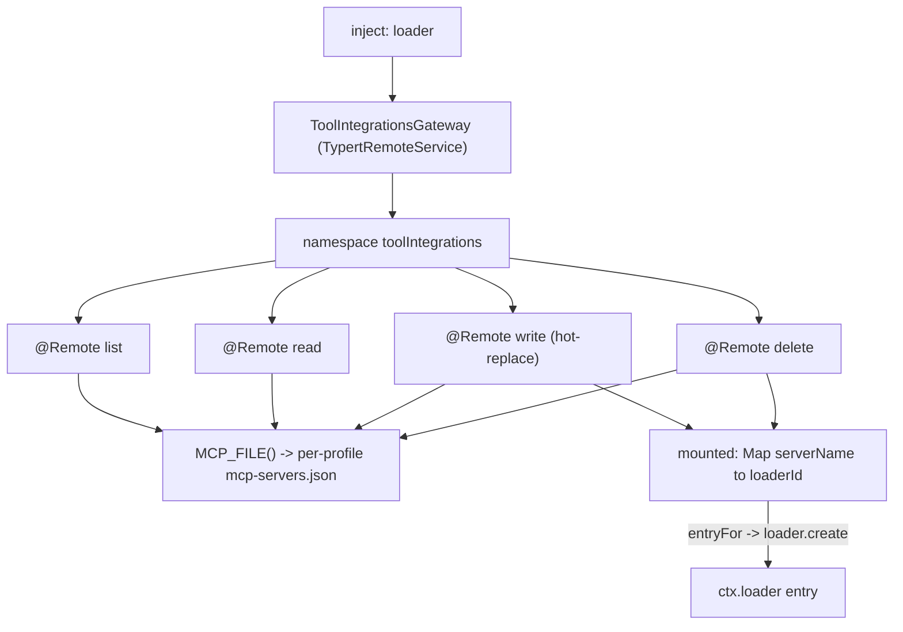
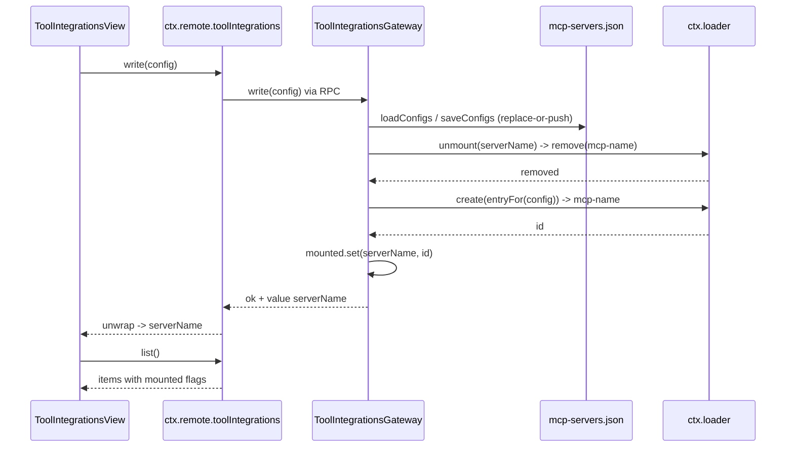

# Tool Integrations (工具集成 / MCP)

The Tool Integrations tab is dsh-pet-panel's self-service **MCP server registry**: it lets a user list, read, write, and delete the MCP server configs in the **active profile's `mcp-servers.json`**, and — crucially — **live-mounts** each configured server so the agent immediately gains that server's tools. The feature is split across the two plugin faces: the host face (`src/index.ts`) owns the JSON file, the loader lifecycle, and the mounted map; the browser face (`src/client/ToolIntegrationsView.tsx`) owns the list/form UI and the mirrored `McpApi` wrappers over the Typert remote.

The single most distinctive behavior is the **hot-replace** in `write()`: saving a config does not merely persist it — it first unmounts the old loader entry and mounts a new one, so a running agent picks up the change without a restart. This page is that workflow in detail. The per-profile isolation invariant it depends on is documented on [Per-Profile Data Isolation](/openwiki/concepts/per-profile-isolation.md), the wire contract on [Client-to-Host Typert Remote Bridge](/openwiki/architecture/typert-remote-bridge.md), and the browser slot that hosts the tab on [Browser Client Surfaces](/openwiki/workflows/client-surface.md).

## The `toolIntegrations` namespace and the gateway

`ToolIntegrationsGateway` extends `TypertRemoteService`, injects `['loader']` via its `static inject`, and binds its wire namespace to `toolIntegrations` in its constructor (`repo://src/index.ts#L228-L233`). It owns a private `mounted = new Map<string, string>()` that maps `serverName` → loader entry id — the authoritative record of which configured server is currently live (`repo://src/index.ts#L226`). It is registered alongside the other host Gateways in `apply()` (`repo://src/index.ts#L1465-L1473`).

It exposes four `@Remote` methods — `list`, `read`, `write`, `delete` — each returning a **JSON-safe business value** that the Typert framework wraps into the `{ ok: true, value } | { ok: false, error }` envelope (`repo://src/client/remote.ts#L30-L43`, `repo://src/client/remote.ts#L166-L170`). The client never imports this class; it mounts the hand-written `TYPERT_REMOTE` manifest and calls the namespace through `ctx.remote.toolIntegrations.<method>()`.



Caption: the `toolIntegrations` namespace — four MCP-config methods, the persisted file, and the loaded-entry lifecycle tracked by the `mounted` map.

## The persistence surface: per-profile `mcp-servers.json`

`MCP_FILE()` resolves the active profile from `process.argv` and returns the profile `mcp-servers.json` when one is active, else the global `dshHomePath('mcp-servers.json')` (`repo://src/index.ts#L205-L208`). It is re-derived **fresh on every call** via `profileNameFromArgv(process.argv)`, so the path is always consistent with the process that spawned the plugin (see [Per-Profile Data Isolation](/openwiki/concepts/per-profile-isolation.md) for why this argv derivation is the isolation crux).

- **`loadConfigs()`** (`repo://src/index.ts#L235-L243`) reads and `JSON.parse`s the file. If the file is absent or unparseable it catches and returns `[]` — a fresh profile with no MCP servers is not an error.
- **`saveConfigs(configs)`** (`repo://src/index.ts#L245-L248`) `mkdir`s the dsh home with `recursive: true` and writes the array as indented (2-space) JSON. `mkdir(dshHomePath(''), ...)` ensures the profile directory exists before the file is written.

The file stores a **flat JSON array** of `McpConfig` objects, not a map keyed by server name. So `list`/`read`/`write`/`delete` all operate on an array: `read` finds by `serverName` and throws `mcp server not found: <name>` if absent (`repo://src/index.ts#L291-L297`), `write` replaces at the existing index or pushes (`repo://src/index.ts#L302-L304`), and `delete` filters it out (`repo://src/index.ts#L318-L321`).

## The `McpConfig` shape and its transport discrimination

`McpConfig` is declared **in both faces** and mirrors the host-side shape (`repo://src/index.ts#L211-L220`, `repo://src/client/ToolIntegrationsView.tsx#L11-L20`):

```ts
interface McpConfig {
  serverName: string
  transport: 'stdio' | 'streamable-http'
  command?: string   // stdio
  args?: string[]    // stdio
  env?: Record<string, string>  // stdio
  cwd?: string       // stdio
  url?: string       // streamable-http
  headers?: Record<string, string>  // streamable-http
}
```

`saved` / `loaded` configs carry the full shape, but **the per-transport fields are only populated for the matching transport**: `command`/`args`/`env`/`cwd` describe a `stdio` server; `url`/`headers` describe a `streamable-http` server. The `save()` handler in the view builds exactly one branch based on `form.transport` and omits the other fields (`repo://src/client/ToolIntegrationsView.tsx#L130-L145`). The remote zod codec `mcpConfig` mirrors the same structure: `transport` is a `z.enum(['stdio','streamable-http'])` and `command`/`args`/`env`/`cwd`/`url`/`headers` are all `.optional()` (`repo://src/client/remote.ts#L30-L39`).

The item returned by `list` extends the config with a liveness flag: `mcpListItem = mcpConfig.extend({ mounted: z.boolean() })` (`repo://src/client/remote.ts#L40`), surfaced to the client as `McpSummary extends McpConfig { mounted: boolean }` (`repo://src/client/ToolIntegrationsView.tsx#L22-L24`).

## The loader entry derivation: `entryFor()`

`entryFor(cfg)` is the function that turns a config into a runnable loader entry (`repo://src/index.ts#L265-L272`):

```ts
private entryFor(cfg: McpConfig): { id: string; name: string; config: any } {
  const { serverName, ...rest } = cfg
  return {
    id: `mcp-${serverName}`,
    name: MCP_CLIENT,                 // '@deepseek-ai/dsh-mcp-client'
    config: { serverName, ...rest },
  }
}
```

The entry id is **deterministic** — `mcp-<serverName>` (`MCP_CLIENT` is the constant `'@deepseek-ai/dsh-mcp-client'`, `repo://src/index.ts#L209`). This is what makes the hot-replace safe: the `mounted` map stores the id returned by `loader.create`, and `unmount()` looks up that id to remove the exact entry. Because the id is deterministic and derived from the serverName (which is the map key), the map's key/value pairing is a one-to-one, self-consistent record.

## Startup mount: `mountAll()` without blocking construction

The constructor fires `void this.mountAll().catch(() => {})` — **asynchronously and non-blocking** (`repo://src/index.ts#L232-L233`). `mountAll()` loads the configs and, for each, `loader.create(entryFor(cfg))` and records the returned id in `mounted` (`repo://src/index.ts#L251-L263`).

The deliberate failure semantics here are a core invariant: **a single server failing to mount does not fail the others**. Each `create` is wrapped in its own `try/catch`; a failure deletes that serverName from `mounted` (so it shows as `mounted: false`) and continues the loop. No exception propagates out of `mountAll` — the catch is swallowed so the non-blocking `mountAll().catch(() => {})` in the constructor never surfaces a rejection.

## The hot-replace: `write()` persists, then unmounts, then mounts

`write()` is the heart of the feature and the reason the tool integrations panel can take effect live. It performs three ordered steps (`repo://src/index.ts#L299-L316`):

1. **Persist first.** Load the existing configs, replace-or-push the incoming config, and `saveConfigs` to disk.
2. **Unmount the old.** Call `this.unmount(config.serverName)` to remove the previous loader entry for that server.
3. **Mount the new.** `loader.create(this.entryFor(config))` and record the resulting id in `mounted`.

The mount is wrapped in `try/catch`; on failure the serverName is deleted from `mounted` (so the server shows as `mounted: false`), but **the method still returns `{ serverName }`** — the save succeeded and the disk config is authoritative. The failure is therefore surfaced to the UI through the `mounted` flag on the next `list()`, not as an error rejection. This is why the view can show a server that is configured-but-not-live.

`unmount()` is the other half of the lifecycle and uses a `try/finally` (`repo://src/index.ts#L274-L283`): it looks up the mounted id, and if present, `loader.remove(id)` inside `try`, then unconditionally `mounted.delete(serverName)` in `finally`. This means a `remove` that throws still cleans up the tracked state — the `mounted` map never retains a stale id pointing at an entry that may not exist.



Caption: the `write()` hot-replace — persist the config, remove the old loader entry, create the new one, then let the next `list()` report liveness via `mounted`.

## The `mounted` map as the live-vs-stale source of truth

The `mounted` map plus the loader entry lifecycle is the **source of truth for whether a server is live** — not the config file and not a store of catches. `list()` derives each item's `mounted` flag directly from it: `configs.map((c) => ({ ...c, mounted: this.mounted.has(c.serverName) }))` (`repo://src/index.ts#L285-L289`). Because a config can be persisted while its mount failed (or was swapped), the map alone tells the UI whether the server's tools are actually available to the agent. This is why a server that failed to mount at startup or on write shows `mounted: false` with its config still intact and editable.

## The `delete()` flow

`delete()` is the mirror image — it removes the config and then unmounts (`repo://src/index.ts#L318-L325`):

1. Load configs, filter out `serverName`, `saveConfigs`.
2. Call `unmount(serverName)` to remove the live loader entry.

Because deleting a config that was already unmounted is a no-op in `unmount` (no id in the map), `delete` is idempotent for the loader side. The view confirms with `window.confirm(...)` that the server's tools "will immediately become invalid" before calling `api.delete` (`repo://src/client/ToolIntegrationsView.tsx#L159-L172`).

## The client panel: `ToolIntegrationsView`

`ToolIntegrationsView` is the browser face. It receives a `McpApi` (`repo://src/client/ToolIntegrationsView.tsx#L27-L32`) and holds local `items: McpSummary[]`, `editing: McpConfig | null`, `busy`, and `error` state (`repo://src/client/ToolIntegrationsView.tsx#L58-L61`). The sidebar lists each server with a name plus a **mounted dot** — `已挂载` vs `未挂载` (`repo://src/client/ToolIntegrationsView.tsx#L200-L203`) — which is exactly the `mounted` flag from `list()`.

Key client behaviors:

- **Refresh on mount and after mutations.** `refresh()` calls `api.list()` (`repo://src/client/ToolIntegrationsView.tsx#L84-L91`); `save` and `remove` both `await refresh()` after the RPC so the sidebar reflects the new mounted state (`repo://src/client/ToolIntegrationsView.tsx#L149-L167`).
- **Validation before save.** The `serverName` must match `/^[A-Za-z0-9_-]{1,32}$/` (letters, digits, hyphen, underscore, 1-32 chars); otherwise the save bails with an inline error (`repo://src/client/ToolIntegrationsView.tsx#L124-L129`). This mirrors the host's per-profile filename-safety rationale and prevents a server name that would break the `mcp-<serverName>` entry id.
- **Per-transport form.** The form has separate textareas for `argsText` / `envText` / `headersText`, parsed to arrays/objects at save time. `parsePairs` and `stringifyPairs` convert key=value-per-line text ↔ `Record<string,string>` (`repo://src/client/ToolIntegrationsView.tsx#L37-L53`); `args` is split by newline (`repo://src/client/ToolIntegrationsView.tsx#L136`).
- **`serverName` is read-only when editing.** While `editing` is set, the name input is disabled (`repo://src/client/ToolIntegrationsView.tsx#L219`). This matters because `write` keys the replace-and-mount off `serverName` — an edited server must keep its identity so the old entry `mcp-<serverName>` is the one that gets removed.
- **`startEdit` populates the form from `api.read`**, splitting `args` back into newline text and stringifying `env`/`headers` (`repo://src/client/ToolIntegrationsView.tsx#L103-L122`).

## How the client wires the `McpApi`

`registerCapabilityViews` in `src/client/index.ts` builds `mcpApi` by wrapping each `ctx.remote.toolIntegrations.<method>()` call in `unwrap()` (`repo://src/client/index.ts#L106-L111`), then injects it into the `conversation.view` slot row `id: 'tool-integrations'` at `order: 40` (`repo://src/client/index.ts#L143-L150`). `unwrap()` collapses the `{ ok, value } | { ok, error }` envelope, throwing on `ok: false` — so a host failure of `read('not-present')` surfaces as the view's inline error.

This wiring is subject to the same load-order constraint as the other namespaces: the `TYPERT_REMOTE` manifest must be `$mount`ed onto `ctx.remote` before the child plugin that injects `remote.toolIntegrations` runs. `apply()` mounts the manifest first (`repo://src/client/index.ts#L192-L193`) and defers the capability-view registration to a child plugin whose inject list includes `remote.toolIntegrations` (`repo://src/client/index.ts#L231-L237`) — a namespace is only resolvable after `$mount` (see [Client-to-Host Typert Remote Bridge](/openwiki/architecture/typert-remote-bridge.md)).

## Invariants and failure semantics

- **The config on disk is the source of persistence; the `mounted` map is the source of liveness.** A config can be saved while not mounted, and `list()` reports exactly that split.
- **One failing mount never fails the others.** Both `mountAll()` startup and `write()` isolate each `loader.create` in its own `try/catch`.
- **`unmount()` cleans up the tracked state even when `loader.remove` throws**, via the `try/finally`, so the `mounted` map never retains a stale id.
- **The `mcp-<serverName>` id is deterministic**, which makes the map's key/value pairing internally consistent and the hot-replace's remove-then-create predictable.
- **Every value crossing the Typert boundary is JSON-safe.** The toolIntegrations business results are all-required fields (the `mounted` extension is required too), so they cross untouched — unlike the `lifecycle` path, no `compact()` is needed here (see [Client-to-Host Typert Remote Bridge](/openwiki/architecture/typert-remote-bridge.md#why-compact-is-mandatory)).

## Configuration and operations

The only operational surface is the `mcp-servers.json` file itself:

| Path | Description |
| --- | --- |
| `$DSH_HOME/profiles/<name>/mcp-servers.json` | Active profile (the isolation default) |
| `$DSH_HOME/mcp-servers.json` | Global fallback when no `--profile` |

The file is a JSON **array** of `McpConfig` objects (with optional `transport`-specific fields). Editing by hand is possible, but it bypasses the loader lifecycle: a server added directly to the file only becomes live after a `mountAll()` (i.e., a plugin/host restart), whereas a save through the panel hot-mounts it immediately. The host's `MCP_FILE()` derives the profile from `process.argv` each call, so the file the gateway reads is always the one for the running profile.
